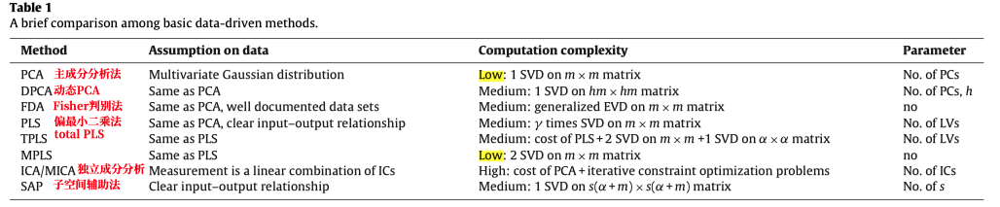
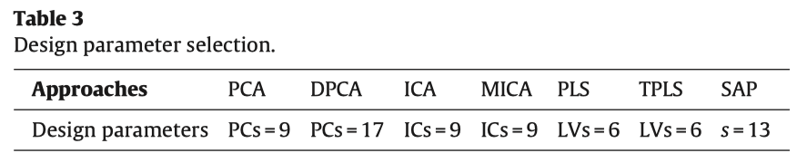
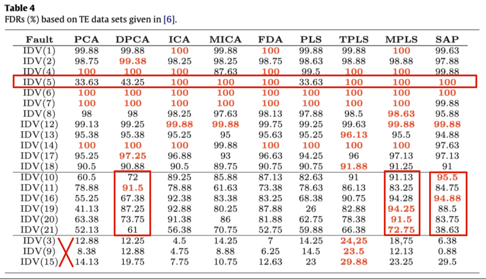
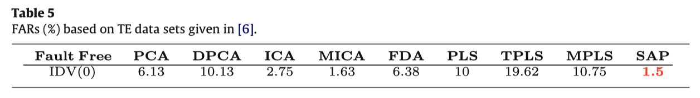
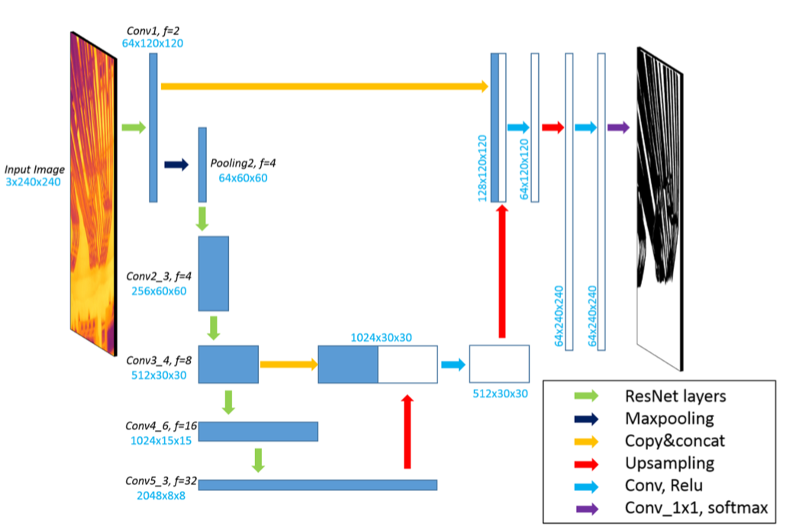
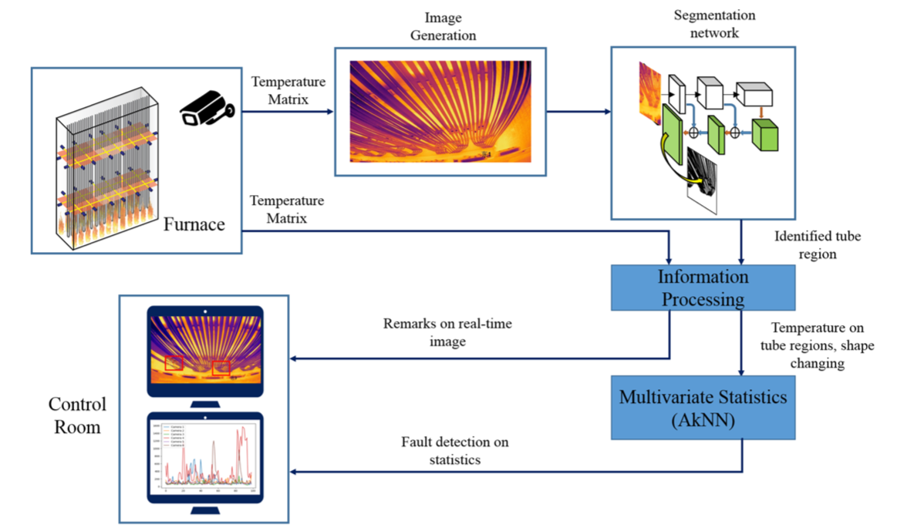
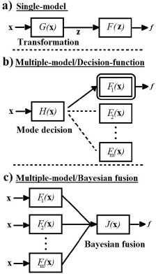
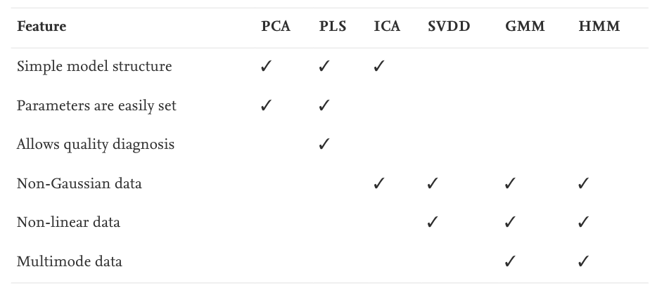

# Anomaly Detection 相关文献

1. 基于知识的方法
2. 基于模型的方法
     - 基于定性模型
     - 基于定量模型
3. **基于数据的方法**
     - Multivariate Statistical Methods 多元统计方法
     - Shallow Learning Methods 浅层学习方法
     - Deep earning Methods 深度学习方法

## Multivariate Statistical Methods

​		多元统计方法被广泛应用并被视为化学过程监控最重要的工具之一。为了克服实际过程中的动态和非线性特性，开发了基于动态和基于内核的变体方法。

1. **主成分分析** `PCA`: 无监督的方法，它通过连续最大化方差将高度相关的数据转换为线性不相关的特征。
   - [ ] *A theoretical basis for the use of principal component models for monitoring multivariate processes*{Wise, 1990 #127}
   - [ ] *Monitoring batch processes using multiway principal component analysis*{Nomikos, 1994 #128}
     - 动态PCA `dynamic PCA`:为了处理过程变量的自相关问题所提出的。`PCA` 和 `DPCA `是多元统计过程监控方案框架中的标准方法，其中归一化过程起着核心作用
       - [ ] *Disturbance detection and isolation by dynamic principal component analysis*  {Ku, 1995 #130}
       - [ ] *A novel dynamic PCA algorithm for dynamic data modeling and process monitoring* {Dong, 2018 #131}
     - 核PCA和非线性PCA  `kernel PCA &nonlinear PCA `
       - [ ] *Fault identification for process monitoring using kernel principal component analysis* {Cho, 2005 #132}
       - [ ] *Nonlinear process monitoring using kernel principal component analysis* {Lee, 2004 #133}
     - 批量PCA `batch PCA`
       - [ ] *On-line batch process monitoring using batch dynamic kernel principal component analysis* {Jia, 2010 #134}
   
2. **独立成分分析**`ICA`: 无监督的方法，利用高阶统计数据提取相互独立的成分，它适用于非高斯过程监测。

   - [ ] *Monitoring independent components for fault detection*{Kano, 2003 #148}

   - 动态ICA`Dynamic ICA`  

   - 鲁棒ICA`robust ICA`
   - 混合ICA`hybrid ICA`

3. **偏最小二乘法**` PLS`:有监督方法，它通过最小化误差的平方和找到一组数据的最佳函数匹配。`偏最小二乘回归=多元线性回归分析+典型相关分析+主成分分析`

   - [ ] *Process monitoring and diagnosis by multiblock PLS methods*{MacGregor, 1994 #149}

4. **其他算法**

   - Fisher 判别分析 (FDA)：核心是解决一个广义特征值分解（EVD）问题
   - 定性趋势分析 (QTA) 
   - 子空间辅助判别法（SAP）:直接从过程数据中识别状态空间过程模型
     - [ ] *Subspace method aided data-driven design of fault detection and isolation systems*{Ding, 2009 #153}

5. **综述**

   - [x] *A comparison study of basic data-driven fault diagnosis and process monitoring methods on the benchmark Tennessee Eastman process*{Yin, 2012 #135}

     > 《基准Tennessee Eastman过程的数据驱动故障诊断和过程监控基本方法的比较研究》
     >
     > ​		本文对`过程监控和故障诊断`（PM-FD）的基于数据驱动的方法进行了比较研究。对于大型的工业生产环境，不能直接将基于数据的方法直接应用。需要遵循先预处理，再降维、选择变量，最后选择有效的数据驱动方法用于PM-FD。
     >
     > ​		本文在回顾这些方法及其最新进展的基础上，详细讨论了这些方法的最初思想、实现条件、离线设计和在线计算算法以及计算复杂度。为了从应用角度进一步比较它们的性能，田纳西伊士曼（TE）工艺的工业基准被用来说明所有讨论方法的效率。研究结果致力于为在大规模工业过程中成功实现 PM-FD 提供参考。本文最后总结了一些重要的结论。
     >
     > ​		对基于数据驱动的方法进行比较：
     >
     > ​				主成分`PC`、潜在变量`latent variables LA`
     >
     > 
     >
     > ​		 本文将PCA、DPCA、PLS、TPLS、MPLS、FDA、ICA、MICA 和SAP，都将应用于 TE 过程进行比较研究。评估指标使用故障检测率`FDR`和误报率`FAR`：
     >
     >
     > $$
     > \mathrm{FDR}=\frac{\text { No. of samples }\left(J>J_{t h} \mid f \neq 0\right)}{\text { total samples }(f \neq 0)} \times 100 \\
     > FAR =\frac{\text { No. of samples }\left(J>J_{t h} \mid f=0\right)}{\text { total samples }(f=0)} \times 100
     > $$
     >
     > - 研究《**工业系统中的故障检测和诊断**》{Chiang, 2000 #150}所给的数据集
     >
     >   - 模拟中，FDA、PCA 和 ICA 相关方法包括 22 个过程测量值、11 个操纵变量 ；对于 PLS 和 SAP包括产品质量变量，即组件 G 的指标（输出变量）和其他 33 个过程变量（输入变量）。
     >
     >   - 设计参数设置
     >
     >     
     >
     >   - FDR结果
     >
     >     - 红色表示与某种故障类型相关的的最高FDR
     >
     >       
     >
     >   - FAR结果
     >
     >     
     >
     >   - 由于组件 G的指标被视为产品质量变量，因此过程故障 IDV(3-4)、IDV(9,11)、IDV(14-15) 和 IDV(19) 几乎没有影响在产品质量上，而其他故障会导致质量变量的显着变化。
     >   - 实验还使用了不同的设计参数设置，发现不同的参数设计会显著的影响PCA、DPCA 和 PLS 方法的 PM-FD 性能。SAP 的设计参数对 FDR 影响不大，并且FAR最低。
     >
     > - 研究《**田纳西伊士曼挑战过程的分散控制**》{Ricker, 1996 #151}所给的数据集
     >
     >   - SAP 在大多数情况下也提供了更好的 FDR。此外，DPCA 和 TPLS/MPLS 显然提供比标准 PCA 和 PLS 方法更好的 FDR。ICA 相关方法显示出比标准 PCA 更好的结果，但与其他方法相比没有显示出明显的改进。
     >
     > - 结论
     >
     >   - 与`DPCA`相比，未考虑过程变量自相关的标准`PCA` 显示出相对较低的FDR。与标准方法相比，`PLS`的两种变体，即`TPLS`和`MPLS`，提供了更好的FDR 和更准确的故障诊断信息。尽管`ICA`相关方法涉及复杂的计算，但与标准`PCA`方法相比，它们仅提供了显着的改进。值得进一步讨论的是`ICs`，尤其是与 `PCs`相比，是否可以为PM-FD的评估阶段带来额外的优势。请注意，`SAP`在大多数情况下提供了卓越的 FDR，因为它能够处理具有广泛的过程变量操作范围的过程中的动态问题。
     >
     >   - `PCA`、`PLS`和`ICA`相关方法中的设计参数将相当大的影响PM-FD性能。尽管有一些参数选择标准但尚未分析证明哪个标准为PM-FD提供最佳性能。
     >
     >     即使对于相同的标准，例如通过leave-N-out交叉验证来决定LVs的数量，根据不同的N值可以获得不同的结果。因此，像MPLS/TPLS和SAP这样的方法，没有这些设计参数或受这些设计参数影响很小，在应用方面更有优势。
     >
     >   - 在实践中，大型工业厂房通常是复杂的动态系统过程测量不会严格遵循TE过程所示的高斯分布。另一方面，非高斯分布式过程测量是否可以描述为`ICs`的线性组合也很难给出物理解释。尽管过程数据不能完美地满足表1中的基本假设，但大多数测试方法显示了它们在TE过程中的PM-FD能力，即使具有非高斯测量噪声。特别是`SAP`等FDRs较高、计算成本相对较低、对过程数据无特殊假设的方法，无论在实际应用中还是在学术研究中都将受到更多关注。
   
   - [x] *Survey on data-driven industrial process monitoring and diagnosis*{Qin, 2012 #136}
   
     >过程监控和故障识别有两种不同的策略：
     >
     >1. 依据第一性驱动或数据驱动模型为感兴趣的故障类型建模
     >2. ✅为正常运行情况的建模，用它检测偏离正常值的故障（大多数统计监控方法）
     >   - PCA 模型主要用于从正常操作数据中提取过程变量相关性
     >   - 内核 PCA 和 PLS 方法类似于线性对应方法，只是将原始变量非线性变换到特征空间，然后在特征空间中构建 PCA 或 PLS 模型。当仅建立正常情况模型时，通常需要将故障模型构建为与正常情况的方向偏差
     >
     >故障检测指标：
     >
     >1. 平方预测误差`Squared prediction error`：刻画了输入变量的测量值对主元模型的偏离程度，是对模型外部变化的一种度量。
     >2. 霍特林统计量`Hotelling's T^2 statistic`: 反映了每个主成分在变化趋势和幅值上偏离模型的程度，是对模型内部化的一种度量，它可以用来对多个主元同时进行监测
     >3. 综合指标

## Shallow Learning Methods

1. **支持向量机** `SVM`
2. **人工免疫系统** `AIS`
3. **K-近邻算法** `KNN`
4. **高斯混合模型** `GMM`
5. **人工神经网络** `ANN`
   1. **分层 ANN** `HANN`
   2. **面向职责的 HANN** `DOHANN`
   3. **监督局部多层感知器** `SLMLP`

## Deep Learning Methods

1.  

2.  

3. **综述**

   - [x] *Advances and opportunities in machine learning for process data analytics*{Qin, 2019 #143}

     > 《用于过程数据分析的机器学习的进步和机遇》
     >
     > - 深度学习：准确性与可解释性
     >
     >   对于实现及精准预测，深度学习这样的复杂的模型具有更强的能力。另一方面，可解释性对于工业应用至关重要。
     >
     >   深度神经网络也已应用于燃烧炉的图像分类（Zhu et al., 2019 ）这是直接将图像分析方法应用于处理操作。
     >
     >   为了避免深度卷积神经网络中的随机梯度训练(Kuo 等人)提出了一种可解释的前馈设计，用于使用 PCA 并添加偏置项的深度学习结构。该方法还在图像分类基准上进行了测试，结果良好。这项工作为开发可解释的深度学习模型提供了另一个证据和想法。

4.  **相关论文**

   - [x] *Deep learning for pyrolysis reactor monitoring: From thermal imaging toward smart monitoring system*{Zhu, 2019 #146}

     > 《热解反应器监控的深度学习：从热成像到智能监控系统》
     >
     > 
     >
     > ​		由于燃烧炉中极高的工作温度（超过 800°C），监控热解反应器的运行始终具有挑战性。为了提高电流监控能力，提出了一种基于热摄影的监控框架，以提供燃烧炉内部的详细视图。基于摄像机提供的温度数据生成的红外图像，引入深度学习方法从原始图像中自动识别管区域。逐像素管分割网络被命名为 `Res50-UNet`，它结合了流行的 `ResNet-50` 和 `U-Net` 架构。通过这种方法，可以监测热解管上的精确温度和形状。控制限制最终由自适应` k 近邻`方法绘制，以发出故障警报。通过对真实工厂数据的测试，该框架通过提供反应堆的深入运行信息和故障诊断来帮助过程操作员。
     >
     > - `Data preparation`：将从燃烧炉内六个不同位置的热成像相机获取的信号。为了增加训练集的多样性，对原始图像进行图像分割、采样，最终每张图片生成36 张分辨率为 240 × 240 的图像片段。每台相机拍摄四张，并对每张照片的管区域和不相关的背景进行标记，一共生成864张图像进行训练。
     >
     > - `Tube region segmentation`:本文提出识别图像中的热解管区域的方法是`Res50-UNet` :具体是将`U-Net` 解码合并到 `ResNet-50` 网络中实现图像分割，策略是将具有不同下采样因子的特征图组合到解码器进行预测。
     >
     >   
     >
     > - `Monitoring framework`: 输入数据是由红外相机获取的温度矩阵，首先将其转换为RGB图像，将其进行`Tube region segmentation`。为了实现监控管型的变化，先做出准稳态假设，基于此使用移动窗口来连续存储来自先前步长的区域信息。可以通过`移动窗口平均预测`和`当前预测` 之间的比较来捕捉形状变化($△A$,$SSE(\bar Y_{mw}, Y_t)$)；通过结合原始温度矩阵来计算管表面温度$T_{tube}$, 由此可以获得平均温度和最高温度，以提供不同尺度的统计信息。最后，通过多元统计方法`AkNN`监测计算出的温度和形状变化信息
     >
     >   

   - [ ]  

5. 

## Multimode MSPM

​		大多数传统的 多元统计过程监控`MSPM `方法和基于 `DNN` 的方法通常依赖于一些假设，例如单峰或高斯分布的假设。数据分布的多模态将使这些方法不适用于多模过程监测, 近年来提出了许多的多模MSPM`Multimode MSPM`方法。{Wu, 2020 #112}

1. **单一模型方案** `single-model scheme`: 由于多模型方案需要构建多个局部监控模型以分别适应每个模式，当很难估计模式的数量和获取所有模式的历史数据时，单模式方案具有优势。

   - 自适应监控 `adaptive monitoring`

     - [ ] 递归PCA`RPCA`： *Recursive PCA for adaptive process monitoring* {Li, 2000 #140}

     - [ ] 快速移动窗口PCA `MWPCA` / 可变的MPCA

     - [ ] `MWLoOP`算法 

     - [x]  *Self-adaptive deep learning for multimode process monitoring* {Wu, 2020 #112}

       > 发表在《计算机与化学工程》上的《用于多模态过程监控的自适应深度学习》
       >
       > 
       >
       > 本方法提出了局部自适应标准化方法，并应用了深度神经网络的变分自动编码器技术，通过计算局部移动窗口内数据的平均值，作为局部自适应标准化的平均值参数，针对不同的数据使用不同的平均值，具有自适应能力。
       >
       > 
       >
       > 本方法利用局部自适应标准化处理，通过检测局部移动窗口内数据是否发生偏离趋势来进行故障检测。本方法能够适用于任意工况，而且具有更高的准确率和更强的泛化能力，能够满足实时检测的需求，通过早期预警故障避免化工事故发生或者减小事故带来的危害。
       >
       > 
       >
       > 1. 局部自适应标准化(LAS)方法用于对局部移动窗口数据进行标准化和预处理
       >    - 首先从化工系统的历史数据库中获取N种工况下的正常运行数据集，将数据集进行拆分后进行局部自适应标准化处理
       >    - 先是计算训练集上的全局平均标准差，根据时间顺序计算局部移动窗口数据，计算m个变量的平均值mean($W_k$)
       >    - 根据以上数据进行局部自适应标准化得到$\hat w_k$以此计算数据集内其他正常运行的数据，验证集也是类似的操作
       > 2. 变分自编码器双向长短期记忆(VAE-BiLSTM)监测模型用于检测局部运动数据中的不稳定偏差。
       >    - 在本文中，一个VAE-BiLSTM模型，本质上是一个由几个双向长短期记忆（BiLSTM）层组成的变分自动编码机VAE模型，用于多模式过程监控建模。

   - 使用转换函数将单模态映射到子空间

     - [ ] 超级 PCA 

2. **多模型/决策函数方案** `multiple-model/decision function scheme`：决策函数的目的$H(X)$就是在线判断进程当前的运行模式是什么，从而选择相应的监控模式。一个流行的决策函数是特定模型适应度

   - [ ] *Multi-mode operation of principal component analysis with k-nearest neighbor algorithm to monitor compressors for liquefied natural gas mixed refrigerant processes*{Ha, 2017 #137}

3. **多模型/贝叶斯融合方案** `multiple-model/Bayesian fusion scheme`:使用函数将输入空间映射到故障空间$J(X)$它以概率的方式考虑所有监控模型的决策。

   - [ ]  *A nonlinear kernel Gaussian mixture model based inferential monitoring approach for fault detection and diagnosis of chemical processes* {Yu, 2012 #139}

4. **综述**

   - [x] :star: *Data-driven monitoring of multimode continuous processes: A review* {Quinones-Grueiro, 2019 #138}

     > 《多模态连续过程的数据驱动控制：综述》
     >
     > ​		在工业生产过程中，存在着动态和非线性特性的行为，并且在多模态机制下的不同工作点上工作。以连续搅拌罐加热器为例，单变量的经典监控方法不能取得很好的效果因此，实现正确监控系统的关键是区分故障影响`fault effects`和多模变化`multimode changes`。
     >
     > ​		监测多模连续过程需要：通过使用`聚类`方法来表征多模数据；表征故障数据（当标记的故障数据可用时）；开发一个有监督的监控方案，将特征与模式和故障区分开来。
     >
     > ​		`聚类`：混合模型、K-均值、模糊 C 均值、基于窗口
     >
     > ​		`监测方案`:单一模型方案、多模型/决策函数方案、多模型/贝叶斯融合方案
     >
     > 
     >
     > 
     >
     > ​		`检测方法`：
     >
     > 
     >
     > ​		`评估指标`： 故障诊断任务是一个多类分类问题。因此，大多数性能指标可以从`混淆矩阵`中获得; `ROC 曲线`描述了故障检测和误报率之间的权衡。
     >
   
5. 

6. 

数据驱动的过程监控方法可以分为

- 多元统计过程监控（MSPM）
  - 主成分分析PCA
  - 偏最小二乘法PLS
  - 独立成分分析ICA

- 基于深度神经网络（DNN）
  - 深度置信网络DBN
  - 自动编码器AE
  - 卷积神经网络CNN

Deep convolutional neural network model based chemical process fault diagnosis {Wu, 2018 #123}

