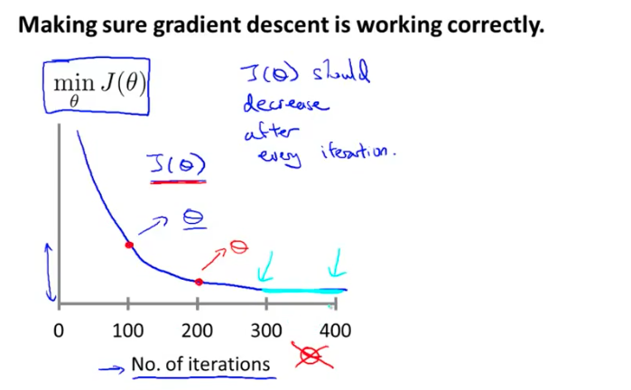
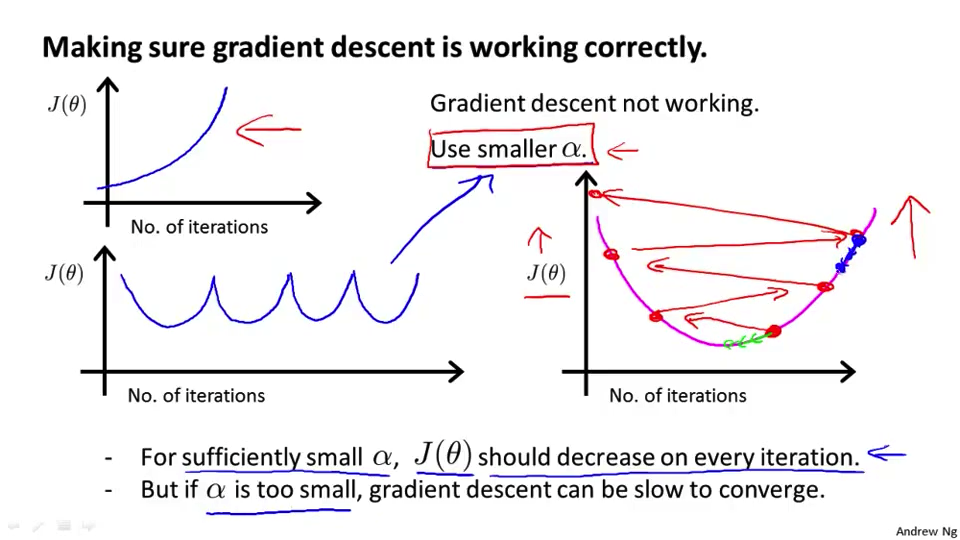
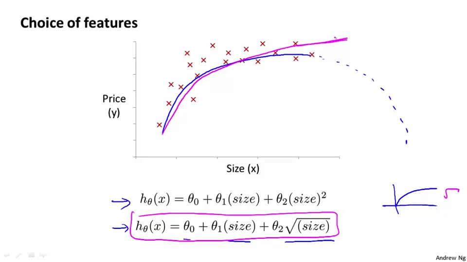
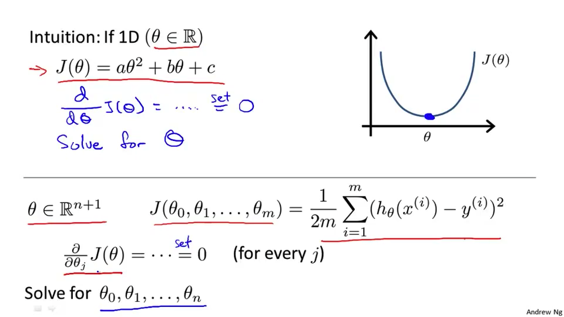
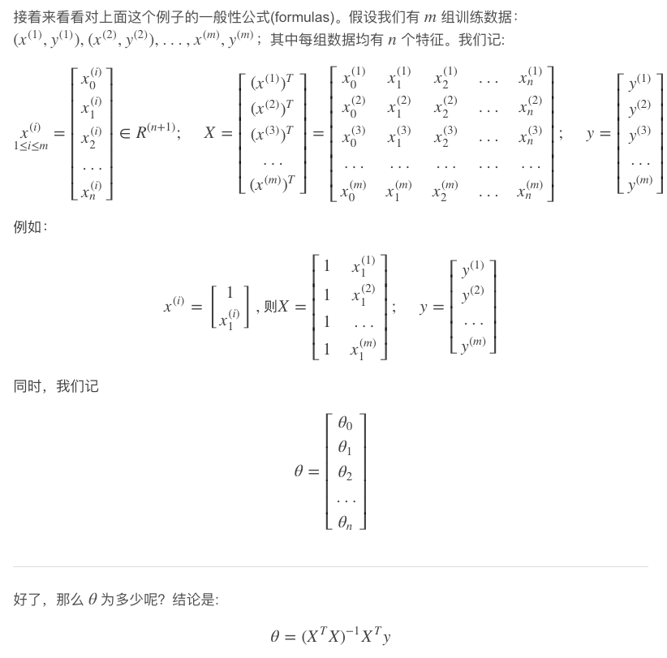
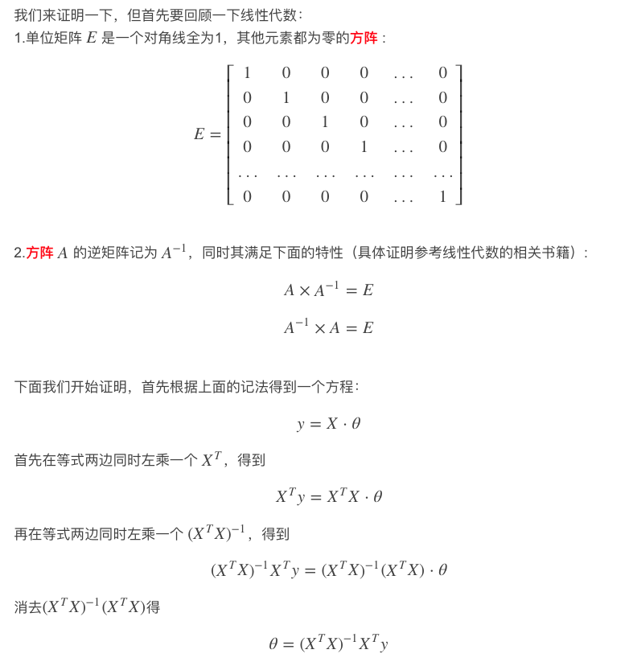

[TOC]

四、多变量线性回归(Linear Regression with Multiple Variables)
-------------------------------------------------------------

### 4.1 多维特征

参考视频: 4 - 1 - Multiple Features (8 min).mkv

​	目前为止，我们探讨了单变量/特征的回归模型，现在我们对房价模型增加更多的特征，例如房间数楼层等，构成一个含有多个变量的模型，模型中的特征为$\left( {x_{1}},{x_{2}},...,{x_{n}} \right)$。


|             符号             | 注释                                                         |
| :--------------------------: | :----------------------------------------------------------- |
|             $n$              | 代表特征的数量                                               |
|   ${x^{\left( i \right)}}$   | 代表第 $i$ 个训练实例，是特征矩阵中的第$i$行，是一个向量**vector**。 ${x}^{(2)}\text{=}\begin{bmatrix} 1416\\\ 3\\\ 2\\\ 40 \end{bmatrix}$ |
| ${x}_{j}^{\left( i \right)}$ | 代表特征矩阵中第 $i$ 行的第 $j$ 个特征，也就是第 $i$ 个训练实例的第 $j$ 个特征。如上图的$x_{2}^{\left( 2 \right)}=3,x_{3}^{\left( 2 \right)}=2$， |

​	支持多变量的假设 $h$ 表示为：
$$
h_{\theta}\left( x \right)={\theta_{0}}+{\theta_{1}}{x_{1}}+{\theta_{2}}{x_{2}}+...+{\theta_{n}}{x_{n}}
$$
​	这个公式中有$n+1$个参数和$n$个变量，为了使得公式能够简化一些，引入$x_{0}=1$，则公式转化为：
$$
h_{\theta} \left( x \right)={\theta_{0}}{x_{0}}+{\theta_{1}}{x_{1}}+{\theta_{2}}{x_{2}}+...+{\theta_{n}}{x_{n}}
$$
​	此时模型中的参数是一个$n+1$维的向量，任何一个训练实例也都是$n+1$维的向量，特征矩阵$X$的维度是 $m*(n+1)$。 因此公式可以简化为：
$$
h_{\theta} \left( x \right)={\theta^{T}}X
$$
​	其中上标$T$代表矩阵转置。

### 4.2 多变量梯度下降

参考视频: 4 - 2 - Gradient Descent for Multiple Variables (5 min).mkv

​	与单变量线性回归类似，==在多变量线性回归中，我们也构建一个代价函数==，则这个代价函数是所有建模误差的平方和，即：
$$
J\left( {\theta_{0}},{\theta_{1}}...{\theta_{n}} \right)=\frac{1}{2m}\sum\limits_{i=1}^{m}{{{\left( h_{\theta} \left({x}^{\left( i \right)} \right)-{y}^{\left( i \right)} \right)}^{2}}}
$$
其中：
$$
h_{\theta}\left( x \right)=\theta^{T}X={\theta_{0}}+{\theta_{1}}{x_{1}}+{\theta_{2}}{x_{2}}+...+{\theta_{n}}{x_{n}}
$$
我们的目标和单变量线性回归问题中一样，是要找出使得代价函数最小的一系列参数。
多变量线性回归的批量梯度下降算法为：
$$
\large
\begin{array}{l}
\text { Repeat \{  } \\
\qquad \theta_{\mathrm{j}}:=\theta_{\mathrm{j}}-\alpha \frac{\partial}{\partial \theta_{j}} \mathrm{~J}\left(\theta_{0}, \theta_{1}, \ldots, \theta_{\mathrm{n}}\right)\\
\text { \} }
\end{array}
$$
即：
$$
\large
\begin{array}{l}
\text { Repeat \{  } \\
\qquad \theta_{\mathrm{j}}:=\theta_{\mathrm{j}}-\alpha \frac{\partial}{\partial \theta_{j}} 
\frac{1}{2m}\sum\limits_{i=1}^{m}{{{\left( h_{\theta} \left({x}^{\left( i \right)} \right)-{y}^{\left( i \right)} \right)}^{2}}}
\\
\text { \} }
\end{array}
$$
求导数后得到：

- 当$n=1$时，	
  $$
  \large
  \begin{array}{l}
  \text { Repeat \{  } \\
  \qquad 
  {{\theta }_{0}}:={{\theta }_{0}}-a\frac{1}{m}\sum\limits_{i=1}^{m}{({{h}_{\theta }}({{x}^{(i)}})-{{y}^{(i)}})}
  \\
  \qquad 
  {{\theta }_{1}}:={{\theta }_{1}}-a\frac{1}{m}\sum\limits_{i=1}^{m}{({{h}_{\theta }}({{x}^{(i)}})-{{y}^{(i)}})}x^{(i)} 
  \\
  \qquad(\text { simultaneous update } \theta_0,\theta_1)  \\
  \text { \} }
  \end{array}
  $$

- 当$n>=1$时，
  $$
  \large
  \begin{array}{l}
  \text { Repeat \{  } \\
  \qquad \theta_{\mathrm{j}}:=\theta_{\mathrm{j}}-a
  \frac{1}{m}\sum\limits_{i=1}^{m}{{{\left(( h_{\theta} \left({x}^{\left( i \right)} \right)-{y}^{\left( i \right)} \right)·x^{(i)}_j)}}}
  \\
  \qquad(\text { simultaneous update } \theta_j \text{ for }j=0,1,...,n) \\
  \text { \} }
  \end{array}
  $$

$$
{{\theta }_{0}}:={{\theta }_{0}}-a\frac{1}{m}\sum\limits_{i=1}^{m}{({{h}_{\theta }}({{x}^{(i)}})-{{y}^{(i)}})}x_{0}^{(i)}
$$

$$
{{\theta }_{1}}:={{\theta }_{1}}-a\frac{1}{m}\sum\limits_{i=1}^{m}{({{h}_{\theta }}({{x}^{(i)}})-{{y}^{(i)}})}x_{1}^{(i)}
$$

$$
{{\theta }_{2}}:={{\theta }_{2}}-a\frac{1}{m}\sum\limits_{i=1}^{m}{({{h}_{\theta }}({{x}^{(i)}})-{{y}^{(i)}})}x_{2}^{(i)}
$$


​	我们开始随机选择一系列的参数值，计算所有的预测结果后，再给所有的参数一个新的值，如此循环直到收敛。

- 代码示例：

  1. 计算代价函数
    
     $$
     J\left( \theta  \right)=\frac{1}{2m}\sum\limits_{i=1}^{m}{{{\left( {h_{\theta}}\left( {x^{(i)}} \right)-{y^{(i)}} \right)}^{2}}}
     $$

     ​	其中：${h_{\theta}}\left( x \right)={\theta^{T}}X={\theta_{0}}{x_{0}}+{\theta_{1}}{x_{1}}+{\theta_{2}}{x_{2}}+...+{\theta_{n}}{x_{n}}$

  2. **Python** 代码：

     ```python
     def computeCost(X, y, theta):
         inner = np.power(((X * theta.T) - y), 2)
         return np.sum(inner) / (2 * len(X))
     ```

     

### 4.3 梯度下降法实践1-特征缩放

参考视频: 4 - 3 - Gradient Descent in Practice I - Feature Scaling (9 min).mkv

​	 在我们面对多维特征问题的时候，我们要保证这些特征都具有相近的尺度，这将帮助梯度下降算法更快地收敛。

​	以房价问题为例，假设我们使用两个特征，

- $x_1=$房屋的尺寸( 0-2000平方英尺)
- $x_2 =$房间的数量(0-5)

​     以两个参数分别为横纵坐标，绘制代价函数的等高线图能，看出图像会显得很扁，梯度下降算法需要非常多次的迭代才能收敛。


​	一种有效的解决的方法就是特征缩放**feature scaling**,目的是可将两个特征值范围尽可能靠近，甚至相同。

​	尝试==将所有特征的尺度都尽量缩放到-1到1之间==。

​	注意，并不需要完全严格的将其幅度控制在以上区间之内，$-3\leq x_i \leq 3$是可以接受的。

​	如图所示，令特征值缩放到 $0\leq x_1 \leq 1$   $0\leq x_2 \leq 1$，让轮廓图像就很“圆”，这样梯度下降算法就能很快收敛。


​	

​	一般的解决方法：==均值归一化==**mean normalization**

​	Replace  $x_i$ with $x_i - \mu_i$ to make features have approximately zero mean (Do not apply to $x_0$=1).
$$
{{x}_{i}}=\frac{{{x}_{i}}-{{\mu}_{i}}}{{x_{imax}-x_{imin}}}
$$
​	其中 ${\mu_{n}}$是平均值.


### 4.4 梯度下降法实践2-学习率

参考视频: 4 - 4 - Gradient Descent in Practice II - Learning Rate (9 min).mkv

​	梯度下降算法收敛所需要的迭代次数根据模型的不同而不同，我们不能提前预知，我们可以绘制==$J\left( \theta  \right) - N$曲线来观测算法在何时趋于收敛==。

​	$x$轴表示的是迭代次数，$y$轴表示的是代价函数。

​	==当$J\left( \theta  \right)$随着迭代次数的增大而减小的话，我们认为该算法工作正常==，反之，则工作不正常。



​		

​		也有一些自动测试是否收敛的方法，例如将代价函数的变化值与某个阀值（例如0.001）进行比较, 但通常看上面这样的图表更好。

​	Example:

​		Declare convergence if $J\left( \theta  \right)$ decreases by less than $10^-3$ in one iteration.

​	梯度下降算法的每次迭代受到学习率的影响

- 如果学习率$a$过小，则达到收敛所需的迭代次数会非常高；
- 如果学习率$a$过大，每次迭代可能不会减小代价函数，可能会越过局部最小值导致无法收敛.	
- If a is too small: slow convergence
- If a is too large: $J\left( \theta  \right)$may not decrease on every iteration; may not converge	



​	通常可以考虑尝试些学习率,以三倍的速率增加:

​		$\alpha=...0.01，0.03，0.1，0.3，1，3，10...$


### 4.5 特征和多项式回归

参考视频: 4 - 5 - Features and Polynomial Regression (8 min).mkv

​	房价预测问题，


$$
h_{\theta}\left( x \right)={\theta_{0}}+{\theta_{1}}\times{frontage}+{\theta_{2}}\times{depth}
$$

- ${x_{1}}=frontage$（临街宽度）

- ${x_{2}}=depth$（纵向深度）

- $x=frontage*depth=area$（面积）
  $$
  {h_{\theta}}\left( x \right)={\theta_{0}}+{\theta_{1}}x
  $$

   线性回归并不适用于所有数据，有时我们需要曲线来适应我们的数据，比如一个二次方模型：$h_{\theta}\left( x \right)={\theta_{0}}+{\theta_{1}}{x_{1}}+{\theta_{2}}{x_{2}^2}$ ,但是二次函数会下降，房子的价格显然不会随着面积的增加而下降，因此，我们可以尝试三次函数  $h_{\theta}\left( x \right)={\theta_{0}}+{\theta_{1}}{x_{1}}+{\theta_{2}}{x_{2}^2}+{\theta_{3}}{x_{3}^3}$ 


​	通常我们需要先观察数据然后再决定准备尝试怎样的模型。

​	另外，我们可以令：${{x}_{2}}=x_{2}^{2},{{x}_{3}}=x_{3}^{3}$，从而==将模型转化为线性回归模型==。

​	根据函数图形特性，我们还可以使：

$$
{{{h}}_{\theta}}(x)={{\theta }_{0}}\text{+}{{\theta }_{1}}(size)+{{\theta}_{2}}{{(size)}^{2}}
$$
​	或者加上根号进行拟合，效果可能更好。

$$
{{{h}}_{\theta}}(x)={{\theta }_{0}}\text{+}{{\theta }_{1}}(size)+{{\theta }_{2}}\sqrt{size}
$$


注：如果我们采用多项式回归模型，在运行梯度下降算法前，特征缩放非常有必要。


### 4.6 正规方程

参考视频: 4 - 6 - Normal Equation (16 min).mkv

​	到目前为止，我们都在使用梯度下降算法，但是对于某些线性回归问题，正规方程方法是更好的解决方案。

1. 当$\theta ∈ R$ ,此时只需要很简单地对 $θ$ 求导数，使其导数为 0 即可求出  $θ$ 
2. 当$\theta ∈ R^{n+1}$ ,我们只要对每个 $θ$ 求偏导数，并使其为0 即可求出每个 $θ$ 的值



​	正规方程是通过求解下面的方程来找出使得代价函数最小的参数
$$
\frac{\partial}{\partial{\theta_{j}}}J\left( {\theta_{j}} \right)=0
$$
​	假设我们的训练集特征矩阵为 $X$（包含了 ${{x}_{0}}=1$）并且我们的训练集结果为向量 $y$，则==利用正规方程解出向量==
$$
\theta ={{\left( {X^T}X \right)}^{-1}}{X^{T}}y
$$
​	上标$^{T}$代表矩阵转置，上标$^{-1}$ 代表矩阵的逆。



​	设矩阵$A={X^{T}}X$，则：${{\left( {X^T}X \right)}^{-1}}={A^{-1}}$

​	以下表示数据为例：


​	即：


​	运用正规方程方法求解参数：


- 注：对于那些不可逆的矩阵（通常是因为特征之间不独立，如同时包含英尺为单位的尺寸和米为单位的尺寸两个特征，也有可能是特征数量大于训练集的数量），正规方程方法是不能用的。

  

- 梯度下降与正规方程的比较：

| 梯度下降                      | 正规方程                                                     |
| ----------------------------- | :----------------------------------------------------------- |
| 需要选择学习率$\alpha$        | 不需要                                                       |
| 需要多次迭代                  | 一次运算得出                                                 |
| 当特征数量$n$大时也能较好适用 | 需要计算${{\left( {{X}^{T}}X \right)}^{-1}}$ 如果特征数量n较大则运算代价大，因为矩阵逆的计算时间复杂度为$O\left( {{n}^{3}} \right)$，通常来说当$n$小于10000 时还是可以接受的 |
| 适用于各种类型的模型          | 只适用于线性模型，不适合逻辑回归模型等其他模型               |

​	总结一下，只要特征变量的数目并不大，标准方程是一个很好的计算参数$\theta $的替代方法。具体地说，==只要特征变量数量小于一万，我通常使用标准方程法，而不使用梯度下降法==。

​	随着我们要讲的学习算法越来越复杂，例如，当我们讲到分类算法，像逻辑回归算法，我们会看到，实际上对于那些算法，并不能使用标准方程法。对于那些更复杂的学习算法，我们将不得不仍然使用梯度下降法。因此，梯度下降法是一个非常有用的算法，可以用在有大量特征变量的线性回归问题。或者我们以后在课程中，会讲到的一些其他的算法，因为标准方程法不适合或者不能用在它们上。但对于这个特定的线性回归模型，标准方程法是一个比梯度下降法更快的替代算法。所以，根据具体的问题，以及你的特征变量的数量，这两种算法都是值得学习的。

- 正规方程的**python**实现：

```python
import numpy as np
    
def normalEqn(X, y):
   # X.T@X等价于X.T.dot(X)  @--矩阵乘法
   # np.linalg.inv():矩阵求逆
   theta = np.linalg.inv(X.T@X)@X.T@y 
    
   return theta
```


### 4.7 正规方程及不可逆性（可选）

参考视频: 4 - 7 - Normal Equation Noninvertibility (Optional) (6 min).mkv

​	在这段视频中谈谈正规方程 ( **normal equation** )，以及它们的不可逆性。
由于这是一种较为深入的概念，并且总有人问我有关这方面的问题，因此，我想在这里来讨论它，由于概念较为深入，所以对这段可选材料大家放轻松吧，也许你可能会深入地探索下去，并且会觉得理解以后会非常有用。但即使你没有理解正规方程和线性回归的关系，也没有关系。

​	我们要讲的问题如下：$\theta ={{\left( {X^{T}}X \right)}^{-1}}{X^{T}}y$ 

​	有些同学曾经问过我，当计算 $\theta ={{\left( {X^{T}}X \right)}^{-1}}{X^{T}}y$ ，那**对于矩阵$X'X$的结果是不可逆的情况**咋办呢?
​	原因有以下两点：

1. 存在冗余特征。

   例如，在预测住房价格时，如果${x_{1}}$是以英尺为尺寸规格计算的房子，${x_{2}}$是以平方米为尺寸规格计算的房子，同时，你也知道1米等于3.28英尺 ( 四舍五入到两位小数 )，这样，你的这两个特征值将始终满足约束：${x_{1}}={x_{2}}*{{\left( 3.28 \right)}^{2}}$。
   实际上，你可以用这样的一个线性方程，来展示那两个相关联的特征值，矩阵$X'X$将是不可逆的。

2. 特征数量 $n$ 过多，而训练样本数 $m$ 过少

   在你想用大量的特征值，尝试实践你的学习算法的时候，可能会导致矩阵$X'X$的结果是不可逆的。
    具体地说，在$m$小于或等于n的时候，例如，有$m$等于10个的训练样本也有$n$等于100的特征数量。要找到适合的$(n +1)$ 维参数矢量$\theta$，这将会变成一个101维的矢量，尝试从10个训练样本中找到满足101个参数的值，这工作可能会让你花上一阵子时间，但这并不总是一个好主意。因为，正如我们所看到你只有10个样本，以适应这100或101个参数，数据还是有些少。

​     稍后我们将看到，如何使用小数据样本以得到这100或101个参数，通常，我们会使用一种叫做**正则化**的线性代数方法，通过删除某些特征或者是使用某些技术，来解决当$m$比$n$小的时候的问题。即使你有一个相对较小的训练集，也可使用很多的特征来找到很多合适的参数。
​     总之当你发现的矩阵$X'X$的结果是奇异矩阵，或者找到的其它矩阵是不可逆的，我会建议你这么做。

1. 首先，看特征值里是否有一些多余的特征，像这些${x_{1}}$和${x_{2}}$是线性相关的，互为线性函数。同时，当有一些多余的特征时，可以删除这两个重复特征里的其中一个，无须两个特征同时保留，将解决不可逆性的问题。
2. 如果特征数量实在太多，我会删除些用较少的特征来反映尽可能多内容，否则我会考虑使用正规化方法。
3. 特征数量 $n$ 过多，而训练样本数 $m$ 过少。解决方法是删除一部分特征，或者增加样本数量。


- **增加内容：**



$\theta ={{\left( {X^{T}}X \right)}^{-1}}{X^{T}}y$ 的推导过程：


$$
J\left( \theta  \right)=\frac{1}{2m}\sum\limits_{i=1}^{m}{{{\left( {h_{\theta}}\left( {x^{(i)}} \right)-{y^{(i)}} \right)}^{2}}}
$$

其中：
$$
{h_{\theta}}\left( x \right)={\theta^{T}}X={\theta_{0}}{x_{0}}+{\theta_{1}}{x_{1}}+{\theta_{2}}{x_{2}}+...+{\theta_{n}}{x_{n}}
$$
​	将向量表达形式转为矩阵表达形式，则有$J(\theta )=\frac{1}{2}{{\left( X\theta -y\right)}^{2}}$ ，其中$X$为$m$行$n$列的矩阵（$m$为样本个数，$n$为特征个数），$\theta$为$n$行1列的矩阵，$y$为$m$行1列的矩阵，对$J(\theta )$进行如下变换

$J(\theta )=\frac{1}{2}{{\left( X\theta -y\right)}^{T}}\left( X\theta -y \right)$

​        $=\frac{1}{2}\left( {{\theta }^{T}}{{X}^{T}}-{{y}^{T}} \right)\left(X\theta -y \right)$

​        $=\frac{1}{2}\left( {{\theta }^{T}}{{X}^{T}}X\theta -{{\theta}^{T}}{{X}^{T}}y-{{y}^{T}}X\theta -{{y}^{T}}y \right)$

接下来对$J(\theta )$偏导，需要用到以下几个矩阵的求导法则:

$\frac{dAB}{dB}={{A}^{T}}$ 

$\frac{d{{X}^{T}}AX}{dX}=2AX$                            

 所以有:

$\frac{\partial J\left( \theta  \right)}{\partial \theta }=\frac{1}{2}\left(2{{X}^{T}}X\theta -{{X}^{T}}y -{}({{y}^{T}}X )^{T}-0 \right)$

​	 	$=\frac{1}{2}\left(2{{X}^{T}}X\theta -{{X}^{T}}y -{{X}^{T}}y -0 \right)$

​         $={{X}^{T}}X\theta -{{X}^{T}}y$

令$\frac{\partial J\left( \theta  \right)}{\partial \theta }=0$,

则有$\theta ={{\left( {X^{T}}X \right)}^{-1}}{X^{T}}y$