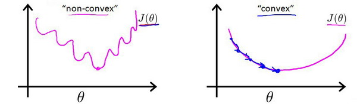
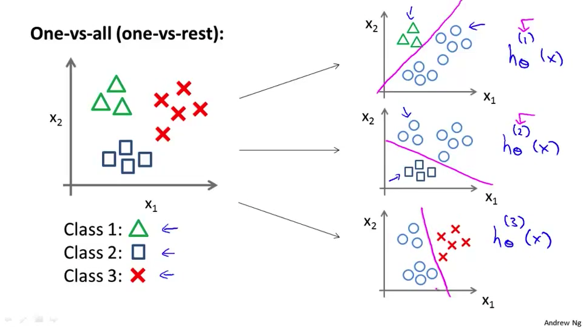

[TOC]

六、逻辑回归(Logistic Regression)
---------------------------------

### 6.1 分类问题

参考文档: 6 - 1 - Classification (8 min).mkv

​	在这个以及接下来的几个视频中，开始介绍分类问题**Classification**

​	在分类问题中，你要预测的变量 $y$ 是离散的值，我们将学习一种叫做逻辑回归 **Logistic Regression**的算法，这是目前最流行使用最广泛的一种学习算法。

​	在分类问题中，我们尝试预测的是结果是否属于某一个类（例如正确或错误）。分类问题的例子有：判断一封电子邮件是否是垃圾邮件；判断一次金融交易是否是欺诈；之前我们也谈到了肿瘤分类问题的例子，区别一个肿瘤是恶性的还是良性的。


​	我们从二元的分类问题开始讨论。

​	我们将因变量**dependent variable**可能属于的两个类分别称为

- 负向类**negative class**
- 正向类**positive class**

则因变量$y\in { 0,1 }$ ，其中 0 表示负向类，1 表示正向类


​	上图中的叉号就是我们的数据样本，横轴为肿瘤大小，纵轴为是否为恶性肿瘤。如果用我们之前学习的线性回归方程，则可以假设$h_\theta(x) = \theta^Tx$。可以得出图中的倾斜的斜率高一点的那一条直线。

​	为了更好的做出预测，我们可以设定当

- $h_\theta(x)>=0.5$时，认为$y=1$,
- 当$h_\theta(x)<0.5$时，认为$y=0$,

​    如此看来，假设我们在x轴正方向远处还有一点如下图中所示，我们的假设函数也是满足实际情况。


​	但如果我们的假设函数设置的如图中斜率偏低的那一条呢。很显然和数据集中的数据发生了误差。

​	所以==线性回归在分类问题中并不是最适合的方法==，而且如果使用线性回归，我们得出的$h_\theta(x)$是可以大于1或者小于0。


​	如果我们要用线性回归算法来解决一个分类问题，对于分类， $y$ 取值为 0 或者1，但如果你使用的是线性回归，那么假设函数的输出值可能远大于 1，或者远小于0，即使所有训练样本的标签  $y$ 都等于 0 或 1。

​	而接下来要讨论的logistic分类算法**Logistic Regression**的值域大小是在[0,1]之间的。


### 6.2 假说表示

参考视频: 6 - 2 - Hypothesis Representation (7 min).mkv

​	此前我们说过，希望我们的分类器**classifier**的输出值在0和1之间，因此，我们希望想出一个满足某个性质的假设函数，这个性质是它的预测值要在0和1之间。

​	我们引入一个新的模型，逻辑回归，该模型的输出变量范围始终在0和1之间。
​	逻辑回归模型的假设是： 
$$
h_\theta \left( x \right)=g\left(\theta^{T}X \right)
$$

其中：

- $X$ 代表特征向量

- $g$ 代表逻辑函数**logistic function**或**S**形函数**Sigmoid function**

  ​	公式为： 
  $$
  g\left( z \right)=\frac{1}{1+{{e}^{-z}}}
  $$
  **python**代码实现：

  ```python
  import numpy as np
  def sigmoid(z):
     return 1 / (1 + np.exp(-z))
  ```

  该函数的图像为：

  

综上：
$$
h_\theta \left( x \right)=\frac{1}{1+{{e}^{-\theta^{T}X}}}
$$
​	$h_\theta \left( x \right)$的作用是，对于给定的输入变量，根据选择的参数计算输出变量=1的概率估计**estimated probablity**
$$
h_\theta \left( x \right)=P\left( y=1|x;\theta \right)
$$
​	例如，如果对于给定的$x$，通过已经确定的参数计算得出$h_\theta \left( x \right)=0.7$，则表示有70%的几率$y$为正向类，相应地$y$为负向类的几率为$1-0.7=0.3$。
$$
\begin{array}{l}
If  \ \   x=\left[\begin{array}{l}
x_{0} \\
x_{1}
\end{array}\right]=\left[\begin{array}{c}
1  \\
\text { tumorSize }
\end{array}\right] \\
h_{\theta}(x)=\underline{0.7}
\end{array}
$$
​	从概率上的角度来描述可以表达为以下的公式：
$$
P( y=0|x;\theta)+P( y=1|x;\theta) = 1\\
P( y=0|x;\theta) = 1 - P( y=1|x;\theta)
$$


### 6.3 判定边界

参考视频: 6 - 3 - Decision Boundary (15 min).mkv

​	现在讲下决策边界**decision boundary**的概念。这个概念能更好地帮助我们理解逻辑回归的假设函数在计算什么。

​	在逻辑回归中，我们预测：

- 当${h_\theta}\left( x \right)>=0.5$时，预测 $y=1$。

- 当${h_\theta}\left( x \right)<0.5$时，预测 $y=0$ 。


​	根据上面绘制出的 **S** 形函数图像，我们知道当

- $z=0$ 时 $g(z)=0.5$

- $z>0$ 时 $g(z)>0.5$

- $z<0$ 时 $g(z)<0.5$

​	又因为
$$
z={\theta^{T}}x
$$
​	即：

- ${\theta^{T}}x>=0$  时，预测 $y=1$
- ${\theta^{T}}x<0$  时，预测 $y=0$

​	现在假设我们有一个模型：


​	这里可以举一个例子，假设
$$
h_\theta(x) = g(\theta_0+\theta_1x_1+\theta_2x_2)=g(\theta^Tx)
$$
​	$\theta_0,\theta_1,\theta_2$分别等于-3,1,1。则$\theta = \begin{bmatrix} -3\\ 1 \\ 1 \end{bmatrix}$,

- $y=1$ 时，即代表$h_\theta(x) = g(z) >= 0.5$,即$\theta^Tx = -3+x_1+x_2>=0$,
- $y=0$ 时，$\theta^Tx = -3+x_1+x_2<0$,那么我们可以得出这两个不等式的分界线即$x_1+x_2=3$。

​	我们可以绘制直线${x_1}+{x_2} = 3$，这条线便是我们模型的分界线，==将预测为1的区域和预测为0的区域分隔开，我们将这根线称之为决策边界==。


​	我们可以用非常复杂的模型来适应非常复杂形状的判定边界。假使我们的数据呈现这样的分布情况，怎样的模型才能适合呢？


$$
{h_\theta}\left( x \right)=g\left( {\theta_0}+{\theta_1}{x_1}+{\theta_{2}}{x_{2}}+{\theta_{3}}x_{1}^{2}+{\theta_{4}}x_{2}^{2} \right)
$$
假定$\theta = \begin{bmatrix} -1\\ 0 \\ 0 \\ 1 \\ 1 \end{bmatrix}$，则我们得到的判定边界恰好是圆点在原点且半径为1的圆形。

​	则可得出，若

- $-1+x_1^2+x_2^2>=0$,则$y=1$
- $-1+x_1^2+x_2^2<0$,则$y=0$,

那么显然，这里的决策边界的图像是$x_1^2+x_2^2 = 1$。


### 6.4 代价函数

参考视频: 6 - 4 - Cost Function (11 min).mkv

​	在这段视频中，我们要介绍如何拟合逻辑回归模型的参数$\theta$。具体来说，我要定义用来拟合参数的优化目标或者叫代价函数，这便是监督学习问题中的逻辑回归模型的拟合问题。


​	对于线性回归模型，我们定义的代价函数是所有模型误差的平方和。理论上来说，我们也可以对逻辑回归模型沿用这个定义，但是问题在于，当我们将
$$
{h_\theta}\left( x \right)=\frac{1}{1+{e^{-\theta^{T}x}}}
$$
带入到这样定义了的代价函数中时，我们得到的代价函数将是一个非凸函数**non-convexfunction**。如左下图所示。



​	这意味着我们的代价函数有许多局部最小值，我们就很难用梯度下降法得到全局收敛的最小值，我们需要代价函数是凸函数，

线性回归的代价函数为：
$$
J\left( \theta  \right)=\frac{1}{m}\sum\limits_{i=1}^{m}{\frac{1}{2}{{\left( {h_\theta}\left({x}^{\left( i \right)} \right)-{y}^{\left( i \right)} \right)}^{2}}}
$$

我们重新定义逻辑回归的代价函数为：
$$
J\left( \theta  \right)=\frac{1}{m}\sum\limits_{i=1}^{m}{{Cost}\left( {h_\theta}\left( {x}^{\left( i \right)} \right),{y}^{\left( i \right)} \right)}
$$
其中
$$
{Cost}\left(h_{\theta}(x), y\right)=\left\{\begin{aligned}
-\log (h_{\theta}(x)) & \ \ \ \text { if } y=1 \\
-\log (1-h_{\theta}(x)) & \ \ \ \text { if } y=0
\end{aligned}\right.
$$
${h_\theta}\left( x \right)$与 $Cost\left( {h_\theta}\left( x \right),y \right)$之间的关系如下图所示：


​	这样构建的$Cost\left( {h_\theta}\left( x \right),y \right)$函数的特点是：

- 当实际的  $y=1$ 且${h_\theta}\left( x \right)$也为 1 时误差为 0

- 当 $y=1$ 但${h_\theta}\left( x \right)$不为1时误差随着${h_\theta}\left( x \right)$变小而变大

  

- 当实际的 $y=0$ 且${h_\theta}\left( x \right)$也为 0 时代价为 0

- 当$y=0$ 但${h_\theta}\left( x \right)$不为 0时误差随着 ${h_\theta}\left( x \right)$的变大而变大。

​	在这个视频中，我们定义了单训练样本的代价函数，凸性分析的内容是超出这门课的范围的，但是可以证明我们所选的代价值函数会给我们一个凸优化问题。==代价函数会是一个凸函数，并且没有局部最优值==。


### 6.5 简化的成本函数和梯度下降

参考视频: 6 - 5 - Simplified Cost Function and Gradient Descent (10 min).mkv

​	在这段视频中，我们将会找出一种稍微简单一点的方法来写代价函数，来替换我们现在用的方法。同时我们还要弄清楚如何运用梯度下降法，来拟合出逻辑回归的参数。因此，听了这节课，你就应该知道如何实现一个完整的逻辑回归算法。

​	这就是逻辑回归的代价函数：
$$
J\left( \theta  \right)=\frac{1}{m}\sum\limits_{i=1}^{m}{{Cost}\left( {h_\theta}\left( {x}^{\left( i \right)} \right),{y}^{\left( i \right)} \right)}\\
{Cost}\left(h_{\theta}(x), y\right)=\left\{\begin{aligned}
-\log (h_{\theta}(x)) & \ \ \ \text { if } y=1 \\
-\log (1-h_{\theta}(x)) & \ \ \ \text { if } y=0
\end{aligned}\right.\\
\text {Note : y=0  or  1  always }
$$
​	这个式子可以合并成：

$$
Cost\left( {h_\theta}\left( x \right),y \right)=-y·log\left( {h_\theta}\left( x \right) \right)-(1-y)·log\left( 1-{h_\theta}\left( x \right) \right)
$$
​	逻辑回归的代价函数：
$$
J\left( \theta  \right)=\frac{1}{m}\sum\limits_{i=1}^{m}{[{-{y}^{(i)}}\log \left( {h_\theta}\left( {{x}^{(i)}} \right) \right)-\left( 1-{{y}^{(i)}} \right)\log \left( 1-{h_\theta}\left( {{x}^{(i)}} \right) \right)]}
$$
​	其中：
$$
h_\theta\left( x \right)=g(\theta^TX)\\
g\left( z \right)=\frac{1}{1+{{e}^{-z}}}\\
$$

- **Python**代码实现：

```python
import numpy as np
def cost(theta, X, y):
  theta = np.matrix(theta)
  X = np.matrix(X)
  y = np.matrix(y)
  
  first = np.multiply(-y, np.log(sigmoid(X* theta.T)))
  second = np.multiply((1 - y), np.log(1 - sigmoid(X* theta.T)))
  return np.sum(first - second) / (len(X))
```

​	根据这个代价函数，为了拟合出参数，该怎么做呢？

​	我们要试图找尽量让$J\left( \theta  \right)$ 取得最小值的参数$\theta $。
$$
\underset{\theta}{\min }J\left( \theta  \right)
$$
​	所以我们想要尽量减小这一项，这将我们将得到某个参数$\theta $。
​	如果我们给出一个新的样本，假如某个特征 $x$，我们可以用拟合训练样本的参数$\theta $，来输出对假设的预测。
​	另外，我们假设的输出，实际上就是这个概率值：$P(y=1|x;\theta)$，就是关于 $x$以$\theta $为参数，$y=1$ 的概率，你可以认为我们的假设就是估计 $y=1$ 的概率，所以，接下来就是弄清楚如何最大限度地最小化代价函数$J\left( \theta  \right)$，作为一个关于$\theta $的函数，这样我们才能为训练集拟合出参数$\theta $。

​	最小化代价函数的方法，是使用**梯度下降法gradient descent**。 
$$
\begin{array}{l}
 { Repeat \{  } \\
\qquad \theta_{\mathrm{j}}:=\theta_{\mathrm{j}}-\alpha \frac{\partial}{\partial \theta_{j}} \mathrm{~J}\left(\theta \right)\\
\text { \} }
\end{array}\\
\text{(simultaneously update all )} \\
$$
​	即：
$$
\begin{array}{l}
\text { Repeat \{  } \\
\qquad \theta_{\mathrm{j}}:=\theta_{\mathrm{j}}-\alpha \frac{\partial}{\partial \theta_{j}} 
\{\frac{1}{m}\sum\limits_{i=1}^{m}{[{-{y}^{(i)}}\log \left( {h_\theta}\left( {{x}^{(i)}} \right) \right)-\left( 1-{{y}^{(i)}} \right)\log \left( 1-{h_\theta}\left( {{x}^{(i)}} \right) \right)]}\}
\\
\text { \} }\
\end{array}\\
\text{(simultaneously update all )} \\
$$
​	求导后得到：

$$
\begin{array}{l}
\text { Repeat \{  } \\
\qquad \theta_j := \theta_j - \alpha \frac{1}{m}\sum\limits_{i=1}^{m}{{\left( {h_\theta}\left( \mathop{x}^{\left( i \right)} \right)-\mathop{y}^{\left( i \right)} \right)}}\mathop{x}_{j}^{(i)}
\\
\text { \} }
\end{array}\\
\text {(simultaneously update all)}
$$

​	所以，如果你有 $n$ 个特征，也就是说$\theta=\left[\begin{array}{c}\theta_{0} \\\theta_{1} \\\theta_{2} \\\cdots \\\theta_{n}\end{array}\right]$参数向量$\theta $包括${\theta_{0}}$ ${\theta_{1}}$ ${\theta_{2}}$ 一直到${\theta_{n}}$，那么你就需要用以上这个式子：来同时更新所有$\theta $的值。


​	现在，如果你把这个更新规则和我们之前 用在线性回归上的进行比较的话，你会惊讶地发现，这个式子正是我们用来做线性回归梯度下降的。那么，线性回归和逻辑回归是同一个算法吗？

- 对于线性回归假设函数：

$$
{h_\theta}\left( x \right)={\theta^T}X={\theta_{0}}{x_{0}}+{\theta_{1}}{x_{1}}+{\theta_{2}}{x_{2}}+...+{\theta_{n}}{x_{n}}
$$

- 而现在逻辑函数假设函数：

$$
{h_\theta}\left( x \right)=\frac{1}{1+{{e}^{-{\theta^T}X}}}
$$

​	因此，逻辑函数的梯度下降，跟线性回归的梯度下降实际上是两个完全不同的东西。

​	最后，我们之前在谈线性回归时讲到的特征缩放，我们看到了特征缩放是如何提高梯度下降的收敛速度的，这个特征缩放的方法，也适用于逻辑回归。如果你的特征范围差距很大的话，那么应用特征缩放的方法，同样也可以让逻辑回归中，梯度下降收敛更快。


- **代价函数求偏导的推导过程：**

$$
J\left( \theta  \right)=-\frac{1}{m}\sum\limits_{i=1}^{m}{[{{y}^{(i)}}\log \left( {h_\theta}\left( {{x}^{(i)}} \right) \right)+\left( 1-{{y}^{(i)}} \right)\log \left( 1-{h_\theta}\left( {{x}^{(i)}} \right) \right)]}
$$

考虑：
$$
{h_\theta}\left( {{x}^{(i)}} \right)=\frac{1}{1+{{e}^{-{\theta^T}{{x}^{(i)}}}}}
$$

-2-2012669-2012699.jpg)

​	注：虽然得到的梯度下降算法表面上看上去与线性回归的梯度下降算法一样，但是这里的${h_\theta}\left( x \right)=g\left( {\theta^T}X \right)$与线性回归中不同，所以实际上是不一样的。另外，在运行梯度下降算法之前，进行特征缩放依旧是非常必要的。


### 6.6 高级优化

参考视频: 6 - 6 - Advanced Optimization (14 min).mkv

​	在上一个视频中，我们讨论了用梯度下降的方法最小化逻辑回归中代价函数$J\left( \theta  \right)$。在本次视频中，我会教你们一些高级优化算法和一些高级的优化概念，利用这些方法，我们就能够使通过梯度下降，进行逻辑回归的速度大大提高，而这也将使算法更加适合解决大型的机器学习问题，比如，我们有数目庞大的特征量。
​	换个角度来看梯度下降的话，实际上就是我们有一个代价函数$J(\theta)$，我们需要使它最小化。我们要做的就是编写代码来计算输入$\theta$时，得到$J(\theta)$和$J(\theta)$对$\theta_j$的偏导。


​	梯度下降本质上就是不断重复这个过程来更新参数$\theta$。也就是说梯度下降就是编写代码计算出$J(\theta)$和$J(\theta)$的偏导带入梯度下降公式中，然后它就可以为我们最小化这个函数。实际上对于梯度下降而言，不是一定要计算出$J(\theta)$的值，但如果为了能更好的监控到$J(\theta)$的收敛性，需要自己编写代码来计算代价函数和偏导性。

​	除了梯度下降之外还有一些其他算法来优化代价函数。包括

- 变尺度法**BFGS**
- 限制变尺度法**L-BFGS**
- 共轭梯度法**Conjugate gradient**。

​	这些算法相对梯度下降算法更高级但同时也是更加的复杂。这些算法都暂时不在当前学习的范畴内。不过这里可以简单说一下他们的特性：

1. 不需要手动选择学习速率$\alpha$

   ​	具有智能的内部循环，称为**线性搜索**(**line search**)算法，它可以自动尝试不同的学习速率 $\alpha$，并自动选择一个好的学习速率 $a$，因此它甚至可以为每次迭代选择不同的学习速率。

2. 往往比梯度下降算法要快一点

3. 但相对来说更加的复杂

   

### 6.7 多类别分类：一对多

参考视频: 6 - 7 - Multiclass Classification\_ One-vs-all (6 min).mkv

​	在本节视频中，我们将谈到如何使用逻辑回归 (**logistic regression**)来解决多类别分类问题，具体来说，我想通过一个叫做"一对多" **one-vs-all**的分类算法。

​	先看这样一些例子。

- 第一个例子：假如说你现在需要一个学习算法能自动地将邮件归类到不同的文件夹里，或者说可以自动地加上标签，那么，你也许需要一些不同的文件夹，或者不同的标签来完成这件事，来区分开来自工作的邮件、来自朋友的邮件、来自家人的邮件或者是有关兴趣爱好的邮件，那么，我们就有了这样一个分类问题：其类别有四个，分别用$y=1$、$y=2$、$y=3$、$y=4$ 来代表。

- 第二个例子是有关药物诊断的，如果一个病人因为鼻塞来到你的诊所，他可能并没有生病，用 $y=1$ 这个类别来代表；或者患了感冒，用 $y=2$ 来代表；或者得了流感用$y=3$来代表。

- 第三个例子：如果你正在做有关天气的机器学习分类问题，那么你可能想要区分哪些天是晴天、多云、雨天、或者下雪天，对上述所有的例子，$y$ 可以取一个很小的数值，一个相对"谨慎"的数值，比如1 到3、1到4或者其它数值，以上说的都是多类分类问题，顺便一提的是，对于下标是0 1 2 3，还是 1 2 3 4 都不重要，我更喜欢将分类从 1 开始标而不是0，其实怎样标注都不会影响最后的结果。

   然而对于之前的一个，二元分类问题，我们的数据看起来可能是像左下图这样；对于一个多类分类问题，我们的数据集或许看起来像右下图这样。


​	我用3种不同的符号来代表3个类别，问题就是给出3个类型的数据集，我们如何得到一个学习算法来进行分类呢？

​	我们现在已经知道如何进行二元分类，可以使用逻辑回归，对于直线或许你也知道，可以将数据集一分为二为正类和负类。用一对多的分类思想，我们可以将其用在多类分类问题上。

​	下面将介绍如何进行一对多的分类工作，有时这个方法也被称为"一对余"方法。


​	现在我们有一个训练集，好比上图表示的有3个类别，我们用三角形表示 $y=1$，方框表示$y=2$，叉叉表示 $y=3$。==我们下面要做的就是使用一个训练集，将其分成3个二元分类问题==。

​	我们先从用三角形代表的类别1开始，实际上我们可以创建一个，新的"伪"训练集，类型2和类型3定为负类，类型1设定为正类，我们创建一个新的训练集，如下图所示的那样，我们要拟合出一个合适的分类器。


​	这里的三角形是正样本，而圆形代表负样本。可以这样想，设置三角形的值为1，圆形的值为0，下面我们来训练一个标准的逻辑回归分类器**logistic regression classifier**，这样我们就得到一个正边界。

​	为了能实现这样的转变，我们将多个类中的一个类标记为正向类（$y=1$），然后将其他所有类都标记为负向类，这个模型记作$h_\theta^{\left( 1 \right)}\left( x \right)$。接着，类似地第我们选择另一个类标记为正向类（$y=2$），再将其它类都标记为负向类，将这个模型记作 $h_\theta^{\left( 2 \right)}\left( x \right)$,依此类推。



​	最后我们得到一系列的模型简记为： 
$$
h_\theta^{\left( i \right)}\left( x \right)=p\left( y=i|x;\theta  \right)
$$
​	其中：$i=\left( 1,2,3....k \right)$ 


​	最后，在我们需要做预测时，我们将所有的分类机都运行一遍，然后对每一个输入变量，都选择最高可能性的输出变量。

​	总之，我们已经把要做的做完了，现在要做的就是训练这个逻辑回归分类器：$h_\theta^{\left( i \right)}\left( x \right)$， 其中 $i$ 对应每一个可能的 $y=i$，最后，为了做出预测，我们给出输入一个新的 $x$ 值，用这个做预测。我们要做的就是在我们三个分类器里面输入 $x$，然后我们选择一个让 $h_\theta^{\left( i \right)}\left( x \right)$ 最大的$ i$，即
$$
\mathop{\max}\limits_i\,h_\theta^{\left( i \right)}\left( x \right)
$$
​	你现在知道了基本的挑选分类器的方法，==选择出哪一个分类器是可信度最高效果最好的，那么就可认为得到一个正确的分类==，无论$i$值是多少，我们都有最高的概率值，我们预测$y$就是那个值。这就是多类别分类问题，以及一对多的方法，通过这个小方法，你现在也可以将逻辑回归分类器用在多类分类的问题上。


### 6.8 补充：牛顿法

-6.jpg)

-7.jpg)

-8.jpg)

-9.jpg)

-10.jpg)


七、正则化(Regularization)
--------------------------

### 7.1 过拟合的问题

参考视频: 7 - 1 - The Problem of Overfitting (10 min).mkv

​	到现在为止，我们已经学习了几种不同的学习算法，包括线性回归和逻辑回归，它们能够有效地解决许多问题，但是当将它们应用到某些特定的机器学习应用时，会遇到过拟合**over-fitting**的问题，可能会导致它们效果很差。

​	在这段视频中，我将为你解释什么是过度拟合问题，并且在此之后接下来的几个视频中，我们将谈论一种称为正则化(**regularization**)的技术，它可以改善或者减少过度拟合问题。

​	如果我们有非常多的特征，我们通过学习得到的假设可能能够非常好地适应训练集（代价函数可能几乎为0），但是可能会不能推广到新的数据。

​	下图是一个回归问题的例子：


- 第一个模型是一个线性模型，==欠拟合==，不能很好地适应我们的训练集；

- 第三个模型是一个四次方的模型，过于强调拟合原始数据，而丢失了算法的本质：预测新数据。我们可以看出，若给出一个新的值使之预测，它将表现的很差，是==过拟合==，虽然能非常好地适应我们的训练集但在新输入变量进行预测时可能会效果不好；

- 中间的模型似乎最合适。

```
Overfitting: If we have too many features, the learned hypothesis may fit the training set very well( J(θ)≈0 ) but fail to generalize to new examples(predict prices on new examples)
```

​    分类问题中也存在这样的问题：


​	就以多项式理解，$x$ 的次数越高，拟合的越好，但相应的预测的能力就可能变差。


​	问题是，如果我们发现了过拟合问题，应该如何处理？

1. 丢弃一些不能帮助我们正确预测的特征。
   - 手工选择保留哪些特征
   - 使用一些模型选择的算法来帮忙（例如**PCA**）
2. 正则化。 
   - 保留所有的特征，但是减少参数的大小（**magnitude**）
   - 正则化在在我们拥有大量的有用的特征时往往能处理的很好


### 7.2 代价函数

参考视频: 7 - 2 - Cost Function (10 min).mkv

​	上面的回归问题中如果我们的模型是：
$$
{h_\theta}\left( x \right)={\theta_{0}}+{\theta_{1}}{x_{1}}+{\theta_{2}}{x_{2}^2}+{\theta_{3}}{x_{3}^3}+{\theta_{4}}{x_{4}^4}
$$
​	我们可以从之前的事例中看出，正是那些高次项导致了过拟合的产生，所以如果我们能让这些高次项的系数接近于0的话，我们就能很好的拟合了。
​	所以我们要做的就是在==一定程度上减小这些参数$\theta $ 的值，这就是正则化的基本方法==。我们决定要减少${\theta_{3}}$和${\theta_{4}}$的大小，我们要做的便是修改代价函数，在其中${\theta_{3}}$和${\theta_{4}}$ 设置惩罚项。这样做的话，我们在尝试最小化代价时也需要将这个惩罚纳入考虑中，并最终导致选择较小一些的${\theta_{3}}$和${\theta_{4}}$。

​	修改后的代价函数如下：
$$
\underset{\theta }{\mathop{\min }}\,\frac{1}{2m}[\sum\limits_{i=1}^{m}{{{\left( {{h}_{\theta }}\left( {{x}^{(i)}} \right)-{{y}^{(i)}} \right)}^{2}}+1000\theta _{3}^{2}+10000\theta _{4}^{2}]}
$$
​	通过这样的代价函数选择出的${\theta_{3}}$和${\theta_{4}}$ 对预测结果的影响就比之前要小许多。由上面的讨论，我们可以得到结论减小$\theta_0,\theta_1,...,\theta_n$的值，我们会有

- 更简单的假设函数
- 更不会趋于过拟合

​     假如我们有非常多的特征，我们并不知道其中哪些特征我们要惩罚，我们将对所有的特征进行惩罚，并且让代价函数最优化的软件来选择这些惩罚的程度。这样的结果是得到了一个较为简单的能防止过拟合问题的假设：
$$
J\left( \theta  \right)=\frac{1}{2m}[\sum\limits_{i=1}^{m}{{{({h_\theta}({{x}^{(i)}})-{{y}^{(i)}})}^{2}}+\lambda \sum\limits_{j=1}^{n}{\theta_{j}^{2}}]}\\
$$
​	其中$\lambda $又称为正则化参数**Regularization Parameter**

​	注：根据惯例，我们不对${\theta_{0}}$ 进行惩罚。

​	经过正则化处理的模型与原模型的可能对比如下图所示：


- ==如果选择的正则化参数$\lambda$ 过大==，则会把所有的参数都最小化了，导致模型变成 ${h_\theta}\left( x \right)={\theta_{0}}$，那么$\theta $（不包括${\theta_{0}}$）都会趋近于0，这样我们所得到的只能是一条平行于$x$轴的直线。也就是上图中红色直线所示的情况，==造成欠拟合==。
- 那为什么增加的一项$\lambda \sum\limits_{j=1}^{n}{\theta_j^{2}}$ 可以使$\theta $的值减小呢？
  	因为如果我们令 $\lambda$ 的值很大的话，为了使**Cost Function** 尽可能的小，所有的 $\theta $ 的值（不包括${\theta_{0}}$）都会在一定程度上减小。

​    所以对于正则化，我们要取一个合理的 $\lambda$ 的值，这样才能更好的应用正则化。

​	回顾一下代价函数，为了使用正则化，让我们把这些概念应用到到线性回归和逻辑回归中去，那么我们就可以让他们避免过度拟合了。


### 7.3 正则化的线性回归模型

参考视频: 7 - 3 - Regularized Linear Regression (11 min).mkv

​	对于线性回归的求解，我们之前推导了两种学习算法：一种基于梯度下降，一种基于正规方程。

​	正则化线性回归的代价函数为：

$$
J\left( \theta  \right)=\frac{1}{2m}\sum\limits_{i=1}^{m}{[({{({h_\theta}({{x}^{(i)}})-{{y}^{(i)}})}^{2}}+\lambda \sum\limits_{j=1}^{n}{\theta _{j}^{2}})]}\\
\underset{\theta }{\mathop{\min }}J\left( \theta  \right)
$$
1. 梯度下降法

​    如果我们要**使用梯度下降法**令这个代价函数最小化，因为我们未对$\theta_0$进行正则化，所以梯度下降算法将分两种情形：
$$
\begin{array}{l}
\text { Repeat \{  } \\
\qquad 
{\theta_0}:={\theta_0}-a\frac{1}{m}\sum\limits_{i=1}^{m}{(({h_\theta}({{x}^{(i)}})-{{y}^{(i)}})x_{0}^{(i)}})
\\
\qquad 
{\theta_j}:={\theta_j}-a[\frac{1}{m}\sum\limits_{i=1}^{m}{(({h_\theta}({{x}^{(i)}})-{{y}^{(i)}})x_{j}^{\left( i \right)}}+\frac{\lambda }{m}{\theta_j}]
\\
\qquad(j = 1,2,3,...,n)  \\
\text { \} }
\end{array}
$$

​	对上面的算法中$ j=1,2,...,n$ 时式子化简可得：

$$
{\theta_j}:={\theta_j}(1-a\frac{\lambda }{m})-a\frac{1}{m}\sum\limits_{i=1}^{m}{({h_\theta}({{x}^{(i)}})-{{y}^{(i)}})x_{j}^{\left( i \right)}}
$$
​	其中，$1-a\frac{\lambda }{m}$是一个比1略小的数字。

​	可以看出， 正则化线性回归的梯度下降算法的变化在于，每次都在原有算法更新规则的基础上令$\theta $值减少了一个额外的值。

2. 正规方程

​     我们同样也可以利用**正规方程**来求解正则化线性回归模型
$$
\theta ={{\left( {X^T}X \right)}^{-1}}{X^{T}}y
$$
​	方法如下所示:
$$
{X}=\left[\begin{array}{c}
\left(x^{(1)}\right)^{T} \\
\vdots \\
\left(x^{(m)}\right)^{T}
\end{array}\right]
\qquad
y=\left[\begin{array}{c}
y^{(1)} \\
\vdots \\
y^{(m)}
\end{array}\right]
$$
​	则： 
$$
\large
\theta=\left(X^{T} X+\lambda\left[\begin{array}{lll}
0 & & &\\
& 1 & &\\
& & \ddots \\
& & & 1
\end{array}\right]\right)^{-1}X^{T}y
$$
​	上面公式中的矩阵是个$(n+1)*(n+1)$维矩阵，对角线外其他元素均为0，推导过程就不在此说明。

​	但这里提一下矩阵不可逆的情况。假设我们的样本数量m是小于特征数量n的，那么这里的$(X^TX)$就是不可逆的，或者说是个奇异矩阵。但在正则化中已经考虑过这个问题，也就是说，只要==正则化参数$\lambda>0$==,我们就可以确信$(X^TX+\lambda L)$一定不是奇异矩阵，是可逆的。


### 7.4 正则化的逻辑回归模型

参考视频: 7 - 4 - Regularized Logistic Regression (9 min).mkv

​	针对逻辑回归问题，我们在之前的课程已经学习过两种优化算法：我们首先学习了使用梯度下降法来优化代价函数$J\left( \theta  \right)$，接下来学习了更高级的优化算法，这些高级优化算法需要你自己设计代价函数$J\left( \theta  \right)$。


​	自己计算导数同样对于逻辑回归，我们也给代价函数增加一个正则化的表达式，得到代价函数：

$$
J\left( \theta  \right)=\frac{1}{m}\sum\limits_{i=1}^{m}{[-{{y}^{(i)}}\log \left( {h_\theta}\left( {{x}^{(i)}} \right) \right)-\left( 1-{{y}^{(i)}} \right)\log \left( 1-{h_\theta}\left( {{x}^{(i)}} \right) \right)]}+\frac{\lambda }{2m}\sum\limits_{j=1}^{n}{\theta _{j}^{2}}
$$
**Python**代码：

```python
import numpy as np
def costReg(theta, X, y, learningRate):
    theta = np.matrix(theta)
    X = np.matrix(X)
    y = np.matrix(y)
    first = np.multiply(-y, np.log(sigmoid(X*theta.T)))
    second = np.multiply((1 - y), np.log(1 - sigmoid(X*theta.T)))
    reg = (learningRate / (2 * len(X))* np.sum(np.power(theta[:,1:theta.shape[1]],2))
    return np.sum(first - second) / (len(X)) + reg
```

​	要最小化该代价函数，通过求导，得出梯度下降算法为：
$$
\begin{array}{l}
\text { Repeat \{  } \\
\qquad 
{\theta_0}:={\theta_0}-a\frac{1}{m}\sum\limits_{i=1}^{m}{(({h_\theta}({{x}^{(i)}})-{{y}^{(i)}})x_{0}^{(i)}})
\\
\qquad 
{\theta_j}:={\theta_j}-a[\frac{1}{m}\sum\limits_{i=1}^{m}{(({h_\theta}({{x}^{(i)}})-{{y}^{(i)}})x_{j}^{\left( i \right)}}+\frac{\lambda }{m}{\theta_j}]
\\
\qquad(j = 1,2,3,...,n)  \\
\text { \} }
\end{array}
$$
​	注：看上去同线性回归一样，但是知道 ${h_\theta}\left( x \right)=g\left( {\theta^T}X \right)$，所以与线性回归不同。

​	注意：

1. 虽然正则化的逻辑回归中的梯度下降和正则化的线性回归中的表达式看起来一样，但由于两者的${h_\theta}\left( x \right)$不同所以还是有很大差别。

2. ${\theta_{0}}$不参与其中的任何一个正则化。

​	接下来的课程中，我们将学习一个非常强大的非线性分类器，无论是线性回归问题，还是逻辑回归问题，都可以构造多项式来解决。你将逐渐发现还有更强大的非线性分类器，可以用来解决多项式回归问题。我们接下来将将学会，比现在解决问题的方法强大N倍的学习算法。