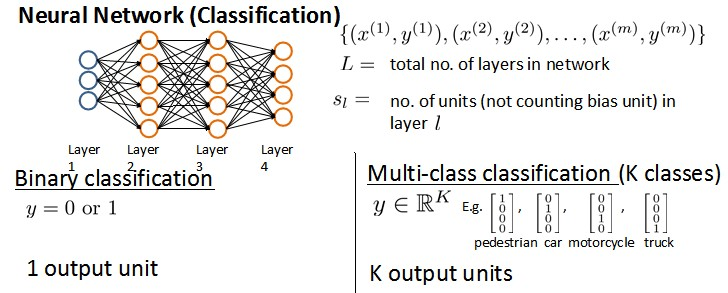
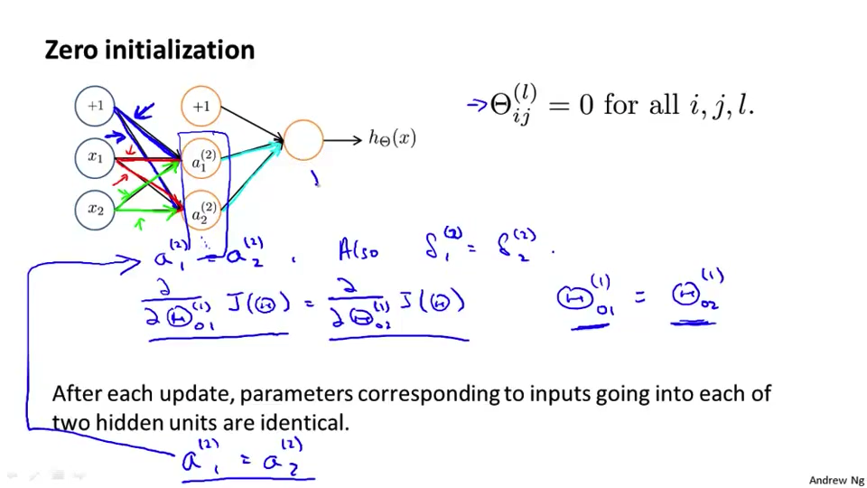

[TOC]

九、神经网络的学习(Neural Networks: Learning)
---------------------------------------------

### 9.1 代价函数

参考视频: 9 - 1 - Cost Function (7 min).mkv

​	首先引入一些便于稍后讨论的新标记方法：

1. 假设神经网络的训练样本有$m$个，每个包含一组输入$x$和一组输出信号$y$

2. $L$表示神经网络层数

3. $S_l$表示第$l$层的**neuron**个数，不包括偏差单元 

4. $S_L$代表最后一层中处理单元的个数  如$S_L = 4$

   

​	将神经网络的分类定义为两种情况：二类分类和多类分类，

- 二类分类**Binary classification**：$S_L=1, y=0\, or\, 1$表示哪一类

- $K$-类分类**Multi-class classification**：$S_L=K, y_i = 1$表示分到第$i$类；$(k>2)$

​	我们回顾**正则化的逻辑回归模型中的代价函数**为：
$$
J\left(\theta \right)=-\frac{1}{m}\left[\sum_\limits{i=1}^{m}{y}^{(i)}\log{h_\theta({x}^{(i)})}+\left(1-{y}^{(i)}\right)log\left(1-h_\theta\left({x}^{(i)}\right)\right)\right]+\frac{\lambda}{2m}\sum_\limits{j=1}^{n}{\theta_j}^{2}
$$
​	在逻辑回归中，我们只有一个输出变量，又称标量**scalar**，也只有一个因变量$y$.

​	但是在神经网络中，我们可以有很多输出变量，我们的**$h_\theta(x)$是一个维度为$K$的向量**，${\left({h_\theta}\left(x\right)\right)}_{i}={i}^{th} \text{output}$ 表示的是选择了神经网络输出向量的第$i$个元素。我们训练集中的因变量也是同样维度的一个向量，因此我们的代价函数会比逻辑回归更加复杂一些:
$$
\large{
h_\theta\left(x\right)\in \mathbb{R}^{K}
\qquad
{\left({h_\theta}\left(x\right)\right)}_{i}={i}^{th} \text{output}}\\
\large{
J(\Theta) = -\frac{1}{m} \left[ \sum\limits_{i=1}^{m} \sum\limits_{k=1}^{k} {y_k}^{(i)} \log {(h_\Theta(x^{(i)}))} + ( 1 - y_k^{(i)} ) \log \left( 1- {( h_\Theta ( x^{(i)} ) )} \right) \right] \\\qquad \qquad + \frac{\lambda}{2m} \sum\limits_{l=1}^{L-1} \sum\limits_{i=1}^{s_l} \sum\limits_{j=1}^{s_{l+1}} \left( \Theta_{ji}^{(l)} \right)^2}
$$

- 函数解释：

  1. 这个看起来复杂很多的代价函数背后的思想还是一样的，我们希望通过代价函数来观察算法预测的结果与真实情况的误差有多大，唯一不同的是，对于每一行特征，我们都会给出$K$个预测，基本上我们可以利用循环，对每一行特征都预测$K$个不同结果，然后在利用循环在$K$个预测中选择可能性最高的一个，将其与$y$中的实际数据进行比较。

  2. 在函数的第一部分中我们额外添加了求出各个节点的代价函数的求和，

  3. 在正则化部分，是排除了每一层$\theta_0$后，每一层的$\theta$ 矩阵的和。在当前$\Theta$矩阵中

     - 列数$i$ = ==我们当前层中的节点数==（包括偏差单元）: 循环$i$则循环所有的列，由该层（$s_l$层）的激活单元数所决定。

     - 行数$j$ = ==下一层的节点数==（不包括偏置单元）: 循环$j$循环所有的行（由$s_{l+1}$  层的激活单元数决定）。

  4. 综合即，$h_\theta(x)$与真实值之间的距 离为每个样本-每个类输出的加和，对参数进行**regularization**的**bias**项处理所有参数的平方和。

### 9.2 反向传播算法(1)

参考视频: 9 - 2 - Backpropagation Algorithm (12 min).mkv

​	反向传播是神经网络中用于最小化代价函数的一个方法，类似于在logistic回归和线性回归中使用的梯度下降，目标都是计算
$$
\underset{\Theta }{\mathop{\min }}J\left( \theta  \right)
$$
​	也就是说，我们需要找到一个最佳的参数来最小化$J$，因此我们需要计算：

1. $J\left( \Theta  \right)$

2. $J(\Theta)$的偏导数$\frac{\partial}{\partial\Theta_{i,j}^{(l)}}J(\Theta)$

​	现在，为了计算代价函数的偏导数，我们需要采用一种反向传播算法**Backpropagation Algorithm**。

​	以一个例子来说明反向传播算法。

​	假设我们的==训练集只有一个样本$(x,y)$==，我们的神经网络是一个四层的神经网络，其中$K=4，S_{L}=4，L=4$：

- 前向传播算法

  ​	使用前向传播来计算一下在给定输入的时候，假设函数是否会真的输出结果。具体地说，这里的$a^{(1)}$就是第一层的激励值，也就是输入层所在的地方，所以设定它为$x$。$a^{(2)}$是隐藏层也就是第二层的激励值,经过一个S型激励函数$g(z)$，同时还会增加一个偏差单元$a_0^{(2)}$,然后可以得出后续的$a^{(3)},a^{(4)}$。

- 反向传播算法

  ​	为了计算导数项，将采用反向传播的算法。反向传播算法从直观上说，就是对每一个节点

  ​	 $\delta_j^{(l)}$     代表的是第$l$层的第$j$个节点的==误差==

  ​	 $a_j^{(l)}$     代表的是第$l$层第$j$个单元的==激励值==

  所以这个$\delta$在某种程度上就捕捉到了在这 个神经节点的激励值的误差，所以我们可能希望这个节点激励值稍微不一样。

  

  

  ​	如上图，用这个有四层的神经网络结构做例子：

  - 对于**第四层**

  $$
  \large{
  \delta_j^{(4)} = a_j^{(4)} - y_j }\\
  \delta_j^{(4)} = (h_\theta(x))_j - y_j
  $$

  ​		即第四层第$j$个节点激励值与实际值的误差，用向量方式表示就是
  $$
  \delta^{(4) }= a^{(4)} - y
  $$
  ​		其中$\delta,a,y$向量的维数就是输出单元的个数。

  - 对于**第三层**，实际上是
    $$
    \large{
    \delta_j^{(3)} = (\Theta^{(3)})^T\delta^{(4)}.*g'(z^{(3)})}
    $$

    - 解释	

      1. .*$点乘指的是两个向量元素间对应相乘。

      2. $g'(z^{(3)})$是对激励函数$g$在输入值为$z(3)$的时候所求的导数。 
         $$
         g'(z^{(3)}) = a^{(3)}.*(1-a^{(3)})
         $$

         -  $a^{(3)}$是一个对那一层的激励向量
         - 1是以1为元素的向量（这一块没看懂）。

  - 对于**第二层**，实际上是

  $$
  \large{
  \delta_j^{(2)} = (\Theta^{(2)})^T\delta^{(3)}.*g'(z^{(2)})}
  $$

  $$
  g'(z^{(2)}) = a^{(2)}.*(1-a^{(2)})
  $$

  - 对于**第一层**

    ​	是没有$\delta_j^{(1)}$项，因为第一层是输入层，即实际的训练集观察到的，因此不会有误差。

​	反向传播算法也就是==首先计算最后一层的误差，然后再一层一层反向求出各层的误差，直到倒数第二层==。

​	利用反向传播算法，在忽略正则化项时，我们可以得出
$$
\frac{\partial}{\partial\Theta_{ij}^{(l)}}J(\Theta) = a_j^{(l)}\delta_i^{(l+1)}
$$
通过反向传播，可以计算出这些$\delta$项进而计算出所有参数的偏导数项。

### 9.3 反向传播算法(2)

​	当我们==有一个**非常大**的训练样本==时如何来计算关于这些参数的偏导数，使用下面的算法：

1. 假设有一组训练集$\{(x^{(1)},y^{(1)}),...(x^{(m)},y^{(m)})\}$，

2. 假设对于所有的$l,i,j$都有$\Delta_{ij}^{(l)} = 0$，这个$\Delta_{ij}^{(l)}$实际上是用来计算
   $$
   \frac{\partial}{\partial\Theta_{ij}^{(l)}}J(\Theta)
   $$
   这些$\Delta$会被作为累加项慢慢的增加以算出这些偏导数。

3. 接下来先循环我们的训练集 for $i=1$ to $m$

   1. 设定$a^{(1)} = x^{(i)}$，

      - $a^{(1)} $     输入层的激励函数
      - $x^{(i)}$     第i个训练样本的输入值

   2. 使用**前向传播算法**来计算所有的$a^{(l)}$直到最后一层L

   3. 使用这个样本的输出值$y^{(i)}$来计算这个输出值对应的**误差项$\delta^{(L)}$**，即假设输出减去目标输出

   4. 使用**反向传播算法**来计算$\delta^{(L-1)},\delta^{(L-2)},\delta^{(L-3)},....,\delta^{(2)}$,注意没有$\delta_j^{(1)}$项

   5. 最后将大写的$\Delta$来累计我们在前面写好的偏导数项，即：
      $$
      \Delta_{ij}^{(l)} := \Delta_{ij}^{(l)} + a_j^{(l)}\delta_i^{(l+1)}
      $$
      如果把$\Delta_{ij}$看作一个矩阵，$i,j$代表矩阵中的位置，那么该等式可以用向量的方式表示为
      $$
      \Delta^{(l)} := \Delta^{(l)} + \delta^{(l+1)}(a^{(l)})^T
      $$

   6. 结束循环

4. 根据$j$是否等于0来分两种情况计算
   $$
   \begin{array}{l}
   D_{i j}^{(l)}:=\frac{1}{m} \Delta_{i j}^{(l)}+\lambda \Theta_{i j}^{(l)} \qquad \text { if } {j \neq 0} \\
   D_{i j}^{(l)}:=\frac{1}{m} \Delta_{i j}^{(l)} \qquad \qquad\qquad \text { if } {j = 0}
   \end{array}
   $$
   当$j=0$时对应偏差项，因此没有加上额外的标准化项。

5. 这样，得到的就是代价函数对每一个参数的偏导数
   $$
   \frac{\partial}{\partial\Theta_{i,j}^{(l)}}J(\Theta) = D_{i j}^{(l)}
   $$
   这样就可以使用梯度下降法或是其他高级算法了。

### 9.4 反向传播算法的直观理解

参考视频: 9 - 3 - Backpropagation Intuition (13 min).mkv

​	为了更好地理解反向传播算法，我们再来仔细研究一下前向传播的原理。

​	如上图所示的神经网络，输入层，隐藏层各有两个单元（不包含偏差单元），输出层有一个单元。

​	反向传播算法做的是：
$$
J(\Theta) = -\frac{1}{m} \left[ \sum\limits_{i=1}^{m} \sum\limits_{k=1}^{k} {y_k}^{(i)} \log {(h_\Theta(x^{(i)}))} + ( 1 - y_k^{(i)} ) \log \left( 1- {( h_\Theta ( x^{(i)} ) )} \right) \right] \\\qquad \qquad + \frac{\lambda}{2m} \sum\limits_{l=1}^{L-1} \sum\limits_{i=1}^{s_l} \sum\limits_{j=1}^{s_{l+1}} \left( \Theta_{ji}^{(l)} \right)^2
$$
​	如果我们只考虑**一个简单样本**$x^{(i)},y^{(i)}$且只有一个输出单元的情况，即$k=1$，且忽略正则项($\lambda = 0$)那么代价函数则变成：
$$
\operatorname{cost}(i)=y^{(i)} \log \left(h_{\Theta}(x^{(i)})\right)+\left(1-y^{(i)}\right) \log \left(h_{\Theta}(x^{(i)})\right)
$$
​	我们可以认为$cost(i) ≈ (h_\Theta(x^{(i)})-y^{(i)})^2$  

- $\delta^{(l)}_{j}=\text {'error' of cost for }\ a^{(l)}_{j} \ \text{(unit j in layer }\ l)$ 理解如下：

  1. $\delta^{(l)}_{j}$ 相当于是第 $l$ 层的第 $j$ 单元中得到的激活项的“误差”，即”正确“的 $a^{(l)}_{j}$ 与计算得到的 $a^{(l)}_{j}$ 的差。

  2. 又因为 $a^{(l)}_{j}=g(z^{(l)})$ ，（$g$为sigmoid函数）。我们可以想象 $\delta^{(l)}_{j}$ 为函数求导时迈出的那一丁点微分。
  3. 更准确的说 $\delta^{(l)}_{j}=\frac{\partial}{\partial z^{(l)}_{j}}cost(i)$

​	由于函数的导数即是其切线的斜率，因此其切线越陡则说明计算的误差越大。每一个神经元的误差都与后面连接的神经元有关。

### 9.5 神经网络与反向传播推导与总结

###  9.5 梯度检验

参考视频: 9 - 5 - Gradient Checking (12 min).mkv

​	当我们对一个较为复杂的模型（例如神经网络）使用梯度下降算法时，可能会存在一些不容易察觉的错误，意味着，虽然代价看上去在不断减小，但最终的结果可能并不是最优解。

​	为了避免这样的问题，我们采取一种叫做梯度检验**Numerical Gradient Checking**的数值检验方法。这种方法的思想是通过估计梯度值来检验我们计算的导数值是否真的是我们要求的。

	

1. 双侧差分**two-sided difference**

   ​	 ==在代价函数上沿着切线的方向选择离两个非常近的点，然后计算两个点的平均值用以估计梯度==

   ​	如估计在$\theta$这一点的导数，对于这个特定的 $\theta$，我们计算出在 $\theta$-$\varepsilon $ 处和 $\theta$+$\varepsilon $ 的代价值，然后求两个代价的平均，用以估计在 $\theta$ 处的代价值。

   ​	$\varepsilon $是一个非常小的值，通常选取 0.001

$$
\frac{\partial}{\partial \Theta} J(\Theta) \approx \frac{J(\Theta+\epsilon)-J(\Theta-\epsilon)}{2 \epsilon}
\\
$$

2. 单侧差分**one-sided difference** ❎
   $$
   \frac{\partial}{\partial \Theta} J(\Theta) \approx \frac{J(\Theta+\epsilon)-J(\Theta)}{\epsilon}
   \\
   $$

​	当$\theta$是一个向量时，我们则需要对偏导数进行检验。因为代价函数的偏导数检验只针对一个参数的改变进行检验，

​	下面是一个只针对$\theta_1$进行检验的示例：
$$
\frac{\partial}{\partial\theta_1}=\frac{J\left(\theta_1+\varepsilon,\theta_2,\theta_3...\theta_n \right)-J \left( \theta_1-\varepsilon,\theta_2,\theta_3...\theta_n \right)}{2\varepsilon}
$$
​	针对$\theta_n$进行检验:
$$
\frac{\partial}{\partial\theta_n}=\frac{J\left(\theta_1,\theta_2,\theta_3...\theta_n+\varepsilon \right)-J \left( \theta_1,\theta_2,\theta_3...\theta_n-\varepsilon \right)}{2\varepsilon}
$$

​	根据上面的算法，计算出的偏导数存储在矩阵 $D_{ij}^{(l)}$ 中。检验时，我们要将该矩阵展开成为向量，同时我们也将 $\theta$ 矩阵展开为向量，我们针对每一个 $\theta$ 都计算一个近似的梯度值，将这些值存储于一个近似梯度矩阵中，最终将得出的这个矩阵同 $D_{ij}^{(l)}$ 进行比较。

​	我们已经计算过deltaVector，而这个梯度检测的过程是非常耗费算力的，所以尽量在你认为有需要的位置做梯度监测，因此计算出gradApprox后就可以判断是否gradApprox ≈ deltaVector。一旦人为梯度没有问题，就将监测过程关闭，而不是在整个过程中，这个尤其要注意。

### 9.6 随机初始化

参考视频: 9 - 6 - Random Initialization (7 min).mkv

​	任何优化算法都需要一些初始的参数。到目前为止我们都是初始所有参数为0，这样的初始方法对于逻辑回归来说是可行的，但是对于神经网络来说是不可行的。

​	如果我们令所有的初始参数都为0，这将意味着我们第二层的所有激活单元都会有相同的值。同理，如果我们初始所有的参数都为一个非0的数，结果也是一样的。

​	

​	我们通常初始参数为==$\Theta_{ij}^{(l)}$为$[-\epsilon,\epsilon]$之间的随机值==，使用上述公式保证我们得到所需的界限，相同的程序使用于所有的$\Theta$。

### 9.7 综合起来

参考视频: 9 - 7 - Putting It Together (14 min).mkv

小结一下使用神经网络时的步骤：

1. 第一件要做的事是`选择网络结构`，即决定选择多少层以及决定每层分别有多少个单元。

   

   - 第一层的单元数即我们训练集的特征数量。
   - 最后一层的单元数是我们训练集的结果的类的数量。
     - $y$需要用向量表示，如$y=[1,0,0,...,0]^T$，而不能直接用某个数值表示
     - 如果隐藏层数大于1，确保每个隐藏层的单元个数相同。如上图三个隐藏层均有5个隐藏单元。

   - 通常情况下隐藏层单元的个数越多越好。

   - 我们真正要决定的是隐藏层的层数和每个中间层的单元数。

2. 训练神经网络：
   1. 参数的`随机初始化`

      ​		**Randomly initialize weights**

   2. 利用`正向传播`方法计算所有的$h_{\theta}(x^{(i)})$ 

      ​		**Implement forward propagation to get $h_{\theta}(x^{(i)})$ for any $x^{(i)}$**

   3. 编写计算`代价函数` $J(\Theta)$ 的代码

      ​		**Implement code to compute cost function $J(\Theta)$ **

   4. 利用`反向传播`方法计算所有偏导数$\frac{\partial}{\partial z^{(l)}_{j}}cost(i)$

      ​		**Implement backprop to compute partial derivatives$\frac{\partial}{\partial z^{(l)}_{j}}cost(i)$**

      ​	具体参考 9.3节反向传播算法(2)

   5. 利用`数值检验`方法检验这些偏导数

      ​		**Use gradient checking to compare $\frac{\partial}{\partial z^{(l)}_{j}}cost(i)$ computed using backpropagation vs using numerical estimate of gradient of $J(\Theta)$
      ​		Then disable gradient checking code**

   6. 使用优化算法来`最小化代价函数`

      ​		**Use gradient descent or advanced optimization method with backpropagation to try to minimize $J(\Theta)$ as a function of parameters $\Theta$**

​		

### 9.8 自主驾驶

参考视频: 9 - 8 - Autonomous Driving (7 min).mkv

​	在这段视频中，我想向你介绍一个具有历史意义的神经网络学习的重要例子。那就是使用神经网络来实现自动驾驶，也就是说使汽车通过学习来自己驾驶。接下来我将演示的这段视频是我从 Dean Pomerleau那里拿到的，他是我的同事，任职于美国东海岸的卡耐基梅隆大学。在这部分视频中，你就会明白可视化技术到底是什么？在看这段视频之前，我会告诉你可视化技术是什么。

​	在下面也就是左下方，就是汽车所看到的前方的路况图像。

​	 在图中你依稀能看出一条道路，朝左延伸了一点，又向右了一点，然后上面的这幅图，你可以看到一条水平的菜单栏显示的是驾驶操作人选择的方向。就是这里的这条白亮的区段显示的就是人类驾驶者选择的方向。比如：最左边的区段，对应的操作就是向左急转，而最右端则对应向右急转的操作。因此，稍微靠左的区段，也就是中心稍微向左一点的位置，则表示在这一点上人类驾驶者的操作是慢慢的向左拐。

​	这幅图的第二部分对应的就是学习算法选出的行驶方向。并且，类似的，这一条白亮的区段显示的就是神经网络在这里选择的行驶方向，是稍微的左转，并且实际上在神经网络开始学习之前，你会看到网络的输出是一条灰色的区段，就像这样的一条灰色区段覆盖着整个区域这些均称的灰色区域，显示出神经网络已经随机初始化了，并且初始化时，我们并不知道汽车如何行驶，或者说我们并不知道所选行驶方向。只有在学习算法运行了足够长的时间之后，才会有这条白色的区段出现在整条灰色区域之中。显示出一个具体的行驶方向这就表示神经网络算法，在这时候已经选出了一个明确的行驶方向，不像刚开始的时候，输出一段模糊的浅灰色区域，而是输出一条白亮的区段，表示已经选出了明确的行驶方向。

​	**ALVINN** (**Autonomous Land Vehicle In a Neural Network**)是一个基于神经网络的智能系统，通过观察人类的驾驶来学习驾驶，**ALVINN**能够控制**NavLab**，装在一辆改装版军用悍马，这辆悍马装载了传感器、计算机和驱动器用来进行自动驾驶的导航试验。实现**ALVINN**功能的第一步，是对它进行训练，也就是训练一个人驾驶汽车。

​	然后让**ALVINN**观看，**ALVINN**每两秒将前方的路况图生成一张数字化图片，并且记录驾驶者的驾驶方向，得到的训练集图片被压缩为30x32像素，并且作为输入提供给**ALVINN**的三层神经网络，通过使用反向传播学习算法，**ALVINN**会训练得到一个与人类驾驶员操纵方向基本相近的结果。一开始，我们的网络选择出的方向是随机的，大约经过两分钟的训练后，我们的神经网络便能够准确地模拟人类驾驶者的驾驶方向，对其他道路类型，也重复进行这个训练过程，当网络被训练完成后，操作者就可按下运行按钮，车辆便开始行驶了。

​	每秒钟**ALVINN**生成12次数字化图片，并且将图像传送给神经网络进行训练，多个神经网络同时工作，每一个网络都生成一个行驶方向，以及一个预测自信度的参数，预测自信度最高的那个神经网络得到的行驶方向。比如这里，在这条单行道上训练出的网络将被最终用于控制车辆方向，车辆前方突然出现了一个交叉十字路口，当车辆到达这个十字路口时，我们单行道网络对应的自信度骤减，当它穿过这个十字路口时，前方的双车道将进入其视线，双车道网络的自信度便开始上升，当它的自信度上升时，双车道的网络，将被选择来控制行驶方向，车辆将被安全地引导进入双车道路。

​	这就是基于神经网络的自动驾驶技术。当然，我们还有很多更加先进的试验来实现自动驾驶技术。在美国，欧洲等一些国家和地区，他们提供了一些比这个方法更加稳定的驾驶控制技术。但我认为，使用这样一个简单的基于反向传播的神经网络，训练出如此强大的自动驾驶汽车，的确是一次令人惊讶的成就。