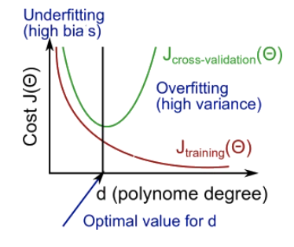
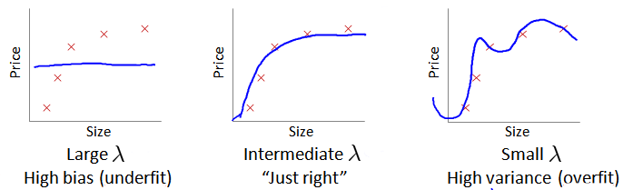

[TOC]
十、应用机器学习的建议(Advice for Applying Machine Learning)
------------------------------------------------------------

### 10.1 决定下一步做什么

参考视频: 10 - 1 - Deciding What to Try Next (6 min).mkv

​	假设我们需要用一个线性回归模型来预测房价，当我们运用训练好了的模型来预测未知数据的时候**发现有较大的误差**，我们下一步可以做什么？

1. `使用更多的训练样本`。具体来讲，也许你能想到通过电话调查或上门调查来获取更多的不同的房屋出售数据。遗憾的是，我看到好多人花费了好多时间想收集更多的训练样本。但有时候获得更多的训练数据实际上并没有作用。

2. 尝试`选用更少的特征集`。因此如果你有一系列特征比如$x_1,x_2,x_3$等等。也许有很多特征，也许你可以花一点时间从这些特征中仔细**挑选一小部分**来防止过拟合。

3. 可以从`获取更多特征`的角度来收集更多的数据，同样地，你可以把这个问题扩展为一个很大的项目，比如使用电话调查来得到更多的房屋案例，或者再进行土地测量来获得更多有关，这块土地的信息等等。

4. 我们也可以`尝试增加多项式特征`的方法，比如$x_1^2$，$x_2^2$，$x_1x_2$

5. 我们也可以考虑其他方法`减小或增大正则化参数λ的值`。

​	幸运的是，有一系列简单的方法能让你事半功倍，排除掉单子上的至少一半的方法，留下那些确实有前途的方法，同时也有一种很简单的方法，最终达到改进机器学习系统性能的目的，而不是随机选择上面的某种方法来改进我们的算法。

​	在接下来的两段视频中，我首先介绍怎样评估机器学习算法的性能，然后在之后的几段视频中，我将开始讨论这些方法，它们也被称为机器学习诊断法**machine learning diagnostic**。

​	“诊断法”的意思是：这是一种测试法，你通过执行这种测试，能够深入了解某种算法到底是否有用。这通常也能够告诉你，要想改进一种算法的效果，什么样的尝试，才是有意义的。

​	在这一系列的视频中我们将介绍具体的诊断法，但我要提前说明一点的是，这些诊断法的执行和实现，是需要花些时间的，有时候确实需要花很多时间来理解和实现，但这样做的确是把时间用在了刀刃上，因为这些方法让你在开发学习算法时，节省了几个月的时间。

### 10.2 评估一个假设

参考视频: 10 - 2 - Evaluating a Hypothesis (8 min).mkv

​	在本节视频中我想介绍一下怎样用你学过的算法来评估假设函数。在之后的课程中，我们将以此为基础来讨论如何避免过拟合和欠拟合的问题。


​	当我们确定学习算法的参数的时候，我们考虑的是选择参量来使训练误差最小化，但我仅仅是因为这个假设具有很小的训练误差，并不能说明它就一定是一个好的假设函数。而且我们也学习了过拟合假设函数的例子，所以这推广到新的训练集上是不适用的。

​	那么，你该如何判断一个假设函数是过拟合的呢？对于这个简单的例子，我们可以对假设函数$h(x)$进行画图，然后观察图形趋势，但对于特征变量不止一个的这种一般情况，还有像有很多特征变量的问题，想要通过画出假设函数来进行观察，就会变得很难甚至是不可能实现。

​	因此，我们需要另一种方法来评估我们的假设函数过拟合检验。

​	为了**检验算法是否过拟合**，我们将数据分成

1. `训练集`（通常用70%的数据）
2. `测试集`（用剩下30%的数据）

​    很重要的一点是训练集和测试集均要含有各种类型的数据，通常我们要对数据进行“洗牌”，然后再分成训练集和测试集。


​	

​	测试集评估在通过训练集让我们的模型学习得出其参数后，对测试集运用该模型，我们有两种方式计算误差：

1. 对于线性回归模型，我们利用测试集数据计算代价函数$J$
   $$
   J_{\text {test }}(\Theta)=\frac{1}{2 m_{\text {test }}} \sum_{i=1}^{m_{\text {test }}}
   (h_{\Theta}(x_{test}^{(i)})-y_{text}^{(i)})^{2}
   $$
   
2. 对于逻辑回归模型

   - 利用测试数据集来计算代价函数
     $$
     J_{test}{(\theta)} = -\frac{1}{{m}_{test}}\sum_\limits{i=1}^{m_{test}}\log{h_{\theta}(x^{(i)}_{test})}+(1-{y^{(i)}_{test}})\log{h_{\theta}(x^{(i)}_{test})}
     $$

   - 使用误分类比率**misclassification error**，对于每一个测试集样本，计算：
     $$
     \operatorname{err}\left(h_{\theta}(x), y\right)=\left\{\begin{array}{c}
     1 \text { if } h(x) \geq 0.5 \text { and } y=0 \text { , or if } h(x)<0.5 \text { and } y=1 \\
     0 \text { ,otherwise }
     \end{array}\right.
     $$
     然后对计算结果求平均
     $$
     \text { TestError }=
     \frac{1}{2 m_{\text {test }}} \sum_{i=1}^{m_{\text {test }}} {err}\left(h_{\theta}(x^{(i)}_{test}), y^{(i)}\right)
     $$

### 10.3 模型选择和交叉验证集

参考视频: 10 - 3 - Model Selection and Train_Validation_Test Sets (12 min).mkv

​	假设我们要在10个不同次数的二项式模型之间进行选择：


​	显然越高次数的多项式模型越能够适应我们的训练数据集，但是适应训练数据集并不代表着能推广至一般情况，我们应该选择一个更能适应一般情况的模型。

​	我们需要使用交叉验证集来帮助选择模型。

1. `训练集`（60%的数据）---- **确定参数**
2. `交叉验证集CV`（20%的数据）---- **确定模型**
3. `测试集`（20%的数据）---- **测试泛化**


-  模型选择的方法为：

1.  通过`训练集`来针对每一个级数的多项式来最优化参数θ   ---- **确定参数**
2.  用模型分别对`交叉验证集`计算得出交叉验证误差（代价函数的值）
3.  通过**交叉验证集来找到误差最小的级数d**   ---- **确定模型**
4. 用步骤3中选出的模型对`测试集`计算得出推广误差$J_{test}(\Theta^d)$   ---- **测试泛化**


因此多项式的级数就不用通过测试集训练得到了。

 

### 10.4 诊断偏差和方差

参考视频: 10 - 4 - Diagnosing Bias vs. Variance (8 min).mkv

- **偏差Bisas：**描述的是预测值（估计值）的期望与真实值之间的差距。偏差越大，越偏离真实数据     ----      `训练集`

- **方差Variance：**描述的是预测值的变化范围，离散程度，也就是离其期望值的距离。方差越大，数据的分布越分散     ----      `测试集`


​	当你运行一个学习算法时，如果这个算法的表现不理想，那么多半是出现两种情况：

1. 高偏差**high bias**            --   欠拟合
2. 高方差**high variance**    --   过拟合

   理想情况下，我们要在这两者之间找到最佳的平均值。


​	我们通常会通过将**训练集**和**交叉验证集**的`代价函数误差`与`多项式的次数`绘制在同一张图表上来帮助分析：

**Training error:**				               
$$
J_{train}(\theta) = \frac{1}{2m}\sum_\limits{i=1}^{m}(h_{\theta}(x^{(i)})-y^{(i)})^2
$$
**Cross Validation error:**				
$$
J_{cv}(\theta) = \frac{1}{2m_{cv}}\sum_\limits{i=1}^{m}(h_{\theta}(x^{(i)}_{cv})-y^{(i)}_{cv})^2
$$


1. 对于`训练集`，当 $d$ 较小时，模型拟合程度更低，误差较大；随着 $d$ 的增长，拟合程度提高，误差减小。
2. 对于`交叉验证集`，当 $d$ 较小时，模型拟合程度低，误差较大；但是随着 $d$ 的增长，误差呈现先减小后增大的趋势，==转折点是我们的模型开始过拟合训练数据集的时候==。

​    我们期望的理想状况是，训练集和测试集的两条精度曲线相距较近，并且随着训练样本数量的增加，越来越近，逐渐收敛。   

​	如果我们的交叉验证集误差较大，我们如何判断是方差还是偏差呢？根据上面的图表，我们知道:


总的来说：

- **High bias (underfitting)**: both $J_{\text {train }}(\Theta)$ and $J_{C V}(\Theta)$ will be high. Also, $J_{C V}(\Theta) \approx J_{\text {train }}(\Theta)$.
- **High variance (overfitting)**: $J_{\text {train }}(\Theta)$ will be low and $J_{C V}(\Theta)$ will be much greater than $J_{\text {train }}(\Theta)$.

- 训练集误差和交叉验证集误差==近似==时：偏差/欠拟合
- 交叉验证集误差远大于训练集==误差==时：方差/过拟合


### 10.5 正则化和偏差/方差

参考视频: 10 - 5 - Regularization and Bias_Variance (11 min).mkv

​	在我们在训练模型的过程中，一般会使用一些**正则化**方法来防止过拟合。但是我们可能会正则化的程度太高或太小了，即我们在选择$\lambda$的值时也需要思考与刚才选择多项式模型次数类似的问题。

$$
\begin{array}{l}
h_{\theta}(x)=\theta_{0}+\theta_{1} x+\theta_{2} x^{2}+\theta_{3} x^{3}+\theta_{4} x^{4} \\
J\left( \theta  \right)=\frac{1}{2m}[\sum\limits_{i=1}^{m}{{{({h_\theta}({{x}^{(i)}})-{{y}^{(i)}})}^{2}}+\lambda \sum\limits_{j=1}^{n}{\theta_{j}^{2}}]}\\
\end{array}
$$


- 当$\lambda$很大，对于$\theta_1$,$\theta_2$..的惩罚都很大，则假设函数将会等于或近似于$\theta_0$,最终得到的假设函数就是一条直线，因此这个假设对于数据严重欠拟合。

- 当$\lambda$很小时，趋向于0，那么正则化项趋向于0，得到的假设函数则会出现过拟合的情况。
- 当我们取一个比较合适的$\lambda$时，我们才能得到对数据拟合比较合理的$\theta$的值。


​	那么如何选择合适的正则化参数$\lambda$呢，具体有如下几个步骤：

1. 我们选择一系列的想要测试的 $\lambda$ 值，通常是 0-10之间的呈现2倍关系的值。 

   我们同样把数据分为`训练集`、`交叉验证集`和`测试集`。


2. 使用`训练集`训练出不同程度正则化的模型
  
3. 用模型分别对`交叉验证集`计算的出交叉验证误差
  
4. 选择得出交叉验证误  差**最小**的模型  ---- **确定模型**

5. 运用步骤3中选出模型对`测试集`计算得出推广误差
   $$
   J_{test}(\theta)=\frac{1}{2m_{test}}\sum_\limits{i=1}^{m_{test}}(h_{\theta}(x^{(i)}_{cv})-y^{(i)}_{cv})^2
   $$

​    我们也可以同时将`训练集`和`交叉验证集`模型的代价函数误差与λ的值绘制在一张图表上：


- 对于训练集的误差$J_{train}(\theta)$随着$\lambda$值的增加而增加，因为$\lambda$的值增大会对应着高偏差问题，此时连训练集都不能很好的拟合，当$\lambda$很小时，对应着你可以很容易地用高次多项式拟合你的数据。

- 对于交叉验证集的误差$J_{cv}(\theta)$，如图中粉色的图像所示，当$\lambda$很大时，会出现欠拟合问题，因此是那一片是高偏差区域，此时交叉验证集的误差会很大，当$\lambda$很小时，会出现过拟合问题，对应的是高方差问题，因此交叉验证集的误差也会很大。

- 同样的，总会有中间的某个点对应的$\lambda$表现的结果正好合适，交叉验证误差和测试误差都很小。


### 10.6 学习曲线

参考视频: 10 - 6 - Learning Curves (12 min).mkv

​	学习曲线就是一种很好的工具，我经常使用学习曲线来判断某一个学习算法是否处于偏差、方差问题。学习曲线是学习算法的一个很好的**合理检验**（**sanity check**）。

​	学习曲线是将`训练集误差`和`交叉验证集误差`作为训练集样本数量（$m$）的函数绘制的图表。

​	当训练集很小的情况下，比如只有两三条数据的时候，我们很容易训练一个二次的算法来拟合数据，并且算法的误差可能几乎为0，因此，

- 当训练集增大时，二次函数的误差将会增加
- 随着集合数据的增加，最终的误差会渐渐趋向于平稳

- 随着训练集的增加，交叉验证集的误差将会慢慢减小知道趋向于某一个值，因为拟合数据越多，就越能拟合出合适的假设。


​	综上，当训练较少数据的时候，训练的模型将能够非常完美地适应较少的训练数据，但是训练出来的模型却不能很好地适应交叉验证集数据或测试集数据。

​	如何利用学习曲线识别**高偏差（欠拟合）**，**高方差（过拟合）**

1. 识别**高偏差（欠拟合）**

   ​	作为例子，我们尝试用一条直线来适应下面的数据，可以看出

   - 若训练集量比较小，那么拟合效果当然不好，导致交叉验证集的误差会很大，那么随着训练集的增加，拟合效果渐渐的变好了，交叉验证集的误差也会渐渐变小,当训练集增大到某一个量时，我们可能就会找到一条最有可能拟合数据的直线，并且此时即便继续增加训练集的样本容量，还是会得到一条差不多的结果。

   - 那么对于训练误差，一开始也是很小的，但在高偏差的情况下，训练集的误差会逐渐增大直到最后接近交叉验证误差，这是因为你的参数很小，但又有很多数据，当$m$很大时，训练集和交叉验证集的误差将会非常接近。

   

   ​	总的来说能得出一个结论，==如果一个算法有高偏差，那么选用更多的训练集数据并不能很好的改善模型。==

2. 识别**高方差（过拟合）**

   ​	假设我们使用一个非常高次的多项式模型，并且正则化非常小，可以看出

   - 一开始训练集的误差是很小的，但随着训练集容量的增加，误差会渐渐变大，也就是说数据越多，就越难将训练集数据拟合的很好，但总的来说，训练集的误差还是很小。

   - 那么对于交叉验证集，由于是高方差的情况，误差会一直都很大，虽然也会慢慢减小，但在训练误差和交叉验证误差之间依然有一段很大的差距。

     

      总的来说得出的结论就是，==如果我们考虑增加训练集样本的容量，对于提高模型的效果还是有一定的帮助的==，因为很显然交叉验证误差再慢慢减小，那么测试集的误差也会慢慢减小

   ​	当然同样这个也能告诉我们==这个模型可能存在高方差的问题==。


### 10.7 决定下一步做什么

参考视频: 10 - 7 - Deciding What to Do Next Revisited (7 min).mkv

​	我们已经介绍了怎样评价一个学习算法，我们讨论了模型选择问题，偏差和方差的问题。那么这些诊断法则怎样帮助我们判断，哪些方法可能有助于改进学习算法的效果，而哪些可能是徒劳的呢？

​	让我们再次回到最开始的例子，在那里寻找答案，这就是我们之前的例子。回顾 10.1 中提出的六种可选的下一步，让我们来看一看我们在什么情况下应该怎样选择：

1. 获得更多的训练样本——解决高方差

2. 尝试减少特征的数量——解决高方差

3. 尝试获得更多的特征——解决高偏差

4. 尝试增加多项式特征——解决高偏差

5. 尝试减少正则化程度λ——解决高偏差

6. 尝试增加正则化程度λ——解决高方差


神经网络的方差和偏差：


- 使用较小的神经网络，类似于参数较少的情况，容易导致高偏差(欠拟合).

- 但计算代价较小使用较大的神经网络，类似于参数较多的情况，容易导致高方差和过拟合，

​    虽然计算代价比较大，但是可以通过正则化手段来调整而更加适应数据。通常选择较大的神经网络并采用正则化处理会比采用较小的神经网络效果要好。

​	对于神经网络中的隐藏层的层数的选择，通常从一层开始逐渐增加层数，为了更好地作选择，可以把数据分为训练集、交叉验证集和测试集，针对不同隐藏层层数的神经网络训练神经网络，然后选择交叉验证集代价最小的神经网络。


十一、机器学习系统的设计(Machine Learning System Design)
--------------------------------------------------------

### 11.1 确定执行的优先级

参考视频: 11 - 1 - Prioritizing What to Work On (10 min).mkv

​	在接下来的视频中，我将谈到机器学习系统的设计。这些视频将谈及在设计复杂的机器学习系统时，你将遇到的主要问题。同时我们会试着给出一些关于如何巧妙构建一个复杂的机器学习系统的建议。下面的课程的的数学性可能不是那么强，但是我认为我们将要讲到的这些东西是非常有用的，可能在构建大型的机器学习系统时，节省大量的时间。

​	以一个垃圾邮件分类器算法为例进行讨论。

​	为了解决这样一个问题，我们首先要做的决定是如何选择并表达特征向量$x$。我们可以选择一个由100个最常出现在垃圾邮件中的词所构成的列表，根据这些词是否有在邮件中出现，来获得我们的特征向量（出现为1，不出现为0），尺寸为100×1。

​	那么如何来提升这个分类器的准确度呢？，例如：
1. 收集更多的数据，让我们有更多的垃圾邮件和非垃圾邮件的样本

2. 基于邮件的路由信息开发一系列复杂的特征

3. 基于邮件的正文信息开发一系列复杂的特征，包括考虑截词的处理

4. 为探测刻意的拼写错误（把**watch** 写成**w4tch**）开发复杂的算法

   

### 11.2 误差分析

参考视频: 11 - 2 - Error Analysis (13 min).mkv

​	在本次课程中，我们将会讲到误差分析（**Error Analysis**）的概念。这会帮助你更系统地做出决定。如果你准备研究机器学习的东西，或者构造机器学习应用程序，最好的实践方法不是建立一个非常复杂的系统，拥有多么复杂的变量；而是构建一个简单的算法，这样你可以很快地实现它。

```
Recommended approach:
1.  Start with a simple algorithm that you can implement quickly.
Implement it and test it on your cross-validation data.
2.  Plot learning curves to decide if more data, more features, etc. are likely to help.
3.  Error analysis: Manually examine the examples(in cross validation set)that your algorithm made errors on. See if you spot any systematic trend in what type of examples it is making errors on
```

构建一个学习算法的推荐方法为：

1. 从一个简单的能快速实现的算法开始，实现该算法并用交叉验证集数据测试这个算法
2. 绘制学习曲线，决定是增加更多数据，或者添加更多特征，还是其他选择
3. 进行误差分析：人工检查交叉验证集中我们算法中产生预测误差的样本，看看这些样本是否有某种系统化的趋势

​	误差分析并不总能帮助我们判断应该采取怎样的行动。有时我们需要尝试不同的模型，然后进行比较，在模型比较时，用数值来判断哪一个模型更好更有效，通常我们是看交叉验证集的误差，而不是在测试集上。


### 11.3 类偏斜的误差度量

参考视频: 11 - 3 - Error Metrics for Skewed Classes (12 min).mkv

​	在前面的课程中，我提到了误差分析，以及设定误差度量值的重要性。那就是，设定某个实数来评估你的学习算法，并衡量它的表现，有了算法的评估和误差度量值。有一件重要的事情要注意，就是使用一个合适的误差度量值，这有时会对于你的学习算法造成非常微妙的影响，这件重要的事情就是偏斜类**skewed classes**的问题。

​	类偏斜情况表现为我们的训练集中有非常多的同一种类的样本，只有很少或没有其他类的样本，即==正负样本的数量偏差太大==

​	举一个判断癌症的问题，这显然是个分类问题，假设y=1为是癌症，反之则判定为不是。我们可能会设计一个算法，该算法的准确率有99%，也就是说1%的误差。但如果癌症患者实际上只占据0.5%，那么设计一个算法，该算法设定y的值恒为0，那么这个算法的误差率只有0.5%。比之前设计的算法的误差要低，但这个算法显然是不符合要求的，因为它设定y的值为一个固定值，这并不是我们想要的。

​	那么在这种情况下，我们需要一个不同的误差度量值，其中一种误差度量值叫做**查准率**（**Precision**）和**召回率**（**Recall**）

​	我们将算法预测的结果分成四种情况：

1. **正确肯定**（**True Positive,TP**）：预测为真，实际为真
2. **正确否定**（**True Negative,TN**）：预测为假，实际为假
3. **错误肯定**（**False Positive,FP**）：预测为真，实际为假
4. **错误否定**（**False Negative,FN**）：预测为假，实际为真

​    则：

- `查准率`=$\frac{TP}{TP+FP}$
  - 例，在所有我们**预测**有恶性肿瘤的病人中，**实际**上有恶性肿瘤的病人的百分比，越高越好。
- `召回率/查全率`=$\frac{TP}{TP+FN}$
  - 例，在所有**实际**上有恶性肿瘤的病人中，**成功预测**有恶性肿瘤的病人的百分比，越高越好。


​	当查准率和召回率都很大时，我们就可以断定该算法是符合我们期望的。上述例子里，恒为0的那个算法的召回率就是0，因此判定该算法是不符合我们所期望的。


### 11.4 查准率和召回率之间的权衡

参考视频: 11 - 4 - Trading Off Precision and Recall (14 min).mkv

​	继续沿用刚才预测肿瘤性质的例子。假使，我们的算法输出的结果在0-1 之间，我们使用阀值0.5 来预测真和假。


​	如果我们希望只在非常确信的情况下预测为真（肿瘤为恶性），即我们希望更高的查准率，我们可以使用比0.5更大的阀值，如0.7，0.9。这样做我们会减少错误预测病人为恶性肿瘤的情况，同时却会增加未能成功预测肿瘤为恶性的情况。

​	那么这个时候，按照公式，`查准率`会变高，`召回率`会变低。

​	如果假设这里希望不漏过更多可能为癌症的患者，那么久可以设定大于等于0.3时判定为癌症

​	根据公式，此时`召回率`会变高，`查准率`会变低。


​	一般来说这里的判定临界值需要根据不同情况来决定。我们可以将不同阀值情况下，查全率与查准率的关系绘制成图表，曲线的形状根据数据的不同而不同：


​	我们希望有一个帮助我们选择这个阀值的方法。

​	一种方法是计算**F1 值**（**F1 Score**），其计算公式为：
$$
{{F}_{1}}Score:2\frac{PR}{P+R}
$$
​	我们选择使得**F1**值最高的阀值。


### 11.5 机器学习的数据

参考视频: 11 - 5 - Data For Machine Learning (11 min).mkv

​	在之前的视频中，我们讨论了评价指标。在这个视频中，我要稍微转换一下，讨论一下机器学习系统设计中另一个重要的方面，这往往涉及到用来训练的数据有多少。在之前的一些视频中，我曾告诫大家不要盲目地开始，而是花大量的时间来收集大量的数据，因为数据有时是唯一能实际起到作用的。但事实证明，在一定条件下，我会在这个视频里讲到这些条件是什么。得到大量的数据并在某种类型的学习算法中进行训练，可以是一种有效的方法来获得一个具有良好性能的学习算法。而这种情况往往出现在这些条件对于你的问题都成立。
​	并且你能够得到大量数据的情况下。这可以是一个很好的方式来获得非常高性能的学习算法。因此，在这段视频中，让我们一起讨论一下这个问题。


​		在有大量的数据的情况下，并在某种类型的学习算法中进行训练。可以是一种获得一个具有良好性能的学习算法 有效的方法。因此在机器学习中有一个共识：

> 取得成功的人不是拥有最好算法的人 而是拥有最多数据的人

​	那么这种说法怎样判断是否正确呢？首先特征x要包含足够的信息来预测y（比如在只给定x的情况下，该领域的专家能自信的预测y），然后，我们要训练一个具有大量参数（能够学习或表示相当复杂的函数）的学习算法，这样可以使得偏差更小，在此之上拥有大量数据的话，可以使得方差减小。这样我们可以得出一个较为良好的算法。

