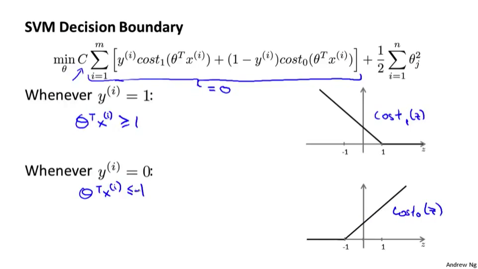

[TOC]
十二、支持向量机(Support Vector Machines)
-----------------------------------------

### 12.1 优化目标

参考视频: 12 - 1 - Optimization Objective (15 min).mkv

​	支持向量机**Support Vector Machine(SVM)**广泛的应用于工业界和学术界，与逻辑回归和神经网络相比，在学习复杂的非线性方程时提供了一种更为清晰，更加强大的方式。

​	为了描述支持向量机，事实上，我将会从**逻辑回归**开始展示我们如何一点一点修改来得到本质上的支持向量机。

$$
h_\theta \left( x \right)=\frac{1}{1+{{e}^{-\theta^{T}X}}}
$$

1. 如果$y=1$的话，现在我们希望${{h}_{\theta }}\left( x \right)$ 趋近1。因为我们想要正确地将此样本分类，这就意味着当 ${{h}_{\theta }}\left( x \right)$趋近于1时，$\theta^Tx$ 应当远大于0，由于 $z$ 表示 $\theta^Tx$，当 $z$远大于0时，即到了该图的右边，你不难发现此时逻辑回归的输出将趋近于1。

2. 如果$y=0$的话，我们希望假设函数的输出值将趋近于0，这对应于$\theta^Tx$，或者就是 $z$ 会远小于0，因为对应的假设函数的输出值趋近0。

逻辑回归的代价函数：
$$
J\left( \theta  \right)=\frac{1}{m}\sum\limits_{i=1}^{m}{[{-{y}^{(i)}}\log \left( {h_\theta}\left( {{x}^{(i)}} \right) \right)-\left( 1-{{y}^{(i)}} \right)\log \left( 1-{h_\theta}\left( {{x}^{(i)}} \right) \right)]}
$$
其中：
$$
h_\theta\left( x \right)=g(\theta^TX)\\
g\left( z \right)=\frac{1}{1+{{e}^{-z}}}\\
$$

对于Logistic回归的**一个样本**的代价则可以表示为：
$$
-\left(y \operatorname{logh}_{\theta}(x)+(1-y) \log \left(1-h_{\theta}(x)\right)\right) \\=-y \log \frac{1}{1+e^{-\theta^{T} x}}-(1-y) \log \left(1-\log \frac{1}{1+e^{-\theta^{T} x}}\right)
$$

现在，一起来考虑两种情况：

一种是$y$等于1的情况；另一种是 $y$ 等于0的情况。

- 当$y=1$时，该函数就只剩减号左边的部分,即
  $$
  -log\frac{1}{1+e^{-\theta^Tx}}
  $$
  ​	因此，逻辑回归在观察到正样本$y=1$时，试图将$\theta^Tx$设置得非常大。因为，在代价函数中的这一项会变的非常小。

  ​	然后我们开始建立支持向量机。首先从这个函数y一点点的进行修改，取这里的$z=1$点，先画出将要用的代价函数，新的代价函数将会水平的从这里到右边，然后再画一条同逻辑回归非常相似的直线，但是在这里是一条直线，也就是 用紫红色画的曲线。那么到了这里已经非常接近逻辑回归中使用的代价函数了，只是这里是由两条线段组成 即位于*右边的水平部分*和位于*左边的直线部分*。

  

- 同理$y=0$时，该函数只剩下减号右边部分，即
  $$
  -log(1-log\frac{1}{1+e^{-\theta^Tx}})
  $$
  ​	同样地，再来一次，我们要替代这一条蓝色的线，用相似的方法。如果用 一个新的代价函数来代替，即这条从0点开始的*水平直线*，然后是*一条斜线*。

  

​     那么，现在给这两个方程命名为$cost_1(z)$和$cost_0(z)$。 这里的下标是指，在代价函数中对应的y=1和 y=0的情况。

​	

### 12.2 构建支持向量机

​	拥有了上一节的这些定义后，现在我们就开始构建支持向量机。

​	最小化正则化的逻辑回归代价函数：
$$
\min _{\theta}\frac{1}{m}\sum\limits_{i=1}^{m}{\left[{{y}^{(i)}}\log \left( -{h_\theta}( {{x}^{(i)}}) \right)+\left( 1-{{y}^{(i)}} \right)\left(-\log ( 1-{h_\theta}( {{x}^{(i)}} ) )\right)\right]}+\frac{\lambda }{2m}\sum\limits_{j=1}^{n}{\theta _{j}^{2}}
$$
​	对于支持向量机而言，将中括号里$\log \left( -{h_\theta}( {{x}^{(i)}}) \right)$表示为$cost_1(\theta^Tx^{(i)})$，后面的$-\log ( 1-{h_\theta}( {{x}^{(i)}} ) ))$表示为$cost_0(\theta^Tx^{(i)})$。

即：
$$
\min _{\theta}\frac{1}{m} \sum_{i=1}^{m}\left[y^{(i)} \operatorname{cost}_{1}\left(\theta^{T} x^{(i)}\right)+\left(1-y^{(i)}\right) \operatorname{cost}_{0}\left(\theta^{T} x^{(i)}\right)\right]
+\frac{\lambda }{2m}\sum\limits_{j=1}^{n}{\theta _{j}^{2}}
$$
接下来对上式做一定处理：

1. 除去$\frac{1}{m}$这一项

   ​	因为$\frac{1}{m}$ 仅是个*常量*，因此在这个最小化问题中，无论前面是否有这一项，最终所得到的最优值${{\theta }}$都是一样的。

2. 将正则化参数$\lambda$，用常数$C$来代替

   ​	对于逻辑回归，在目标函数中，我们有两项：第一个是训练样本的代价，第二个是我们的正则化项，我们不得不去用这一项来平衡。这就相当于我们想要最小化A加上正则化参数λ然后乘以其他项B：
   $$
   A+\lambda B
   $$
   ​	这里的A表示这里的第一项，用B表示第二项但不包括λ。我们所做的是通过设置不同正则参数$\lambda$达到优化目的。这样，我们就能够权衡对应的项，是使得训练样本拟合的更好。

   ​	但对于**SVM**，我们将使用一个不同的==参数$C$==替换这里使用的$\lambda$来权衡这两项
   $$
   C×A+B
   $$
   ​	在逻辑回归中，如果给定$\lambda$一个非常大的值，意味着给予$B$更大的权重。而这里，就对应于将$C$ 设定为非常小的值，那么，相应的将会给$B$比给$A$更大的权重。

   ​	因此，这只是一种用参数来决定是更关心第一项的优化，还是更关心第二项的优化。

   ​	当然你也可以把这里的参数$C$ 考虑成$\frac{1}{\lambda}$，如果当$C=\frac{1}{\lambda}$时，这两个优化目标应当得到相同的值，相同的最优值 ${{\theta }}$。

​    因此，这就得到了在支持向量机中我们的整个优化目标函数。然后最小化这个目标函数，得到**SVM** 学习到的参数$C$。

$$
\min _{\theta} C \sum_{i=1}^{m}\left[y^{(i)} \operatorname{cost}_{1}\left(\theta^{T} x^{(i)}\right)+\left(1-y^{(i)}\right) \operatorname{cost}_{0}\left(\theta^{T} x^{(i)}\right)\right]+\frac{1}{2} \sum_{j=1}^{n} \theta_{j}^{2}
$$
   最后，有别于逻辑回归，输出的概率在这里，当最小化代价函数 获得参数$\theta$时，支持向量机所做的是，它来直接预测y的值等于1还是等于0，因此，这个假设函数会预测当$\theta^Tx$大于等于0或者小于0时。所以学习参数θ就是支持向量机假设函数的形式。
$$
h_{\theta}(x)\left\{\begin{array}{ll}
1 & \text { if } \  \theta^{T} x \geqslant 0 \\
0 & \text { otherwise }
\end{array}\right.
$$
​	在接下来的视频中，让我们再回去从直观的角度看看优化目标，实际上是在做什么，以及SVM的假设函数将会学习什么，同时也会谈谈如何做些许修改，学习更加复杂、非线性的函数。

### 12.3 大边界的直观理解

参考视频: 12 - 2 - Large Margin Intuition (11 min).mkv

​	人们有时将支持向量机看作是大间距分类器。在这一部分，我将介绍其中的含义，这有助于我们直观理解**SVM**模型的假设是什么样的。

​	支持向量机模型的最小化代价函数

$$
\min _{\theta} C \sum_{i=1}^{m}\left[y^{(i)} \operatorname{cost}_{1}\left(\theta^{T} x^{(i)}\right)+\left(1-y^{(i)}\right) \operatorname{cost}_{0}\left(\theta^{T} x^{(i)}\right)\right]+\frac{1}{2} \sum_{j=1}^{n} \theta_{j}^{2}
$$
​	在下图左边我画出了关于$z$的代价函数${\cos}t_1{(z)}$，用于正样本，而在右边这里我画出了关于$z$的代价函数${\cos}t_0{(z)}$，用于负样本。

​	现在让我们考虑一下，最小化这些代价函数的必要条件是什么。

- 当$y=1$时，我们需要$\theta^Tx>=1$     (并不是仅仅大于0)

- 当$y=0$时，我们需要$\theta^Tx<=-1$  (并不是仅仅小于0)

​     这就相当于在支持向量机中嵌入了一个额外的安全因子，或者说安全的间距因子。

​	 我们假设常量C的值为一个很大的数，比如100000，然后观察支持向量机会给出什么结果。如果C非常大则最小化代价函数的时候，我们将会很希望找到一个使第一项为0的最优解。

- 当$y=1$，为了使${\cos}t_1{(z)}$ 函数的值为0，我们需要做的是找到一个${{\theta }}$，使得$\theta^Tx>=1$

- 当$y=0$，我们需要$\theta^Tx<=-1$。

​	即其实我们是要得到
$$
\min _{\theta} \frac{1}{2} \sum_{i=1}^{n} \theta_{j}^{2}
$$
​	并且遵从以下的约束：
$$
\quad \theta^Tx^{(i)}≥1 \quad \text{if} \  y^{(i)}=1 \\
\quad\theta^Tx^{(i)}≤-1 \quad \text{if} \  y^{(i)}=0
$$
​	具体而言，如果你考察这样一个数据集，其中有正样本，也有负样本，可以看到这个数据集是线性可分的。有多条不同的直线，可以把正样本和负样本完全分开。

​	支持向量机将会选择这个黑色的决策边界，相较于之前我用粉色或者绿色画的决策界。黑线看起来是更稳健的决策界。我们看到黑色的决策界和训练样本之间有更大的最短距离。然而粉线和蓝线离训练样本就非常近，在分离样本的时候就会比黑线表现差。

​	这个距离叫做支持向量机的间距**margin**，而这是支持向量机具有鲁棒性的原因，因为它努力用一个最大间距来分离样本。

​	因此支持向量机有时被称为大间距分类器**Large Margin Intuition**

​	在实际的使用中，我们可能会出现一些异常点**outlier**数据

​	由于异常点的存在，决策边界可能就变成了图中倾斜的粉红色线，这显然是不明智的。

​	因此，如果C设置的非常大，这也是支持向量机将会做的，它从图中较为竖直的线变为了倾斜的那条，如果你将C设置的不要太大，则你最终会得到这条黑线。

​	当然，如果数据不是线性可分的，支持向量机也可以将它们分开。==因此大间距分类器仅仅是从直观上给出了正则化参数C非常大的情形==。

​	同时要提醒你C的作用类似于$\frac{1}{\lambda}$,$\lambda$是我们之前使用过的正则化参数

- $C$ 较大时，相当于 $\lambda$ 较小，可能会导致过拟合，高方差。

- $C$ 较小时，相当于 $\lambda$ 较大，可能会导致欠拟合，高偏差。

​    实际上当C不是非常大时，支持向量机可以忽略掉一些异常点的影响，得到更好的决策边界，甚至当数据不是线性可分的时候也能给出很好的结果。

​	本节课中我们略去了一步，那就是我们在幻灯片中给出的优化问题。为什么会是这样的？它是如何得出大间距分类器的？我在本节中没有讲解，在下一节课中，我将略述这些问题背后的数学原理，来解释这个优化问题是如何得到一个大间距分类器的。

### 12.4 大边界分类背后的数学（选修）

参考视频: 12 - 3 - Mathematics Behind Large Margin Classification (Optional) (20 min).mkv

​	在本节课中，我将介绍一些大间隔分类背后的数学原理。本节为选修部分，你完全可以跳过它，但是听听这节课可能让你对支持向量机中的优化问题，以及如何得到大间距分类器，产生更好的直观理解。

#### 12.4.1 向量的内积与范数

​	首先，让我来给大家复习一下关于向量内积的知识。假设我有两个向量，$u$和$v$，两个都是二维向量
$$
u=\left[\begin{array}{l}
u_{1} \\
u_{2}
\end{array}\right] \quad  v=\left[\begin{array}{l}
v_{1} \\
v_{2}
\end{array}\right]
$$
​	我们看一下，$u^T v$的结果。$u^T v$也叫做向量$u$和$v$之间的内积。由于是二维向量，我可以将它们画在这个图上。我们说，这就是向量$u$即在横轴上，取值为某个${{u}_{1}}$，而在纵轴上，高度是某个${{u}_{2}}$作为$u$的第二个分量。

​	现在，很容易计算的一个量就是向量$u$的范数。$\left\| u \right\|$表示$u$的范数，即$u$的长度，即向量$u$的欧几里得长度。根据勾股定理，$\left\| u \right\|=\sqrt{u_{1}^{2}+u_{2}^{2}}$，这是向量$u$的长度，它是一个实数。

​	现在让我们回头来看向量$v$ 。$v$是另一个向量，它的两个分量${{v}_{1}}$和${{v}_{2}}$是已知的。

​	现在让我们来看看如何计算$u$和$v$之间的内积。这就是具体做法，我们将向量$v$投影到向量$u$上，我们做一个直角投影，接下来我度量这条红线的长度。我称这条红线的长度为$p$，$p$是$v$投影到向量$u$上的长度，因此可以将${{u}^{T}}v=p\centerdot \left\| u \right\|$

​	另一个计算公式是：$u^T v$就是$\left[ {{u}_{1}}\text{ }{{u}_{2}} \right]$ 这个一行两列的矩阵乘以$v$。因此可以得到${{u}_{1}}\times {{v}_{1}}+{{u}_{2}}\times {{v}_{2}}$。根据线性代数的知识，这两个公式会给出同样的结果。
$$
{{u}^{T}}v=p\centerdot \left\| u \right\| ={{u}_{1}} {{v}_{1}}+{{u}_{2}} {{v}_{2}}
$$
​	顺便说一句，$u^Tv=v^Tu$。因此如果你将$u$和$v$交换位置，将$u$投影到$v$上，而不是将$v$投影到$u$上，然后做同样地计算，只是把$u$和$v$的位置交换一下，你事实上可以得到同样的结果。申明一点，在这个等式中$u$的范数是一个实数，$p$也是一个实数，因此$u^T v$就是两个实数正常相乘。

​	最后一点，需要注意的就是$p$值，$p$事实上是有符号的，即它可能是正值，也可能是负值。在内积计算中，如果$u$和$v$之间的夹角小于90度，那么那条红线的长度$p$是正值。然而如果这个夹角大于90度，则$p$将会是负的。

#### 12.4.2 理解SVM目标函数

​	我们接下来将会使用这些关于向量内积的性质试图来理解支持向量机中的目标函数。
$$
\min _{\theta} \frac{1}{2} \sum_{i=1}^{n} \theta_{j}^{2} \\
$$
$$
s.t.\quad \theta^Tx^{(i)}≥1 \quad \text{if} \  y^{(i)}=1 \\
\quad \quad \quad\theta^Tx^{(i)}≤-1 \quad \text{if} \  y^{(i)}=0
$$

​	这就是我们先前给出的支持向量机模型中的目标函数。为了讲解方便，我做一点简化，仅仅是为了让目标函数更容易被分析。

- 忽略掉截距，令${{\theta }_{0}}=0$，这样更容易画示意图。
- 特征数$n$置为2，因此我们仅有两个特征${{x}_{1}},{{x}_{2}}$

   现在我们来看一下目标函数，支持向量机的优化目标函数。当我们仅有两个特征，即$n=2$时，这个式子可以写作：
$$
\frac{1}{2}\left({\theta_1^2+\theta_2^2}\right)=\frac{1}{2}\left(\sqrt{\theta_1^2+\theta_2^2}\right)^2
$$
​	我们只有两个参数${{\theta }_{1}},{{\theta }_{2}}$。你可能注意到括号里面的这一项是向量${{\theta }}$的范数，或者说是向量${{\theta }}$的长度。

​	当然你可以将其写作${{\theta }_{0}}\text{,}{{\theta }_{1}},{{\theta }_{2}}$，如果${{\theta }_{0}}=0$，那就是${{\theta }_{1}},{{\theta }_{2}}$的长度。在这里我将忽略${{\theta }_{0}}$，这样来写$\theta$的范数，它仅仅和${{\theta }_{1}},{{\theta }_{2}}$有关。
$$
\frac{1}{2}\left({\theta_1^2+\theta_2^2}\right)=\frac{1}{2}\left(\sqrt{\theta_1^2+\theta_2^2}\right)^2=\frac{1}{2}\left\| \theta \right\|^2
$$
​	因此支持向量机做的全部事情，就是==极小化参数向量θ范数的平方==
$$
\min _{\theta} \frac{1}{2}\left\| \theta \right\|^2
$$
​	

#### 12.4.2 深入地理解$\theta^{T}x$

​	让我们看一下示意图：有一个正样本用一个叉来表示这个样本$x^{(i)}$，我们有一个参数向量θ我会将它也画成向量。那么内积$θ^T x^{(i)}$ 将会是什么呢？

​	使用我们之前的方法，我们计算的方式就是我将训练样本投影到参数向量${{\theta }}$，然后我来看一看这个线段的长度，我将它画成红色。我将它称为$p^{(i)}$用来表示这是第 $i$个训练样本在参数向量${{\theta }}$上的投影。

​	根据我们之前内容，我们知道的是
$$
θ^Tx^{(i)}=p^{(i)}\cdot{\left\| \theta \right\|}=\theta_1\cdot{x_1^{(i)}}+\theta_2\cdot{x_2^{(i)}}
$$
​	这里表达的意思是：这个$θ^Tx^{(i)}>=1$  或者$θ^Tx^{(i)}<-1$的,约束是可以被$p^{(i)}\cdot{x}>=1$这个约束所代替的。

​	即：
$$
\min _{\theta} \frac{1}{2} \sum_{i=1}^{n} \theta_{j}^{2} =\min _{\theta} \frac{1}{2}\left\| \theta \right\|^2\\
$$

$$
s.t.\quad p^{(i)}\cdot{\left\| \theta \right\|}≥1 \quad \text{if} \  y^{(i)}=1 \\
\quad \quad \quad \quad p^{(i)}\cdot{\left\| \theta \right\|}≤-1 \quad \text{if} \  y^{(i)}=0
$$

#### 12.4.3 选择决策界

​	现在让我们考虑下面这里的训练样本。现在，继续使用之前的简化，即${{\theta }_{0}}=0$，意味着决策界必须通过原点$(0,0)$。我们来看一下支持向量机会选择什么样的决策界。

​	参数向量${{\theta }}$事实上是和决策界是90度正交的原因：

- 由于决策边界是$θ^Tx^{(i)}=0$

- 即，$(θ,x^{(i)})=0$ ，内积等于0，称$θ,x^{(i)}$正交。

  

1. 第一种选择

   

   ​	这不是一个非常好的选择，因为它的间距很小。这个决策界离训练样本的距离很近。

   ​	对于这样选择的参数${{\theta }}$，由于参数向量${{\theta }}$事实上是和决策界是正交的，因此这个绿色的决策界对应着参数向量${{\theta }}$蓝色线方向。

   - 假设第一个样本$x^{(1)}$，考察这个样本到参数${{\theta }}$的投影，投影是这个短的红线段，就等于$p^{(1)}$，它非常短。

   - 假设第二个样本$x^{(2)}$，则它到${{\theta }}$的投影在短的粉色线段$p^{(2)}$。由于$p^{(2)}$是在相反的方向，这个向量和参数向量${{\theta }}$的夹角大于90度，$p^{(2)}$的值小于0。

     

   我们会发现这些$p^{(i)}$将会是非常小的数，因此当我们考察优化目标函数的时候：

   - 对于正样本而言，我们需要$p^{(i)}\cdot{\left\| \theta \right\|}>=1$,但是如果 $p^{(i)}$在这里非常小,那就意味着我们需要${{\theta }}$的范数非常大。

   - 对于负样本而言，我们需要$p^{(2)}\cdot{\left\|\theta \right\|}<=-1$。我们已经在这个样本中看到$p^{(2)}$会是一个非常小的数，因此唯一的办法就是${{\theta }}$的范数变大。

   

   ​	但是我们的目标函数是希望找到一个参数${{\theta }}$，它的范数是小的。因此，这看起来不像是一个好的参数向量${{\theta }}$的选择。

   

2. 第二种选择

   

   ​	支持向量机选择了这个决策界，由于参数向量${{\theta }}$是和决策界是正交的，因此这个绿色的决策界对应着参数向量${{\theta }}$蓝色线方向。

   - 假设第一个样本$x^{(1)}$，考察这个样本到参数${{\theta }}$的投影，投影是这个短的红线段，就等于$p^{(1)}$

   - 假设第二个样本$x^{(2)}$，则它到${{\theta }}$的投影在短的粉色线段$p^{(2)}$。

     

   ​    你会注意到现在$p^{(1)}$ 和$p^{(2)}$这些投影长度是长多了。

   - 对于正样本而言，我们需要$p^{(i)}\cdot{\left\| \theta \right\|}>=1$,因为$p^{(1)}$变大了，${{\theta }}$的范数就可以变小了，从而令${{\theta }}$范数的平方变小。

   - 对于负样本而言也类似。

   ​     这就是==支持向量机如何能有效地产生大间距分类的原因==：通过让间距变大，即通过这些$p^{(1)},p^{(2)},p^{(3)}$等等的值变大。

   

   ​	支持向量机最终可以找到一个`较小的θ范数`。这正符合是支持向量机中`最小化目标函数`的目的。

   

​     以上就是为什么支持向量机最终会找到大间距分类器的原因。因为它试图极大化这些$p^{(i)}$的范数，它们是训练样本到决策边界的距离。

​	最后一点，我们的推导自始至终使用了这个简化假设，就是参数$θ_0=0$，作用是：我们让决策界通过原点。如果你令$θ_0$不是0的话，含义就是你希望决策界不通过原点。

​	之前视频中说过，即便$θ_0$不等于0，支持向量机要做的事情都是优化这个目标函数对应着$C$值非常大的情况，但是可以说明的是，即便$θ_0$不等于0，支持向量机仍然会找到正样本和负样本之间的大间距分隔。

​	总之，我们解释了为什么支持向量机是一个大间距分类器。在下一节我们，将开始讨论如何利用支持向量机的原理，应用它们建立一个复杂的非线性分类器。

### 12.5 核函数（1）

参考视频: 12 - 4 - Kernels I (16 min).mkv

​	回顾我们之前讨论过可以使用高级数的多项式模型来解决无法用直线进行分隔的分类问题：

​	这里介绍一种新的写法：$\theta_0+\theta_1 f_1+\theta_2 f_2+\theta_3 f_3+...$，这里的一系列将要计算的新的特征变量。那么现在有一个问题，有没有比这些高阶项更好的特征变量呢？我们可以利用核函数来计算出新的特征。  

​	给定一个训练样本$x$，我们利用$x$的各个特征$x_1,x_2$与我们预先选定的地标$l^{(1)},l^{(2)},l^{(3)}$的近似程度，来选取新的特征$f_1,f_2,f_3$。

​	例如：
$$
{{f}_{1}}=\text{similarity}(x,{{l}^{(1)}})=exp(-\frac{{{\left\| x-{{l}^{(1)}} \right\|}^{2}}}{2{{\sigma }^{2}}})
$$
​												其中：
$$
{{\left\| x-{{l}^{(1)}} \right\|}^{2}}=\sum_{j=1}^{m}{{({{x}_{j}}-l^{(1)}_j)}^{2}}
$$

- 上面范数部分为实例$x$中所有特征与地标$l^{(1)}$之间的距离的和。

- 上例中的$\text{similarity}(x,{{l}^{(1)}})$就是核函数**Kernel**

  具体而言，这里是一个**高斯核函数Gaussian Kernel**。 

- 注：这个函数与正态分布没什么实际上的关系

1. 这些地标的作用是什么？

   

   - 若$x\approx l^{(1)}$，则$f_1 \approx e^{-0}= 1$;

   - 若$x\approx$远离 $l^{(1)}$，则$f_1 \approx e^{-(\text{large number})}= 0$。
   
     

2. $\sigma$对核函数的影响

   ​	假设我们的训练样本含有两个特征[$x_{1}$ $x{_2}$]，给定地标$l^{(1)}$与不同的$\sigma$值，见下图：

   ​	图中水平面的坐标为 $x_{1}$，$x_{2}$，而垂直坐标轴代表$f$。可以看出，只有当$x$与$l^{(1)}$重合时$f$才具有最大值。

   

   ​	随着$x$的改变$f$值改变的速率受到$\sigma^2$的控制。

   

   ​	通过上图可以看出，==$\sigma$越大收敛越慢，反之收敛越快==。

3. 判定边界

   - 在下图中，当样本处于洋红色的点位置处，因为其离$l^{(1)}$更近，但是离$l^{(2)}$和$l^{(3)}$较远，因此$f_1$接近1，而$f_2$,$f_3$接近0。因此$h_θ(x)=θ_0+θ_1f_1+θ_2f_2+θ_1f_3=-0.5+1=0.5>0$，因此预测$y=1$。

   - 同理可以求出，对于离$l^{(2)}$较近的绿色点，也预测$y=1$

   - 但是对于蓝绿色的点，因为其离三个地标都较远，因此$f_1$,$f_2$,$f_3$接近0，$h_θ(x)=θ_0+θ_1f_1+θ_2f_2+θ_1f_3=-0.5<0$，因此预测$y=0$。

     

     ​	这样，图中红色的封闭曲线所表示的范围，便是我们依据一个单一的训练样本和我们选取的地标所得出的判定边界，在预测时，我们采用的特征不是训练样本本身的特征，而是通过核函数计算出的新特征$f_1,f_2,f_3$。

   

### 12.6 核函数（2）

参考视频: 12 - 5 - Kernels II (16 min).mkv

​	在上一节视频里，我们讨论了核函数这个想法，以及怎样利用它去实现支持向量机的一些新特性。在这一节视频中，我将补充一些缺失的细节，并简单的介绍一下怎么在实际中使用应用这些想法。

1. 如何选择地标？

   ​	我们通常是根据训练集的数量选择地标的数量，即如果训练集中有$m$个样本，则我们选取$m$个地标，并且令:$l^{(1)}=x^{(1)},l^{(2)}=x^{(2)},.....,l^{(m)}=x^{(m)}$。这里的$f_0$默认为1。

   

   ​	这样做的好处在于：现在我们得到的新特征是建立在原有特征与训练集中所有其他特征之间距离的基础之上的。
   
   ​	当输入样本$(x^{(i)}, y^{(i)})$，计算特征$f$，得到用于描述特征的特征向量$f^{(i)}$

$$
f^{(i)}=\left[\begin{array}{c}
f_{0}^{(i)}=1 \\
f_{1}^{(i)}=\operatorname{sim}\left(x^{(i)}, l^{(1)}\right) \\
f_{2}^{(i)}=\operatorname{sim}\left(x^{(i)}, l^{(2)}\right) \\
f_{i}^{(i)}=\operatorname{sim}\left(x^{(i)}, l^{(i)}\right)=e^{0}=1 \\
\vdots \\
f_{m}^{(i)}=\operatorname{sim}\left(x^{(i)}, l^{(m)}\right)
\end{array}\right]
$$

​	

2. 将核函数运用到支持向量机中

   ​	给定$x$，计算特征$f\in R^{m+1}$，预测当$\theta^{T} x \geqslant 0$时，则$y=1$。

   ​	假设函数则为：$h_\theta(x) = \theta_0 + \theta_1 f_1+\theta_2 f_2+\theta_3 f_3+...$。相应的，代价函数也修改为：
   $$
   \min _{\theta} C \sum_{i=1}^{m}\left[y^{(i)} \operatorname{cost}_{1}\left(\theta^{T} x^{(i)}\right)+\left(1-y^{(i)}\right) \operatorname{cost}_{0}\left(\theta^{T} x^{(i)}\right)\right]+\frac{1}{2} \sum_{j=1}^{n=m} \theta_{j}^{2}
   $$
   ​	 在实际使用中，我们还需要对正则化项进行调整，计算正则项时候，会用$\theta^TM\theta$来代替$\theta^T\theta$,其中$M$是根据我们选择的核函数而不同的一个矩阵。
   $$
   \min _{\theta} C \sum_{i=1}^{m}\left[y^{(i)} \operatorname{cost}_{1}\left(\theta^{T} x^{(i)}\right)+\left(1-y^{(i)}\right) \operatorname{cost}_{0}\left(\theta^{T} x^{(i)}\right)\right]+\frac{1}{2}\theta^TM\theta
   $$
   ​	这样做的原因是为了简化计算。理论上讲，我们也可以在逻辑回归中使用核函数，但是上面使用$M$来简化计算的方法不适用与逻辑回归，因此计算将非常耗费时间。

   ​	

3. 如何选择支持向量机的参数$C$和$\sigma$？

   ​	下面是支持向量机的两个参数$C$和$\sigma$的影响（$C=1/\lambda$）:

   - $C$ 较大时，相当于$\lambda$较小，可能会导致高方差；

   - $C$ 较小时，相当于$\lambda$较大，可能会导致高偏差；

   - $\sigma$较大时，可能会导致低方差，高偏差；

   - $\sigma$较小时，可能会导致低偏差，高方差。

     

### 12.7 使用支持向量机

参考视频: 12 - 6 - Using An SVM (21 min).mkv

​	目前为止，我们已经讨论了**SVM**比较抽象的层面，在这个视频中我将要讨论到为了运行或者运用**SVM**。你实际上所需要的一些东西：支持向量机算法，提出了一个特别优化的问题。在实际工作中，我们往往使用已有的工具包中所包含的SVM。

#### 12.7.1 注意事项

- 参数选定$C$

- 选择想要使用的核函数/相似函数。

  1. 支持向量机也可以不使用核函数，又称为**线性核函数linear kernel**

     以下情况可以采用线性核函数：

     - 不采用非常复杂的函数
     - 训练集特征非常多而样本非常少的时候

  2. 高斯核函数
     $$
     {{f}_{i}}=exp\left(-\frac{{{\left\| x-{{l}^{(i)}} \right\|}^{2}}}{2{{\sigma }^{2}}}\right),where \ l^{(i)}=x^{(i)}
     $$
     ​	因此，我们需要选择支持向量机的参数$\sigma^2$，注意使用特征缩放。

  3. 在高斯核函数之外我们还有其他一些选择，如：

     - 多项式核函数（**Polynomial Kerne**l）

     - 字符串核函数（**String kernel**）

     - 卡方核函数（ **chi-square kernel**）

     - 直方图交集核函数（**histogram intersection kernel**）等等...

     ​      这些核函数的目标也都是根据训练集和地标之间的距离来构建新特征，这些核函数需要满足**Mercer's定理**，才能被支持向量机的优化软件正确处理。

       

#### 12.7.2 多类分类问题

​	假设我们利用之前介绍的一对多方法来解决一个多类分类问题。如果一共有$k$个类，则我们需要$k$个模型，以及$k$个参数向量${{\theta }}$。我们同样也可以训练$k$个支持向量机来解决多类分类问题。

​	具体选择类似于一对多问题：选择出哪一个分类器是可信度最高效果最好的，那么就可认为得到一个正确的分类。

#### 12.7.3 逻辑回归VS支持向量机

​	从逻辑回归模型，我们得到了支持向量机模型，在两者之间，我们应该如何选择呢？

- $n$为特征数，$m$为训练样本数。
  1. 如果n很大，即训练集数据量不够支持我们训练一个复杂的非线性模型，那么使用`Logistic回归`或者`线性SVM`；
  2. 如果n很小，m大小适中，使用`高斯核函数`；
  3. 如果n很小，m很大，则可以**创建新的特征**然后使用`logistic回归`或者`线性SVM`

​     值得一提的是，`神经网络`在以上三种情况下都可能会有较好的表现，但是训练神经网络可能非常慢。

​	选择支持向量机的原因主要在于它的代价函数是凸函数，不存在局部最小值。