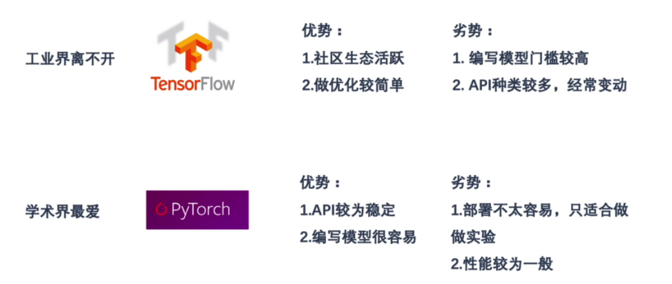
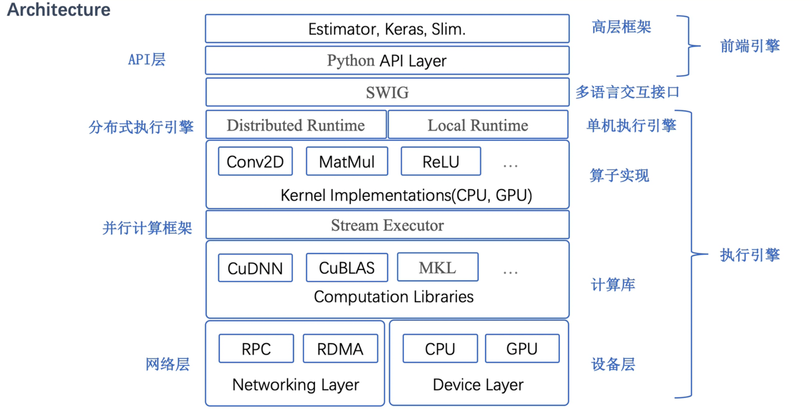
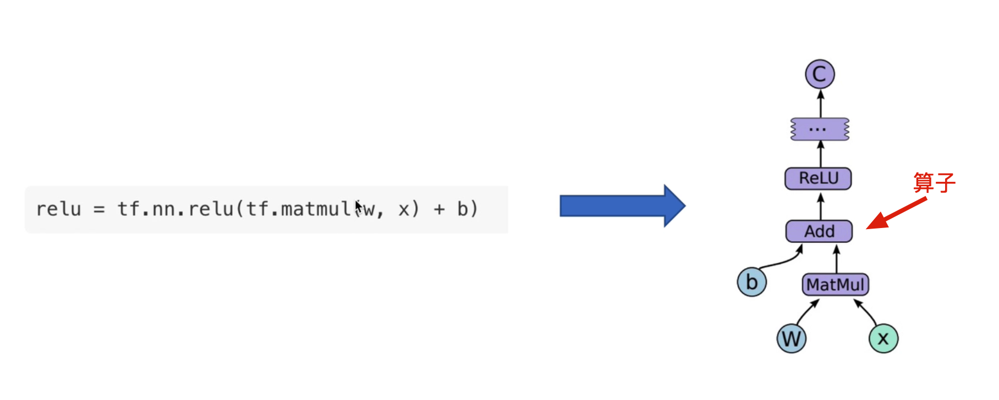
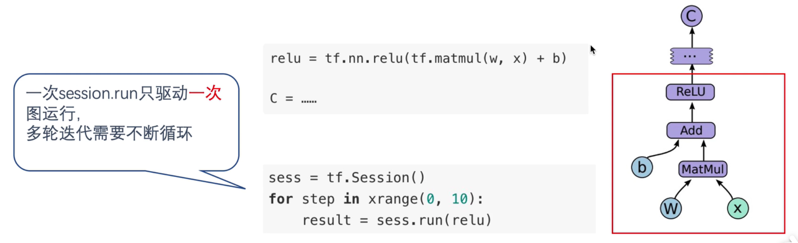
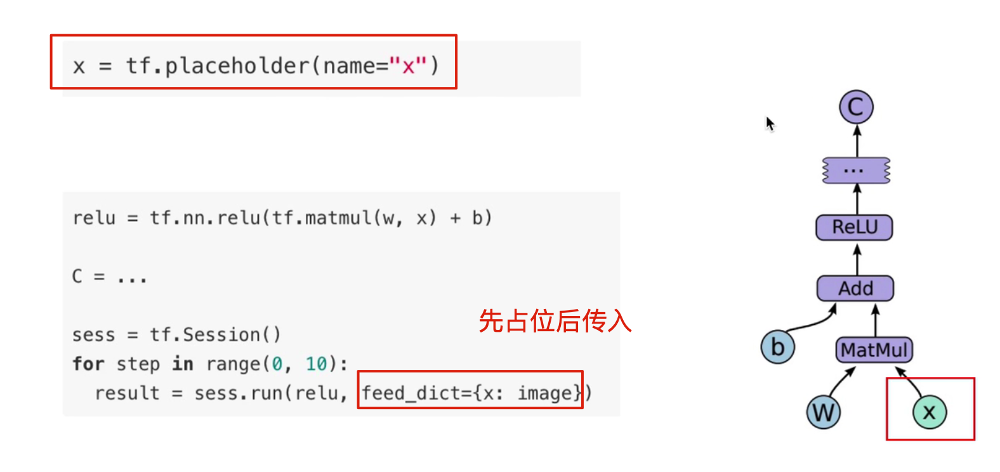
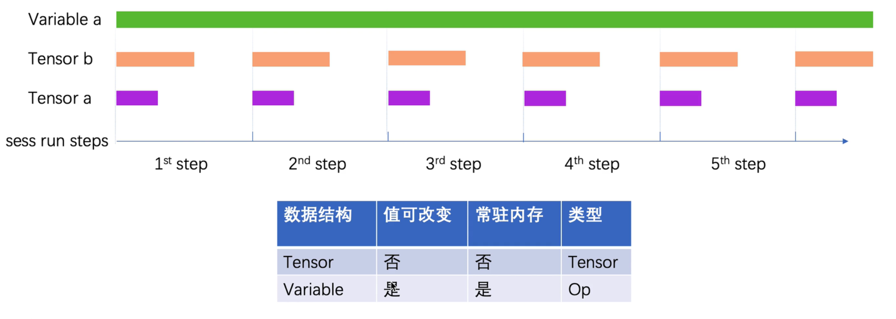
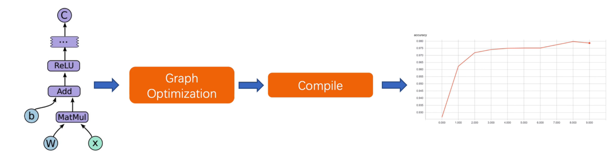

#  1 异构框架的选择

- 如何训练一个模型? 没有脚手架,门槛会很高,你会很痛苦
  1. 设计模型,推导公式
  2. 编写算子程序(GPU,CPU)
  3. 基于算子实现反向传播算法
  4. 编写UT测试正确性
  5. 优化执行效率
  6. 开始做实验调参数
  7. 更多事情。。。

- 工业级不可缺少的内容

  1. 大数据：工业界的优势
  2. 强算力：GPU
  3. 算法框架

  

## 1.1 流行的深度学习异构框架

1. `Caffe` (2013)针对卷积神经网络设计的异构框架，通过堆叠layer搭建神经网络和training的流水线，但对于搭建NLP这类复杂的神经网络就显得不方便了。
2. `TensorFlow`、`mxnet`(2015)对比caffe的区别：
   - 细粒度更高：有layer级别降为OP级别
   - 结构化、符号化编程：引入自动求导
   - 静态图机制

3. `PaddlePaddle`(2016)百度自研深度学习框架
4. `Caffe2` (2017)
5. `Pythorch`(2018)
   - 去除图的机制



6. `Tensorflow2.0`融入了 Eager模式,并正在通过推广 `Keras`约束API


## 1.2 宏观初探TF框架




# 2 环境准备与TF生态


## 2.1 GPU和CUDA

- GPU
  1. 专用计算设备
  2. 大量计算core,并发度极高 
  3. 造价非常昂贵
- CPU
  1. 负责计算和控制
  2. 并发度远不如GPU
  3. 造价比GPU低
- CUDA
  NVIDIA推出的GPU并行编程架构
  1. 语法属于扩展的C语言
  2. 编写高质量程序需要相当程度地了解GPU的架构和硬件特性
  3. 调试门槛较高
  4. 并行编程思想


# 3 静态图机制

模型定义与运行分离的机制


## 3.1 编程模式抽象与Graph

类似于编译器，在TensorFlow层面将模型抽象成有向无环图DAG.

- Operation(`Op`)
  一种细粒度运算的抽象表示,比如add, matmul, concat等等。
- `Kernel`
  某种Op在特定 device(CPU,GPU)上的实现。有些Op可能只有一种 device的实现。


### 3.1.1 计算图的表示

用Op搭建模型的过程，实际上是在组装Graph，并没有被运行.




#### 驱动计算图运行的Client—Session 

计算图构建好之后,需要通过 Session对象驱动图的运行。

`Session`会根据依赖关系,运行那些**必须**要执行的部分,忽略那些与此次计算毫无关系的部分。




#### 在模型定义中声明数据占位符— Placeholder 

为了能将**外部训练数据**送入模型,需要声明占位符,表示该位置的值由外部传入。




#### 在模型定义中声明训练参数— Variable 

模型训练的权值,需要用  tf.Variable 一族的API声明出来。

```python
b = tf.Variable(tf.zeros([100])
w = tf.Variable(tf random.uniform([784, 100], -1, 1)
```

#### 串联Graph中多维数组—Tensor

**参与运算的数据是 Tensor **(不是 Variable、Op等),它们在 Graph中用**箭头**表示。


#### Variable与 Tensor生存周期




### 3.1.2 Graph 机制

Graph模式是构图和运行分离的模式，不能直接print Tensor不能获取其内容，只能print出元信息，比如shape,type等。

Graph的引入是的TensorFlow成为专门用于描述模型定义的新编程语言，程序编译优化技术可以应用其中



- 图信息的IR——`GraphDef`

  ```python
  tf.get_default_graph().as_graph_def()
  ```

  - node: Graph中的节点 
  - op:该节点的类型 
  - device:op的 placement.信息 
  - attr:附属属性,dict类型

   使其具有跨平台的能力.


## 3.2 驱动Graph运行的Client——Session


