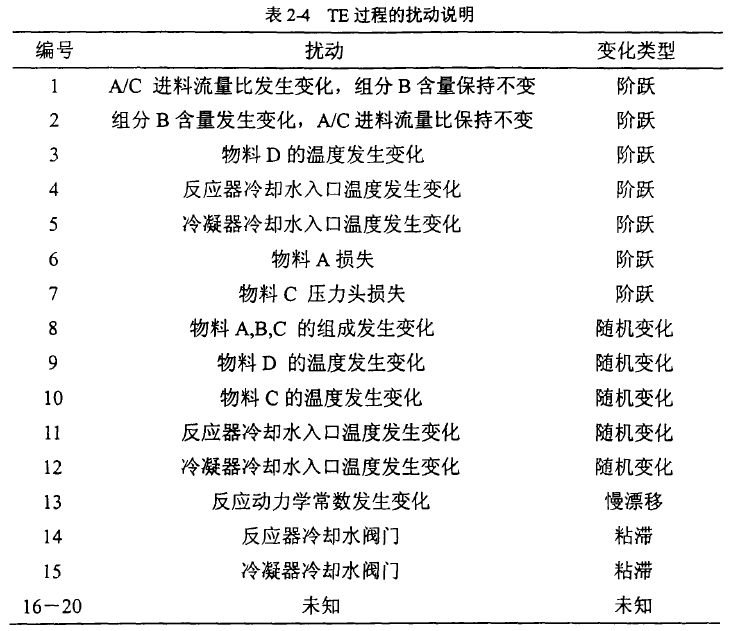

# Tennessee Eastman Process

​		TE过程是1993年由美国田纳西-伊斯曼化工公司的J.J.Downsi和E.F.Vogel提出的基于实际工业过程仿真案例{Downs, 1993 #115}。TE过程适合用于研究过程工程控制技术， 并可用于过程监控和优化以及过程运行系统集成的基础平台。在相关的故障诊断测量和描述研究中，TE过程得到了广泛应用。通过采用`符号定向图`的位置传感器，33种可能的故障情况（不包括正常操作过程)和14变量的测量被识别。{张东旭, 2012 #119}

​		TE 过程包括五个主要单元：`反应器/反应釜Reactor`、`冷凝器Condenser`、`循环压缩机Compressor`、`汽/液分离器Separator`、`汽提塔/汽捉塔/解吸塔Stripper`。整个系统各个部分耦合严重，具有高度的非线性。

​		整个TE过程有四种气态反应物$(A，C，D，E)$，物料参与反应后生成两种产物$(G和H)$。此外，还包含一种惰性物质$B$（含量在1%以内）及副产物$F$。系统中存在的化学反应如下：
$$
\begin{aligned}
&\mathrm{A}(\mathrm{g})+\mathrm{C}(\mathrm{g})+\mathrm{D}(\mathrm{g}) \rightarrow \mathrm{G}(\text { liq })\\
&\mathrm{A}(\mathrm{g})+\mathrm{C}(\mathrm{g})+\mathrm{E}(\mathrm{g}) \rightarrow \mathrm{H}(\text { liq }) \\
&\mathrm{A}(\mathrm{g})+\mathrm{E}(\mathrm{g}) \rightarrow \mathrm{F}(\mathrm{liq}) \\
&3 \mathrm{D}(\mathrm{g}) \rightarrow 2 \mathrm{~F}(\mathrm{liq})
\end{aligned}
$$

## 工艺流程

​		在反应过程中，均需要在高温条件下，温度越高反应速率越快，形成的产品时间就越短。简要生产流程图如下图所示{马笑潇, 2002 #122}

​		具体的TE过程工艺流程图如下图所示。{张东旭, 2012 #119}

- 反应物$A,D,E$与`分离器`的回流气体混合后进入`反应器`的底部参与反应[1,2,3,8 → 6]，而反应物$C$(含有少量的$A$和惰性物质$B$)先进入`汽提塔`作为汽提介质，与汽提流[10]进行分离，通过与再循环流结合然后再进入`反应器`[4 → 5 → 6]。
- `反应器`的产品流通过`冷凝器`冷却，目的是去除热量[7]，然后送入到`汽/液分离器`。气体通过`循环压缩机`又进入`反应器中`进行反应[8]。
- 液相主要包括产物$G,H$及$D,E,F$，它们进入`汽提塔`进行分离[10]。惰性气体和气体产物主要在`汽液分离器`中以气体的形式从系统中排空[9]。
- 产品$G,H$则从汽提塔底部流出[11]，进入下一道工序。在下游的`精馏塔`中进行分离，未包含在TE过程中。{宋凯, 2005 #120}{何宁, 2004 #121}

## 操作模式

​		整个生产过程以三种不同$G/H$ 混合比和产品生产率构成六种不同的操作模式。

$$
\text { 过程的六种运行模式 }\\
\begin{aligned}
&\begin{array}{ccc}
\hline \text { 操作模式 } & \mathrm{G} / \mathrm{H} \text { 混合比例 } & \text { 模式说明 } \\
\hline 1 & 50 / 50 & \text { 基本工况 } \\
2 & 10 / 90 & \text { 优化基本工况 } \\
3 & 90 / 10 & \text { 优化操作 } \\
4 & 50 / 50 & \text { 最大生产率 } \\
5 & 10 / 90 & \text { 最大生产率 } \\
6 & 90 / 10 & \text { 最大生产率 } \\
\hline
\end{array}
\end{aligned}
$$
​		整个系统共有12个操纵变量和41个测量变量（含22个连续变量和 19个成分变量)， 41个测量变量均人为的设置了噪声。

- `操纵变量`范围值在[0, 100]内：100表示完全打开，0表示关闭

- 测量变量中的`过程测量变量`是过程中的连续变量，即温度、液位、流量、压力等测量变量，共22个。
- 测量变量中的`成分测量变量`共19个, 分析器的采样间隔是指分析器在一定时间里对样本采样一次。

## 过程故障

​		该过程共有20种扰动，其中15种扰动是已知扰动。

​		TE过程的所用的故障数据，每种数据包含训练和测试两部分。

- 故障训练数据：每3分钟采样一次的25小时是过程仿真。当采样进行到第2小时时故障开始出现，故障发生在第20组数据之后。
- 故障测试数据：每3分钟采样一次的48小时是过程仿真。当采样进行到第8小时时故障开始出现，故障发生在第160组数据之后。

## 监控结果示例

1. 图2-4（a）为故障3的实时监控图。其中，a图为传统的基于PCA方法的监控结果; b图为基于ICA方法的监控结果。{何宁, 2004 #121}

   

   图中虚线为95%的置信控制限。过程在正常工况下运行500分钟之后引入扰动，扰动持续200分钟，700分钟后恢复为正常工况状态。对该故障（物料D的温度发生了阶跃变化），传统的PCA方法没有监测到该故障（在判断故障时，一般以连续三点超出控制限则认为是发生了故障)

   

   而基于ICA的方法可以监测到该故障的发生，而且是故障一发生，独立分量就及时监测出有异常情况发生了。

   

2. 图2-5为故障5的实时监控结果。故障5为冷凝器冷却水入口温度发生阶跃变化， 该扰动属于不可测扰动。当该扰动发生后，冷凝器冷却水的入口温度会立即发生变化， 而其它40个测量变量相对变化不显著。此扰动在控制器的作用下，其温度值不久会恢复到正常值，但冷却水流量会明显增大。{何宁, 2004 #121}

   由图2-5可见，PCA方法中的SPE图能监测到故障的发生，但故障持续时间较短，随后SPE值又恢复至正常值状态。

   

   而ICA方法中的独立分量在监测到故障之后，其故障会一直处于超限状态，表明系统有异常情况发生。

   

## 模型实验示例

### 基于深度卷积神经网络模型的化工过程故障诊断

*Deep convolutional neural network model based chemical process fault diagnosis*{Wu, 2018 #123}:

- 过程变量包括12个过程操作变量、22个连续过程测量和19个成分分析测量。即使在修订版中有28个过程干扰（故障类型)，只选择IDV(1)-IDV(20)与其他算法进行比较。
- TE过程的正常数据和故障数据是从MATLAB2016a上的仿真中收集的（见表1和表2）。

- 采样方法：采样周期设置为每3分钟采样一次(**20个样本/小时**)
- 模拟器在正常状态下运行500h，收集获得10，000个正态样本矩阵，每个都包含一小时的数据。在对20个故障的每次模拟中，模拟器在开始时在正常状态下运行10h，然后引入相应的故障扰动，模拟器继续运行40h。通过这种方式，在每次模拟中收集了40小时的故障数据(800个故障样本矩阵)。
  - 需要注意的是，`故障06`[物料A损失]的仿真在故障状态7h后关闭，因此`故障06`的每次仿真只有7h的故障数据。
- 正常样本：我们随机选择80%的正态样本矩阵(8000)作为训练样本，剩余的正态样本矩阵 (2000)作为测试样本。对于每个故障，每种故障类型的模拟以10种不同的初始状态重复10次。我们从 8 个模拟中随机选择 122,720 个训练样本，从其他两个模拟中随机选择 30,680 个测试样本。

- 为了在空间和时间域中提取过程数据的特征，将数据样本转换为$m ×  n$的二维矩阵。
- 在 TE 过程中，12个过程操作变量中，XMV(5)`压缩机再循环阀`、XMV(9)`汽提塔水流阀`和 XMV(12)`搅拌速度`在模拟过程中是恒定的。这三个变量被排除在外，因此每个样本矩阵都包含 1 小时内其余 50 个变量的信息，即9个操纵变量和41个测量变量。（$m=20,n=50$）

## 参考资料

1. [Tennessee Eastman(TE过程)简介](https://blog.csdn.net/rosefun96/article/details/78958152)

2. [TEC-Matlab仿真](http://depts.washington.edu/control/LARRY/TE/download.html#Basic_TE_Code)

   ​		根据原始 TE 代码，Ricker提供的 Simulink 代码可用于模拟工厂的闭环行为。基于模拟器，可以轻松修改运行模式、测量噪声、采样时间和故障幅度，因此其生成的数据集可以更有助于 PM-FD 比较研究。

3. [github-tennessee-eastman-profBraatz](https://github.com/camaramm/tennessee-eastman-profBraatz)

4. [TEC-数据集提取和保存](https://blog.csdn.net/luohenyj/article/details/78441707)

5. [Tennessee Eastman（TE）田纳西-伊斯曼仿真平台应用试验与分析](https://blog.csdn.net/weixin_44333889/article/details/119413890)

6. [YouTube-PICENG422 Design of a Tennessee Eastman Plant](https://www.youtube.com/watch?v=PLnOLp5StzI)

7. [github-DL-TEC](https://github.com/lmelvix/tennessee-eastman-fault-detection)

8. [数据集预处理方法](https://blog.csdn.net/weixin_44749271/article/details/121655512)

# Continuous Stirred Tank Reactor

连续搅拌釜式反应器{Johannesmeyer, 2002 #141}{Yoon, 2001 #142}

## 参考资料

1. [github-使用 Colab、Tensorflow、Keras - Tuner 和  Sklearn 训练能够预测连续搅拌罐反应器热失控的神经网络](https://github.com/JVTupinamba/Reactor_NN)
1. [github-使用 Colab、Tensorflow、Keras - Tuner 和  Sklearn 训练能够预测连续搅拌罐反应器热失控的神经网络](https://github.com/UERJ-LIVIA/Reactor-NN)

# Continuous Stirred Tank Heater

连续搅拌罐加热器{Downs, 1993 #115}

## 参考文献

1. [THE CONTINUOUS STIRRED TANK HEATER SIMULATION](http://personal-pages.ps.ic.ac.uk/~nina/CSTHSimulation/index.htm)
