#  Devops Git概述


## Devops

​	开发  development       运维     operations 

- Devops能干什么：提升产品质量

- 1. 自动化测试
  2. 集成测试
  3. 代码质量管理工具
  4. 程序员鼓励师

- Devops如何实现

  设计架构规划-代码的存储-构建-测试、预生产、部署、监控

  

## Git版本控制系统

- 简介

- 1. 版本控制系统是一种记录一个或若干个文件内容变化,以便将来查阅特定版本内容情况的系统 

  2. 记录文件的所有历史变化      

  3. 随时可恢复到任何一个历史状态

  4. 多人协作开发

     

- 常见的版本管理工具

- 1. SVN

     集中式的版本控制系统,只有一个中央数据仓库,如果中央数据仓库挂了或者不可访问,所有的使用者无法使用SVN,无法进行提交或备份文件。

     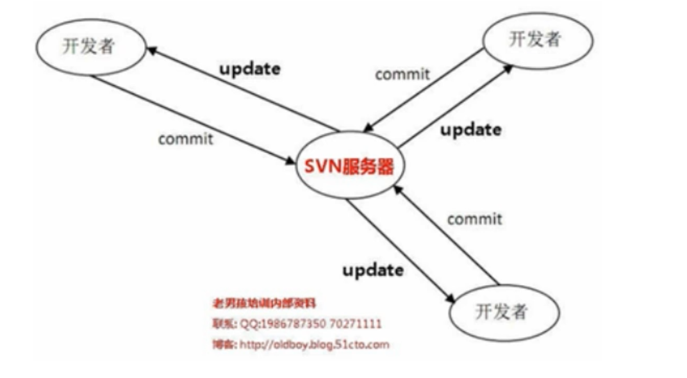

  2. Git 

     分布式的版本控制系统,在每个使用者电脑上就有一个完整的数据仓库,没有网络依然可以使用Git。当然为了习惯及团队协作,会将本地数据同步到Git服务器或者 Github等代码仓库。

     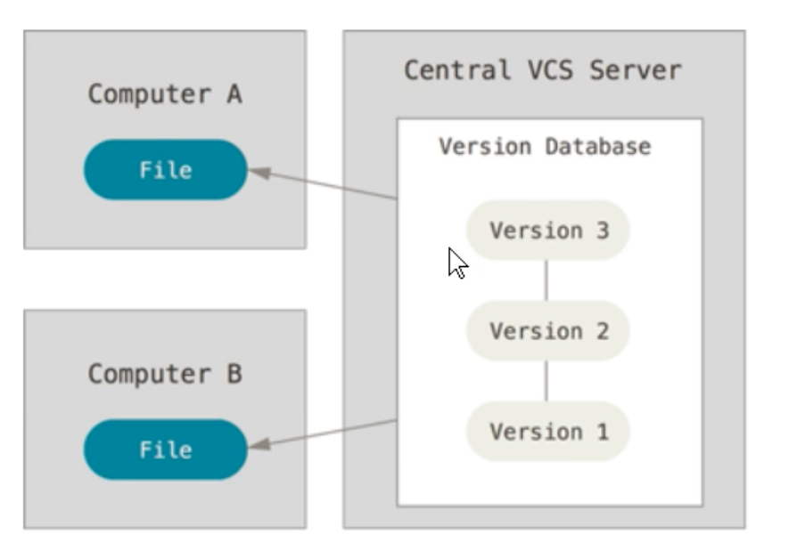


##Git安装部署

### 系统环境准备

- CentOS

  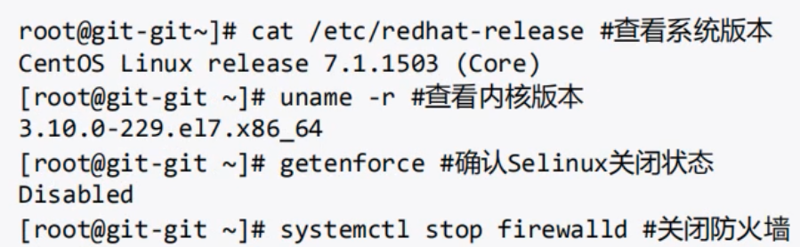

- MacOS

  ```bash
  (base) MacBook-Pro:~ jin$ git --version
  git version 2.21.1 (Apple
  ```

### GIt安装部署

1. 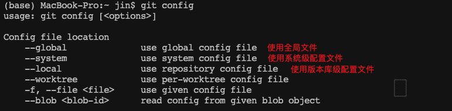

2. 创建一个全局用户名、全局邮箱作为配置信息

   ```bash
   # MacOS
   git config --global user.name 'sora01'    #配置git使用用户 
   git config --global user.email 'sora01@qq.com'   #配置git使用邮箱
   git config --global color.ui true   #语法高亮
   ```

3. Git初始化

   初始化工作目录、对已存在的目录或者对已存在的目录都可进行初始化

   1. 初始化

      ```bash
      [sora @ sora-localhost ~]  mkdir data
      [sora @ sora-localhost ~]  cd data/
      [sora @ sora-localhost ~/data]  git init      #初始化
      Initialized empty Git repository in /home/sora/data/.git/
      
      [sora @ sora-localhost ~/data]  ll -a
      total 4
      drwxrwxr-x   3 sora sora   18 Apr 21 23:43 .
      drwx------. 17 sora sora 4096 Apr 21 23:42 ..
      drwxrwxr-x   7 sora sora  119 Apr 21 23:43 .git
      ```

   2. 查看工作区状态

      ```bash
      git status		#查看工作区状态
      
      [sora @ sora-localhost ~/data]  tree .git/
      .git/
      ├── branches			#分支目录
      ├── config				#定义项目特有的配置选项
      ├── description		#仅供 git web程序使用
      ├── HEAD					#指示当前的分支
      ├── hooks					#包含git钩子文件
      │   ├── applypatch-msg.sample
      │   ├── commit-msg.sample
      │   ├── post-update.sample
      │   ├── pre-applypatch.sample
      │   ├── pre-commit.sample
      │   ├── prepare-commit-msg.sample
      │   ├── pre-push.sample
      │   ├── pre-rebase.sample
      │   └── update.sample
      ├── info					#包含一个全局排除文件( exclude文件)
      │   └── exclude
      ├── objects				#存放所有数据内容
      │   ├── info
      │   └── pack
      └── refs					#存放指向数据(分支)的提交对象的指针
          ├── heads
          └── tags
      #└── index 保存暂存区信息,在执行 git initl的时候,这个文件还没有
      ```

      

# Git常规使用

##创建数据-提交数据

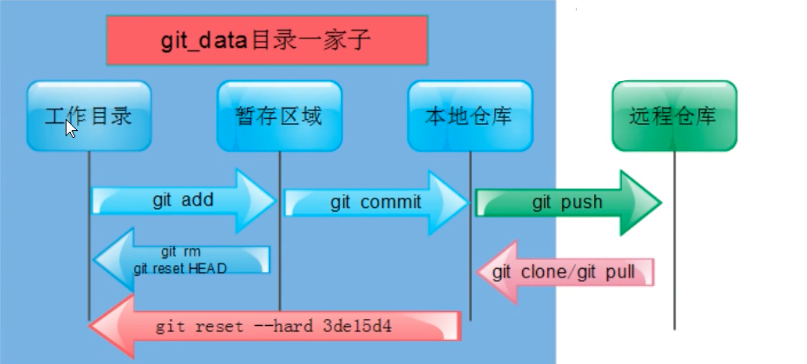

## GIt基础命令

### 添加文件

````bash
[root @ sora-localhost ~/data]  touch a b c
[root @ sora-localhost ~/data]  git status
# Untracked files
#       a
#       b
#       c
[root @ sora-localhost ~/data]  git add a			   #添加文件到暂存区
# Changes to be committed:
#       new file:   a
#
# Untracked files:
#       b
#       c
[root @ sora-localhost ~/data]  git add .     	#添加当前所有文件到暂存区 
# Changes to be committed:
#
#       new file:   a
#       new file:   b
#       new file:   c

````
### 删除文件
```bash
[root @ sora-localhost ~/data]  git rm --cached c 		#撤出暂存区
rm 'c'
# Changes to be committed:
#       new file:   a
#       new file:   b
#
# Untracked files:
#
#       c
[root @ sora-localhost ~/data]  git rm -f b			#同时删除暂存区和工作目录的文件
```
### 提交文件
```bash
[root @ sora-localhost ~/data]  git commit -m "add newfile a"			#从暂存区提交到本地仓库
      [master (root-commit) 5c35cc1] add newfile a
       1 file changed, 0 insertions(+), 0 deletions(-)
       create mode 100644 a
[root @ sora-localhost ~/data]  git status 
      # On branch master
      nothing to commit, working directory clean
```

- 小结:如何真正意义上通过版本控制系统管理文件
  1. 工作目录必须有个代码文件
  
  2. 通过`git add <fi1e>`添加到暂存区域
  
  3. 通过 `git commit  -m  "你自己输入的信息"`添加到本地仓库
  
     

###修改文件名称

```bash
[root @ sora-localhost ~/data]  git mv a.txt a			#git命令直接更改名称
# Changes to be committed:
#       renamed:    a.txt -> a
[root @ sora-localhost ~/data]  git commit -m "rename a.txt a"
```

### 文件比对

```bash
[root @ sora-localhost ~/data]  echo 'sora你好!' >a
[root @ sora-localhost ~/data]  git diff 		#比对工作目录和暂存区有什么不同
    diff --git a/a b/a
    index e69de29..90d8bba 100644
    --- a/a
    +++ b/a
    @@ -0,0 +1 @@
    +sora你好!
    
    
[root @ sora-localhost ~/data]  git add a		
[root @ sora-localhost ~/data]  git diff 		#由于添加到暂存区 因此工作目录和暂存区相同 无返回
[root @ sora-localhost ~/data]  git diff --cached			#比对暂存区和本地仓库有什么不同
    diff --git a/a b/a
    index e69de29..90d8bba 100644
    --- a/a
    +++ b/a
    @@ -0,0 +1 @@
    +sora你好!
    
    
[root @ sora-localhost ~/data]  git commit -m "add greet"
    [master 364af5a] add greet
     1 file changed, 1 insertion(+)
[root @ sora-localhost ~/data]  git diff
[root @ sora-localhost ~/data]  git diff --cached		#由于提交到本地仓库 因此本地仓库和暂存区相同 
```

```bash
[root @ sora-localhost ~/data]  echo 123456 >> a 
[root @ sora-localhost ~/data]  git commit -am "add greet2"  
#如果某个文件已经被仓库管理,如果在更改此文件直接需要一条命令提交即可
    [master 4245e96] add greet2
     1 file changed, 1 insertion(+)
[root @ sora-localhost ~/data]  git diff --cached
```

### 查看历史快照

```bash
[root @ sora-localhost ~/data]  git log
      commit 4245e962027f9db38f4bc7dfe36f5f7089af228b   # 哈希值
      Author: sora02 <sora02@qq.com>										# 作者信息
      Date:   Thu Apr 22 12:05:35 2021 +0800						# 时间
          add greet2																		# 描述信息

[root @ sora-localhost ~/data]  git log --oneline				# 一行简单的显示 Commit信息
      4245e96 add greet2	
      364af5a add greet

[root @ sora-localhost ~/data]  git log --oneline --decorate			# 显示当前的指针指向哪里
      4245e96 (HEAD, master) add greet2
      364af5a add greet
      
[root @ sora-localhost ~/data]  git log  -p							# 显示具体内容的变化
[root @ sora-localhost ~/data]  git log  -1							# 只显示1条内容
```


### 恢复历史数据

```bash
[root @ sora-localhost ~/data]  git reset --hard 364af5a			 # 回滚数据到某一个提交
			HEAD is now at 364af5a add greet

[root @ sora-localhost ~/data]  git reflog 							# 可以查看所有分支的所有操作记录
      364af5a HEAD@{0}: reset: moving to 364af5a
      4245e96 HEAD@{1}: commit: add greet2
      364af5a HEAD@{2}: commit: add greet
      35ecfd5 HEAD@{3}: commit: rename a.txt a
      c1cdef6 HEAD@{4}: commit: rename a a.txt
      5c35cc1 HEAD@{5}: commit (initial): add newfile a
```


## Git分支

​		**分支**即是平行空间,假设你在为某个手机系统研发拍照功能,代码已经完成了80%,但如果将这不完整的代码直接提交到git仓库中,又有可能影响到其他人的工作,此时我们便可以在该软件的项目之上创建一个名叫”拍照功能”的分支,这种分支只会属于你自己,而其他人看不到,等代码编写完成后再与原来的项目主分支合并下即可,这样即能保证代码不丢失,又不影响其他人的工作。

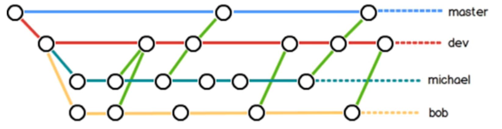

​		一般在实际的项目开发中,我们要尽量保证 masters分支是非常稳定的,仅用于发布新版本,平时不要随便直接修改里面的数据文件。

​		而工作的时候则可以新建不同的工作分支,等到工作完成后在**合并**到 master分支上面,所以团队的合作分支看起来会像上面图那样。

### 创建 查看

```bash
[root @ sora-localhost ~/data]  git log --oneline --decorate	# 显示当前的指针指向哪里
      4245e96 (HEAD, master) add greet2
      364af5a add greet

[root @ sora-localhost ~/data]  git branch testing								# 创建分支
[root @ sora-localhost ~/data]  git branch												# 查看分支
      * master
        testing
```


### 切换分支

```bash
[root @ sora-localhost ~/data]  git checkout testing 							# 切换分支
      Switched to branch 'testing'
[root @ sora-localhost ~/data]  git branch 
        master
      * testing
```

### 删除分支

```bash
[root @ sora-localhost ~/data]  git branch -d testing  							# 删除分支
      Deleted branch testing (was 4245e96).
[root @ sora-localhost ~/data]  git branch 
			* master
```


### 操纵分支

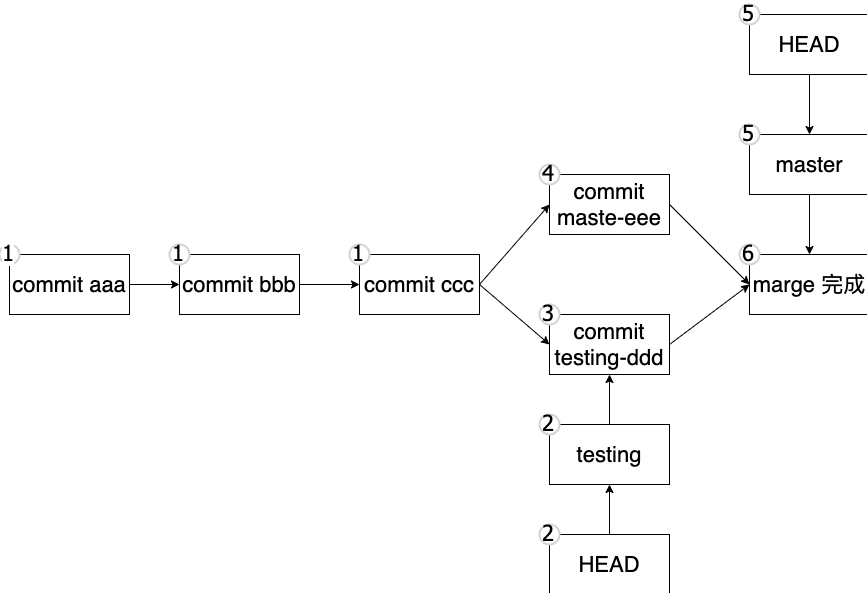

```bash
## Step1.
[root @ sora-localhost ~/data]  touch aaa ...bbb...ccc
# 省略git add, git commit操作

## Step2.
[root @ sora-localhost ~/data]  git checkout -b testing						# 创建并切换到分支
			Switched to a new branch 'testing'
[root @ sora-localhost ~/data]  git branch 
        master
      * testing
      
[root @ sora-localhost ~/data]  git log --oneline --decorate
			44e28b5 (HEAD, testing, master) add ccc
			
## Step3.
[root @ sora-localhost ~/data]  touch testing-add
[root @ sora-localhost ~/data]  git add .
[root @ sora-localhost ~/data]  git commit -m 'add newfile testing-add'
[root @ sora-localhost ~/data]  git log --oneline --decorate
      3b3844f (HEAD, testing) add newfile testing-add
      44e28b5 (master) add ccc

## Step4.
[root @ sora-localhost ~/data]  git checkout master 
[root @ sora-localhost ~/data]  touch master-eee
[root @ sora-localhost ~/data]  git add .
[root @ sora-localhost ~/data]  git commit  -m "add newfile master-eee"
[root @ sora-localhost ~/data]  git log --oneline --decorate
			c8dc512 (HEAD, master) add newfile master-eee
```

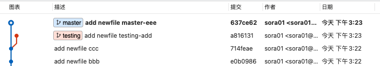


### 合并分支

```bash
## Step5 6.
[root @ sora-localhost ~/data]  git merge testing						#合并分支
      Merge made by the 'recursive' strategy.
       testing-add | 0
       1 file changed, 0 insertions(+), 0 deletions(-)
       create mode 100644 testing-add
[root @ sora-localhost ~/data]  ll
      total 4
      -rw-r--r-- 1 root root  0 Apr 22 14:56 master-eee
      -rw-r--r-- 1 root root  0 Apr 22 14:59 testing-add
      
[root @ sora-localhost ~/data]  git branch -d testing 			# 合并完成后删除分支即可
			Deleted branch testing (was 3b3844f).
```

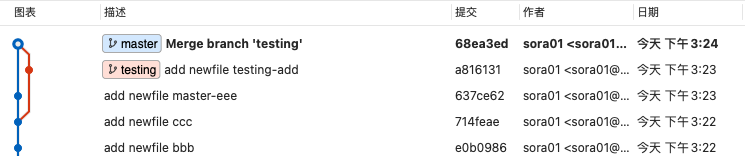


### 冲突合并

```bash
[root @ sora-localhost ~/data]  git checkout master 
			Switched to branch 'master'
[root @ sora-localhost ~/data]  echo master >> aaa
[root @ sora-localhost ~/data]  git commit -am "modify aaa add master"


[root @ sora-localhost ~/data]  git checkout testing 
			Switched to branch 'testing'
[root @ sora-localhost ~/data]  echo testing >> aaa
[root @ sora-localhost ~/data]  git commit -am "modify aaa add testing"


[root @ sora-localhost ~/data]  git checkout master 
[root @ sora-localhost ~/data]  git merge testing 					# 合并分支 aaa文件的内容发生了冲突
      Auto-merging aaa
      CONFLICT (content): Merge conflict in aaa
      Automatic merge failed; fix conflicts and then commit the result.
[root @ sora-localhost ~/data]  cat aaa
      <<<<<<< HEAD
      master
      =======
      testing
      >>>>>>> testing


[root @ sora-localhost ~/data]  vim aaa     # 冲突的文件自动标识到文件里,手动更改沖突要保留的代码
[root @ sora-localhost ~/data]  cat aaa
			master
[root @ sora-localhost ~/data]  git commit -am "resolve marge conflict"
			[master 99f8d5c] resolve marge conflict
```

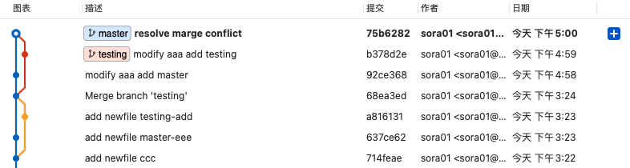


## Git标签

​		标签也是指向了一次 `commit`提交,是一个里程碑式的标签,回滚打标签直接加标签号,不需要加唯一字符串不好记

```bash
[root @ sora-localhost ~/data]  git log --oneline --decorate
      99f8d5c (HEAD, master) resolve marge conflict
      ....
      4a8aa3a add aaa
[root @ sora-localhost ~/data]  git tag -a v1.0 4a8aa3a -m "Tag_add aaa"   
			# -a指定标签名   哈希值 指定某一次的提交为标签    -m指定说明文字
[root @ sora-localhost ~/data]  git show v1.0 			# 查看v1.0的信息 


[root @ sora-localhost ~/data]  git reset --hard v1.0     # 回滚数据到v1.0的提交
[root @ sora-localhost ~/data]  ll
      total 4
      -rw-r--r-- 1 root root 19 Apr 22 17:16 a
      -rw-r--r-- 1 root root  0 Apr 22 17:18 aaa


[root @ sora-localhost ~/data]  git reflog 
      4a8aa3a HEAD@{0}: reset: moving to v1.0
      99f8d5c HEAD@{1}: reset: moving to v2.0
      364af5a HEAD@{2}: reset: moving to v1.0
      99f8d5c HEAD@{3}: commit (merge): resolve marge conflict
[root @ sora-localhost ~/data]  git tag -a v2.0 99f8d5c -m "Tag_resolve marge conflict"

[root @ sora-localhost ~/data]  git reset --hard v2.0 
[root @ sora-localhost ~/data]  ll
			total 8
			
[root @ sora-localhost ~/data]  git tag    # 显示全部标签
      v1.0
      v2.0
[root @ sora-localhost ~/data]  git tag -d v1.0			# 删除标签
			Deleted tag 'v1.0' (was 5a77da4)
```


# GitHub

​		**Github**顾名思义是一个Git版本库的托管服务,是目前全球最大的软件仓库,拥有上百万的开发者用户,也是软件 开发和寻找资源的最佳途径, Github不仅可以托管各种Git版本仓库,还拥有了更美观的Mleb界面,您的代码文件可 以被任何人克隆,使得开发者为开源项贡献代码变得更加容易,当然也可以付费购买私有库,这样高性价比的私有 库真的是帮助到了很多团队和企业 

1. 注册用户 课前注册好用户 

2. 配置ssh-key 

   ````bash
   ssh-keygen -t rsa
   # 无限回车 生成秘钥
   cat .ssh/id_rsa.pub
   # 获取公钥 将其复制 
   ````

   复制到GitHub设置里的SSH keys

   

3. 创建项目 

   ​	创建一个新的仓库 Create a new repository 步骤省略

   

4. 推送新代码到 github

   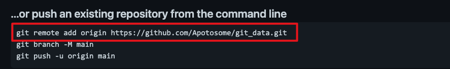

   ```bash
   [root @ sora-localhost ~/data]  git remote add origin git@github.com:Apotosome/git_data.git
   [root @ sora-localhost ~/data]  git push -u origin master
       ...
       Compressing objects: 100% (22/22), done.
       Writing objects: 100% (31/31), 2.51 KiB | 0 bytes/s, done.
       Total 31 (delta 8), reused 0 (delta 0)
       remote: Resolving deltas: 100% (8/8), done.
       To git@github.com:Apotosome/git_data.git
        * [new branch]      master -> master
       Branch master set up to track remote branch master from origin.
   ```

5. 克隆项目到本地 

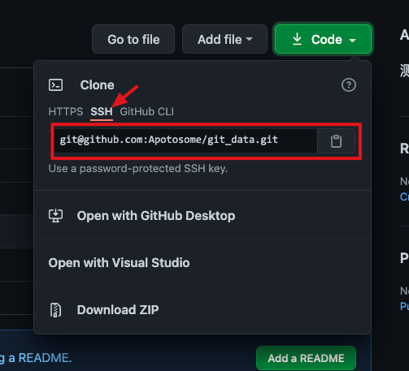

```bash
[root @ sora-localhost ~/dataTemp]  git clone git@github.com:Apotosome/git_data.git
      Cloning into 'git_data'...
      remote: Enumerating objects: 31, done.
      remote: Counting objects: 100% (31/31), done.
      remote: Compressing objects: 100% (14/14), done.
      remote: Total 31 (delta 8), reused 31 (delta 8), pack-reused 0
      Receiving objects: 100% (31/31), done.
      Resolving deltas: 100% (8/8), done.
[root @ sora-localhost ~/dataTemp]  ll git_data/
      total 8
      -rw-r--r-- 1 root root 19 Apr 23 09:32 a
      -rw-r--r-- 1 root root  7 Apr 23 09:32 aaa
      -rw-r--r-- 1 root root  0 Apr 23 09:32 bbb
      -rw-r--r-- 1 root root  0 Apr 23 09:32 ccc
      -rw-r--r-- 1 root root  0 Apr 23 09:32 master-eee
      -rw-r--r-- 1 root root  0 Apr 23 09:32 testing-add
```


# Gitlab

​		Gitlab是一个用于仓库管理系统的开源项目。使用Git作为代码管理工具,并在此基础上搭建起来的eb服务。可通过eb界面进行访问公开的或者私人项目。它拥有与 Github类似的功能,能够浏览源代码,管理缺陷和注释。可 以管理团队对仓库的访词,它非常易于浏览提交过的版本并提供一个文件历史库。团队成员可以利用内置的简单聊天程序进行交流。它还提供一个代码片段收集功能可以轻松实现代码复用。


## 安装配置 

1. 下载链接  选择对应的系统类型

   ```bash
   https://about.gitlab.com/install/
   ```

2. 安装和配置必要的依赖项;禁用防火墙,关 selinux

   ```bash
   sudo yum install -y curl policycoreutils-python openssh-server perl
   sudo systemctl enable sshd
   sudo systemctl start sshd
   
   sudo firewall-cmd --permanent --add-service=http
   sudo firewall-cmd --permanent --add-service=https
   sudo systemctl reload firewalld
   ```

3. 下载rpm安装包  选择对应的包后 点击右侧的`wget`复制  或者下载到本地通过sftp传到虚拟机上

   ```bash
   https://packages.gitlab.com/gitlab/gitlab-ce
   ```

4. rpm指令安装gitlab安装包

   ```bash
   [root @ sora-localhost ~]  rpm -ivh gitlab-ce-13.11.0-ce.0.el7.x86_64.rpm
         ...
         Please configure a URL for your GitLab instance by setting `external_url`
         configuration in /etc/gitlab/gitlab.rb file.
         Then, you can start your GitLab instance by running the following command:
         sudo gitlab-ctl reconfigure
   ```

5. 根据提示更改url地址

   ```bash
   [root @ sora-localhost ~]  vim /etc/gitlab/gitlab.rb 
         external_url 'http://10.200.106.4'   #修改为本机ip地址
   ```

6. 根据提示更改 运行服务前 输入指令 进行重新配置

   ```bash
   [root @ sora-localhost ~]  gitlab-ctl reconfigure
   ```

7. 启动Gitlab后查看状态

   ```bash
   [root @ sora-localhost ~]  gitlab-ctl start
   [root @ sora-localhost ~]  gitlab-ctl status
   ```

8. 访问Gitlab

   浏览器输入主机号即可访问   `http://10.200.106.4/`

   首次访问时，您将被重定向到密码重置屏幕。提供初始管理员帐户的密码，您将被重定向回登录屏幕。使用默认帐户的用户名`root`登录。

9. 安装汉化补丁

    ```bash
   # 1、下载汉化补丁
   			git clone https://gitlab.com/xhang/gitlab.git 
   # 2、査看全部分支版本
   			git branch -a
   # 3、对比版本、生成补丁包
   			git diff remotes/origin/10-2-stable remotes/origin/10-2-stable-zh > ../10.2.2-zh diff 
   # 4、停止服务器 
    			gitlab-ctl stop 
   # 5、打补丁
      		patch -d /opt/gitlab/embedded/service/gitlab-rails -p1 < /tmp/10.2.2-zh diff 
   # 6、启动和重新配置 
   			gitlab-ctl start 
    			gitlab-ctl reconfigure
   ```


10. 基本配置

    - 修改登陆界面提示文字和Logo

      1. 进入🔧设置-Appearance

      2. Navigation bar 导航栏

         Sign in/Sign up pages 登录界面

         Favicon 网站图标

         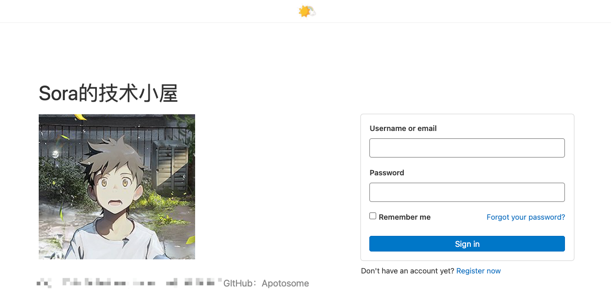

    

## 重要目录和指令

- 重要目录

```bash
/opt/gitlab/								# git1ab的程序安装目录
/var/opt/gitlab							# gitlab目录数据目录
/var/opt/gitlab/git-data		# 存放仓库数据
```

- 重要指令

```bash
gitlab-ctl status						# 查看目前git1ab所有服务运维状态
gitlab-ctl start						# 停止git1ab服务
gitlab-ctl stop							# 停止git1ab服务
gitlab-ctl stop nginx				# 单独停止某个服务
gitlab-ctl tail							# 查看所有服务的日志
```


## 基本操作

### 创建操作

`创建组-创建项目-创建成员`

1. **创建组**

   进入🔧设置-overview-Dashboard-New group			 `test`

2. **创建项目**

   进入🔧设置-overview-Dashboard-New project	 	  `test`

   Create blank proiect   注意选择对应的组

   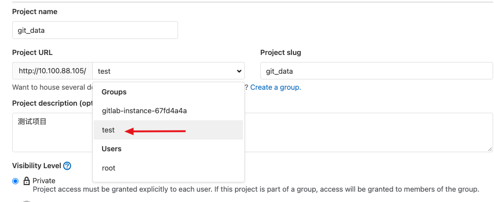

3. 配置SSH-keys 

   ````bash
   ssh-keygen -t rsa
   # 无限回车 生成公钥
   cat .ssh/id_rsa.pub
   # 获取ssh-key 将其复制 
   ````

   复制到Preferences-SSH keys-Add key

4. Push an existing Git repository

   ```bash
   [root @ sora-localhost ~/data]  git remote rm origin 
   [root @ sora-localhost ~/data]  git remote add origin git@192.168.43.198:test/git_data.git
   [root @ sora-localhost ~/data]  git push -u origin master
   ```

5. 安全性设置 开启/关闭注册页面

   进入🔧设置-Setting-Sign-up restrictions

   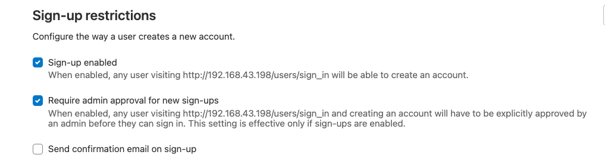

6. **创建用户**

   进入🔧设置-overview-Users-New user 完成用户的创建		`dev`

   Edit-设置password

7. 将`dev`用户加入`test`组

   进入`test`组-Add user(s) to the group		注意权限的设定

   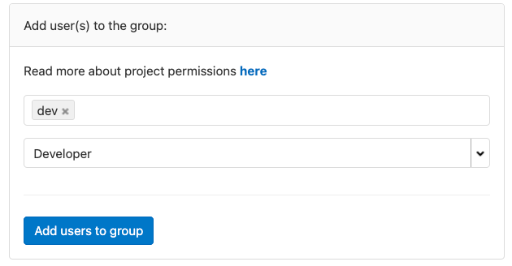

   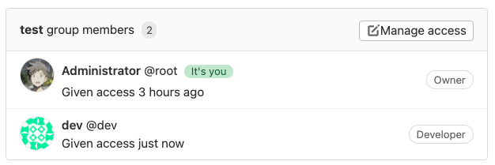

8. 配置SSH Keys等操作同上
9. 从远程仓库clone方法参见GitHub


### 分支保护

``````bash
[root @ dev ~/git_data]  git add .
[root @ dev ~/git_data]  git commit -m "newfile t2.txt from dev"
[root @ dev ~/git_data]  git push -u origin master 
      remote: GitLab: You are not allowed to push code to protected branches on this project.To git@192.168.43.198:test/git_data.git
       ! [remote rejected] master -> master (pre-receive hook declined)
      error: failed to push some refs to 'git@192.168.43.198:test/git_data.git'
``````

推送至master时出现错误：您不得将代码推送到该项目上受保护的分支！

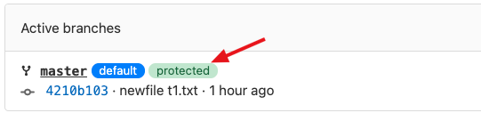

- 正确应该推送到不同的工作分支上

```bash
[root @ dev ~/git_data]  git checkout -b dev
			Switched to a new branch 'dev'
[root @ dev ~/git_data]  git push -u origin dev
      remote: 
      To git@192.168.43.198:test/git_data.git
       * [new branch]      dev -> dev
      Branch dev set up to track remote branch dev from origin.
```

- 查看分支

  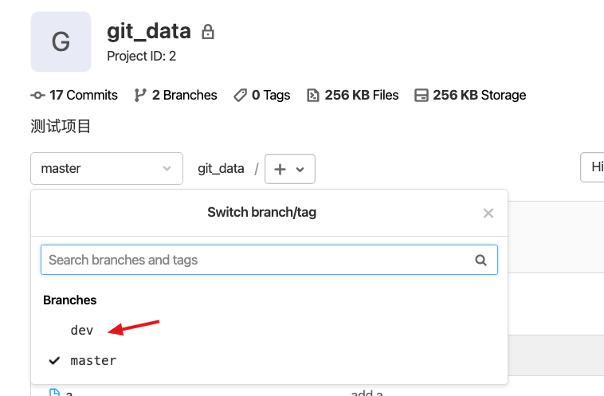


- 设置分支保护

  进入项目-Setting-Repository-Protected branches

  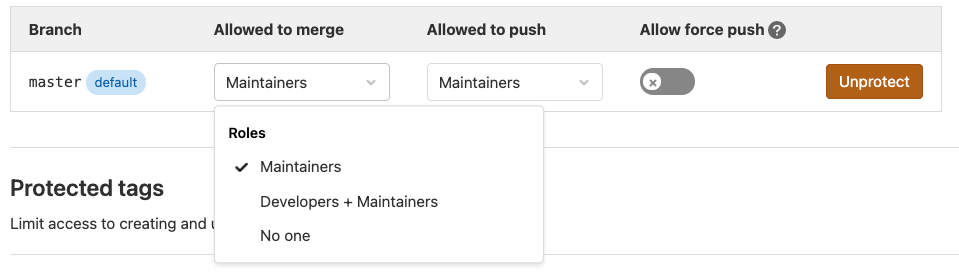


### 代码合并

#### dev到master

```bash
[root @ dev ~/git_data]  echo "merge" >> merge.txt
[root @ dev ~/git_data]  git add .
[root @ dev ~/git_data]  git commit -m "newfile merge.txt from dev"
```

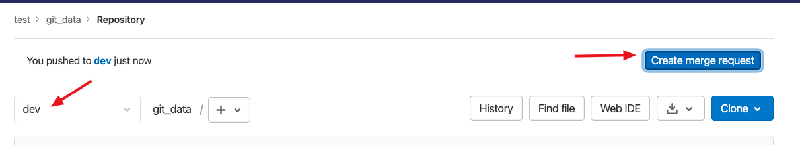

- dev发起合并请求
- 进入`dev`分支 点击`Create merge request`  填写合并请求信息  

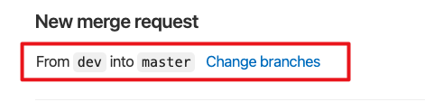

- 确认是`dev`到`master`的请求

- `root`进行确认   进入项目-Merge request  点击`Merge`确认  

  注意确认是否要删除分支

  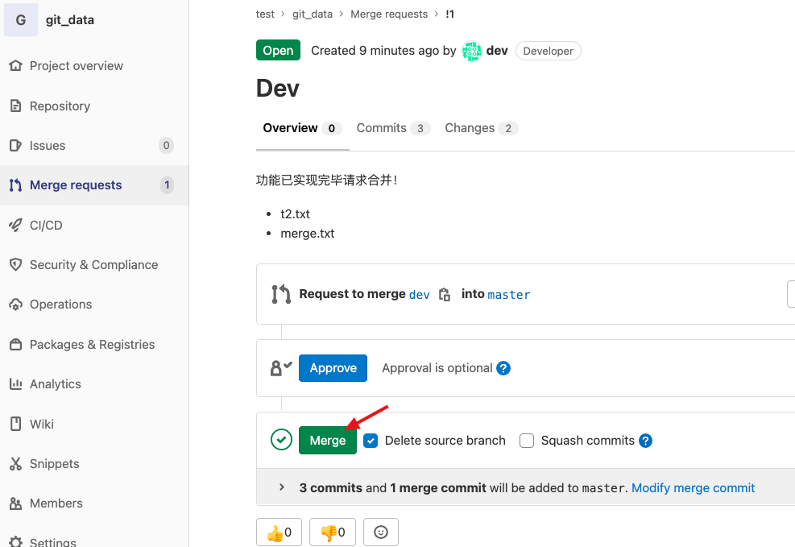


#### master到dev

```bash
[root @ sora-localhost ~/data]  echo "merge2" > merge2.txt
[root @ sora-localhost ~/data]  git add .
[root @ sora-localhost ~/data]  git commit -m "newfile merge2.txt from root"
[root @ sora-localhost ~/data]  git push -u origin master 
```

如果此时对`dev`进行推送是不冲突的 但是分支脱离主干是不被允许的！

``````bash
[root @ sora-localhost ~/data]  ll
      -rw-r--r-- 1 root root  0 Apr 24 16:12 merge2.txt
[root @ dev ~/git_data]  ll
      -rw-r--r-- 1 root root  0 Apr 24 16:32 merge3.txt
``````

==解决==：

1. 将分支删去 根据`master`重建分支 ; 无法执行推送指令 因为本地与远程冲突 

```bash
[root @ dev ~/git_data]  git branch -d dev
[root @ sora-localhost ~/data]  ll
      -rw-r--r-- 1 root root  0 Apr 24 16:12 merge2.txt
[root @ dev ~/git_data]  git checkout -b dev  
[root @ dev ~/git_data]  git pull
			error: failed to push some refs to 'git@192.168.43.198:test/git_data.git'
```

2. 从远程仓库中拉取 保证本地仓库与其保持一致

```bash
[root @ dev ~/git_data]  git pull origin dev
      Merge made by the 'recursive' strategy.
       merge3.txt | 0
[root @ dev ~/git_data]  ll
      -rw-r--r-- 1 root root  0 Apr 24 16:32 merge2.txt
      -rw-r--r-- 1 root root  0 Apr 24 16:43 merge3.txt
```

3. 远程仓库`master`没有 merge3.txt 则需要进行代码合并,即 dev到master

   进入项目-Merge requests-`New merge request`

   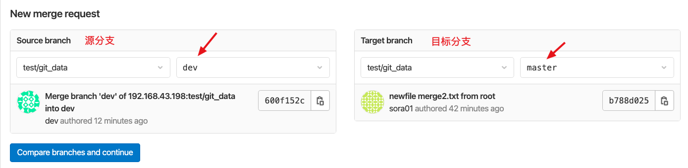

4. root审阅合并请求并进行确认

   此时master和dev相同  需要删掉dev 然后重新创建分支 防止出现错误

   勾选 Delete source branch

5. `dev`本地仓库进行拉取  本地仓库和远程仓库保持一致

```bash
[root @ sora-localhost ~/data]  git pull
			merge3.txt | 0
[root @ sora-localhost ~/data]  ll
      -rw-r--r-- 1 root root  0 Apr 24 16:12 merge2.txt
      -rw-r--r-- 1 root root  0 Apr 24 17:09 merge3.txt
```


# Jenkins

​		Jenkins是一个开源软件项目,是基于]ava开发的一种持续集成工具,用于监控持续重复的工作,旨在提供一个开放易用的软件平台,使软件的持续集成变成可能。


## 安装配置

1. 安装准备
   装备两台服务器 关se1inux和防火墙   内存2G   50G+ 硬盘 

   

2. 下载Jenkins镜像和JDK 到本地通过sftp传到虚拟机上

```bash
Jenkins   https://mirrors.tuna.tsinghua.edu.cn/jenkins/redhat-stable/
JDK       https://www.oracle.com/java/technologies/javase-jdk16-downloads.html # CentOS7自带
```

3. rpm指令进行安装

```bash
[root @ dev ~]  rpm -ivh jdk-8u271-linux-x64.rpm 
[root @ dev ~]  rpm -ivh jenkins-2.222.4-1.1.noarch.rpm  
```

4. 启动服务

```bash
[root @ dev ~]  vim  /etc/sysconfig/jenkins
			JENKINS_PORT="8081"    # 默认端口8080可能会有冲突 修改为8081
[root @ dev ~]  systemctl start jenkins     
```

5. 访问Jenkins

   浏览器输入主机号:8081即可访问   `http://192.168.43.23:8081/`

   首次访问时，您需要解锁 Jenkins 根据提示从本地获取密码即可。

   首次配置可以选择admin，进入操作界面后再设置选项卡中修改密码


## 重要目录和指令

- 重要目录

```bash
/usr/1ib/jenkins/					# jenkins安装目录,WAR包会放在这里
/etc/sysconfig/jenkins  	#jenkins配置文件,“端口”,“ENKINS_HOME”等都可以在这里配置 
/var/1ib/jenkins/					# 默认的 JENKINS_HOME
		/var/lib/jenkins/workspace		# 工作空间目录
		/var/lib/jenkins/users/admin_1039321490989125357/config.xml		# 用户配置文件
/var/1og/jenkins/jenkins.1og			# Jenkins日志文件
```

- 重要指令

```bash
systemctl restart jenkins					# 重启Jenkins服务
systemctl start jenkins						# 启动git1ab服务
```


## 基本操作

### 插件安装

1. 获取插件安装包

2. 本地通过sftp传到虚拟机上  保存到目录` /var/lib/jenkins/plugins`

3. tar xf 指令进行解压   rm指令移动到plugins根目录下 

4. restart Jenkins

5.  需要添加的插件：

   ​	Gitlab Hook

   ​	Build Authorization Token Root

   ​	Publish Over SSH

   ​	Gitlab Authentication

   ​	Gitlab

   ​	Git Paramete

### 创建任务

1. 新建Item-输入任务名-选择`Freestyle project`

2. General - 勾选`Discard old builds`丢弃旧的构建     填入5~7即可

   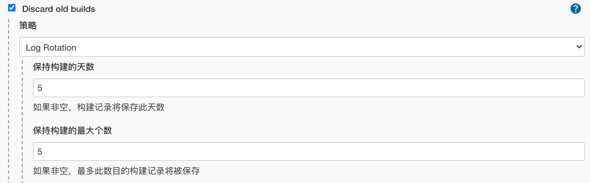

3. 构建-`Execute shell`-键入shell命令 

   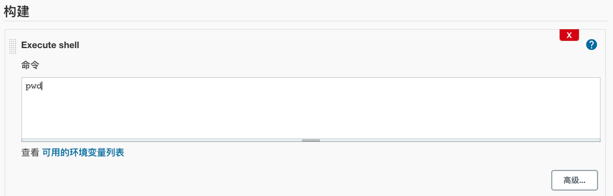

4. 保存成功后进入任务页面-点击`Build Now`   

5. 查看控制台输出

   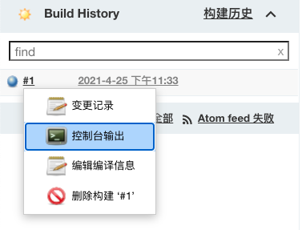

   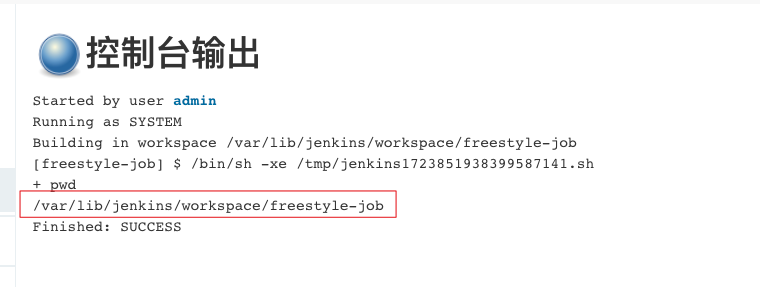

6. 测试创建一个文件夹的任务 

   ```bash
   ## 任务页面-配置-构建
   # 命令
     pwd
     touch text.txt
     
   ## 控制台输出
     + pwd
     /var/lib/jenkins/workspace/freestyle-job
     + touch text.txt
     Finished: SUCCESS
     
   ## 终端
   [root @ dev /var/lib/jenkins/plugins]  cd /var/lib/jenkins/workspace/
   [root @ dev /var/lib/jenkins/workspace]  cd freestyle-job/
   [root @ dev /var/lib/jenkins/workspace/freestyle-job]  ll
   total 0
   -rw-r--r-- 1 jenkins jenkins 0 Apr 25 23:41 text.txt
   ```

   

## 代码上线

### 配置Jenkins

1. 模拟代码手动上线的过程

2. 例如从码云中获取项目     clone-https方式

3. 准备web服务器，并安装nginx WEB页面

   ```bash
   [root @ web ~]  yum -y install nginx
   ```

4. root服务器上准备好要上传的代码 这里以monitor项目为例。

5. `root`的身份登录gitlab，创建项目  注意组要选择`test`

   ``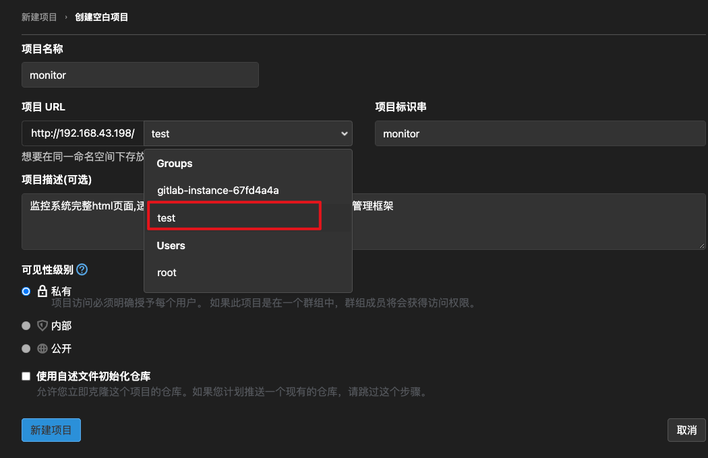

6. 现有文件夹已经存在 根据“推送现有文件夹“提示输入相关指令 完成上传到gitlab的工作

```bash
[root @ sora-localhost ~/monitor]  ll
      total 1368
      ...
      drwxr-xr-x  5 501 games   128 Apr 26 10:14 assets
      -rwxr-xr-x  1 501 games 68654 Jun 28  2017 index.html


[root @ sora-localhost ~/monitor]  git init
[root @ sora-localhost ~/monitor]  git remote add origin git@192.168.43.198:test/monitor.git
[root @ sora-localhost ~/monitor]  git add .
[root @ sora-localhost ~/monitor]  git commit -m "Initial commit"
[root @ sora-localhost ~/monitor]  git push -u origin master
			Branch master set up to track remote branch master from origin.
```

7. 将gitlab上的项目拉取到Jenkins

   完成新建任务-进入任务页面-配置-源码管理-选中`Git`-填写相关信息

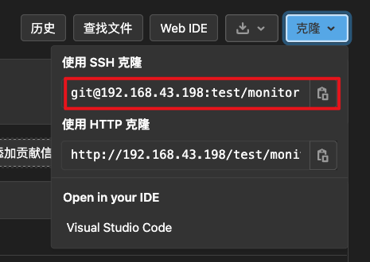

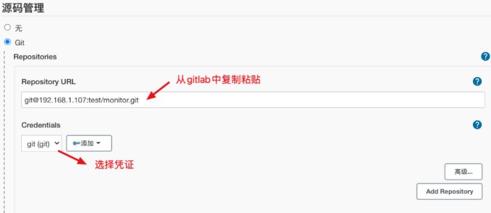

#### 常见错误1

- 连接Gitlab时，出现`128错误`

  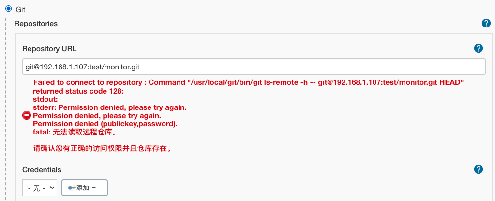

  **原因分析**

  1. 可能是由于git客户端版本过低造成的

  2. 可能是用户凭据不对或该用户没有该项目的访问权限

  **解决方法**

  - 对于git版本问题的解决方法

    1. 安装依赖软件

       ````bash
       [root @ jenkins ~]  yum install curl-devel expat-devel gettext-devel openssl-devel zlib-devel asciidoc
       [root @ jenkins ~]  yum install  gcc perl-ExtUtils-MakeMaker
       ````

    2. 卸载系统自带的低版本git

       ```bash
       [root @ jenkins ~]  git --version		# 检测git客户端版本
             git version 1.8.3.1
       [root @ jenkins ~]  yum remove git
       ```

    3. 安装新版本git

       Git安装包镜像源：https://mirrors.edge.kernel.org/pub/software/scm/git/

       ```bash
       [root @ jenkins ~]  cd /usr/local/src/
       [root @ jenkins src]  wget https://www.kernel.org/pub/software/scm/git/git-2.30.0.tar.xz
       [root @ jenkins src] tar -xvf git-2.30.0.tar.xz
       [root @ jenkins src]  cd git-2.30.0/
       [root @ jenkins git-2.30.0]  make prefix=/usr/local/git all
       [root @ jenkins git-2.30.0]  make prefix=/usr/local/git install
       [root @ jenkins git-2.30.0]  echo "export PATH=$PATH:/usr/local/git/bin" >> /etc/profile
       [root @ jenkins git-2.30.0]  source /etc/profile
       [root @ jenkins git-2.30.0]  git --version
             git version 2.30.0
       ```

    

    - 对于凭证问题的解决方法

      分析：密钥验证失败，导致无法从远程仓库读取。请确保您有正确的访问权限和git仓库的存在。

      1. 部署jenkins的机器创建和查看密钥文件

         ```bash
         ssh-keygen -t rsa				# 无限回车 生成秘钥文件
         cat .ssh/id_rsa.pub			# 获取公钥 
         cat .ssh/id_rsa					# 获取私钥 
         ```

         ==公钥粘到gitLab，私钥粘到jenkins==

      2. 将`公钥id_rsa.pub`配置在git仓库的拥有者的账号上

         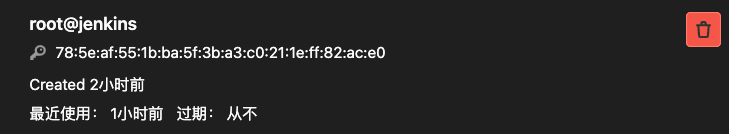

      3. 管理Jenkins-Manage Credentials-全局-添加凭证

         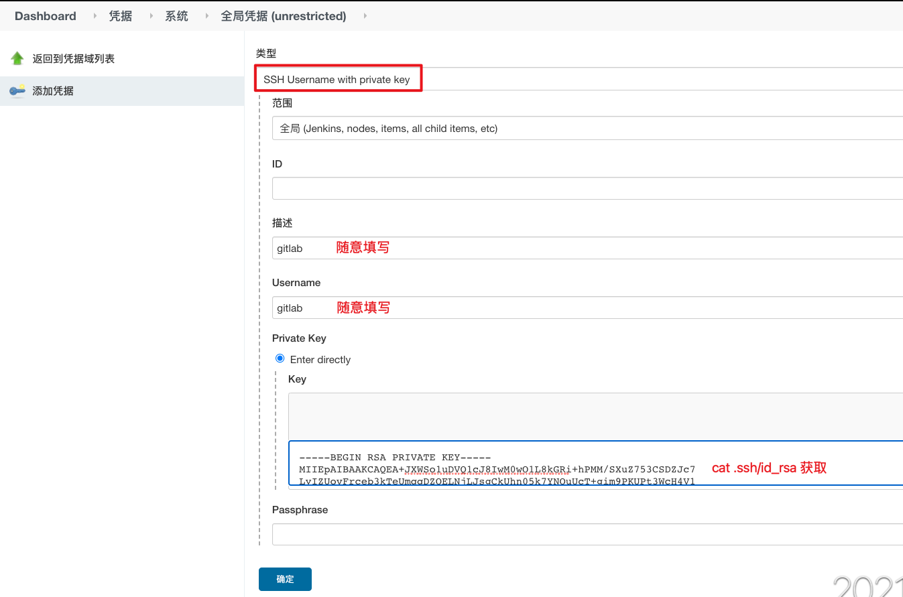

      4. 完成添加

         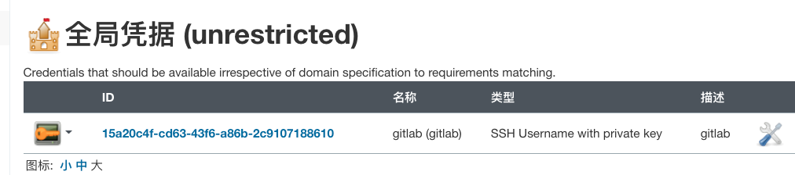


8. 保存成功后进入任务页面-点击`Build Now`   

9. 检查代码拉取情况

   ```bash
   [root @ jenkins ~]  cd /var/lib/jenkins/workspace/
   [root @ jenkins /var/lib/jenkins/workspace]  cd freestyle-job
   [root @ jenkins /var/lib/jenkins/workspace/freestyle-job]  ll
   ```


###代码追踪

####脚本描述

1. 进入工作目录

2. 打包 压缩包命名需记录当前时间精确到秒

   ``````bash
   [root @ jenkins ~]  date +%F-%H-%M-%S
   			2021-04-27-22-16-49
   ``````

3. 将压缩包拷贝到Nginx服务器的站点根目录

   ​	**scp指令**：linux系统下基于ssh登陆进行安全的远程文件拷贝命令，scp传输是加密的。

   ​	站点根目录：/usr/share/nginx/

4. 进入站点根目录，解压拷贝后的压缩包  注意使用==ssh root@==

   ​		tar    -C 选项的作用是：指定需要解压到的目录。

5. 进行初步测试

   1. 测试前需要设置SSH无密码登录

      ​		**ssh-copy-id** :将本机的公钥复制到远程机器的authorized_keys文件中

      ​				-i :显示错误信息

      ```bash
      [root @ jenkins ~]  ssh-copy-id -i .ssh/id_rsa.pub 192.168.1.111
            Are you sure you want to continue connecting (yes/no)? yes
            root@192.168.1.111's password: 
            Now try logging into the machine, with:   "ssh '192.168.1.111'"
            and check to make sure that only the key(s) you wanted were added.
      
      [root @ jenkins ~]  ssh 192.168.1.111
      [root @ web ~]
      ```

   2. 执行脚本

      ```bash
      [root @ jenkins /server/scripts]  sh deploy.sh 			
      web-2021-04-27-23-30-04.tar.gz            100% 4552KB  14.9MB/s   00:00    			
      [root @ jenkins /server/scripts]  ssh 192.168.1.111
      [root @ web ~]  cd /usr/share/nginx/
      [root @ web /usr/share/nginx]  ll      
      drwxr-xr-x 3 root root     136 Apr 25 23:54 html      
      drwxr-xr-x 2 root root     143 Apr 25 23:55 modules      
      drwxr-xr-x 8 root root    4096 Apr 27 23:30 web-2021-04-27-23-30-04      
      -rw-r--r-- 1 root root 4661583 Apr 27 23:30 web-2021-04-27-23-30-04.tar.gz
      ```

6. 删除复制过来的安装包

7. 不使用Nginx站点根目录下的html文件夹。

   利用软链接，将解压后的文件夹连接成html。保证原始代码的完整性

   如果需要回滚，同样可以利用软链接的方法

   ```bash
   [root @ web /usr/share/nginx]  ll      
   total 4      
   lrwxrwxrwx 1 root root   23 Apr 27 23:44 html -> web-2021-04-27-23-44-55      
   drwxr-xr-x 2 root root  143 Apr 25 23:55 modules      
   drwxr-xr-x 8 root root 4096 Apr 27 23:44 web-2021-04-27-23-44-55
   ```

8. 访问Nginx服务器

   

####脚本代码

```shell
#!代码追踪
#!/bin/sh
CODE_DIR=/var/lib/jenkins/workspace/freestyle-job/
WEB_DIR=/usr/share/nginx/
IP=192.168.1.111
TIME=`date +%F-%H-%M-%S`


cd ${CODE_DIR} && tar -zcf /tmp/web-${TIME}.tar.gz ./*
scp /tmp/web-${TIME}.tar.gz  ${IP}:${WEB_DIR}

ssh root@${IP} "cd $WEB_DIR && mkdir web-${TIME}"
ssh root@${IP} "cd $WEB_DIR && tar xf web-${TIME}.tar.gz -C web-${TIME}"
ssh root@${IP} "cd $WEB_DIR && rm -rf web-${TIME}.tar.gz && rm -rf html "
ssh root@${IP} "cd $WEB_DIR && ln -s web-${TIME} html"
```

```shell
#!/bin/sh
cd /usr/share/nginx/
ls -d web-*
read -p "你复制你需要回顾的目录版本:" var
rm -rf html
ln -s $var html
```


## 自动化部署


### 手动实现部署

当仓库代码发生改变，点击`Build Now`  -立即上传到Nginx服务器

进入任务页面-配置-构建-`Execute shell`-键入shell命令 

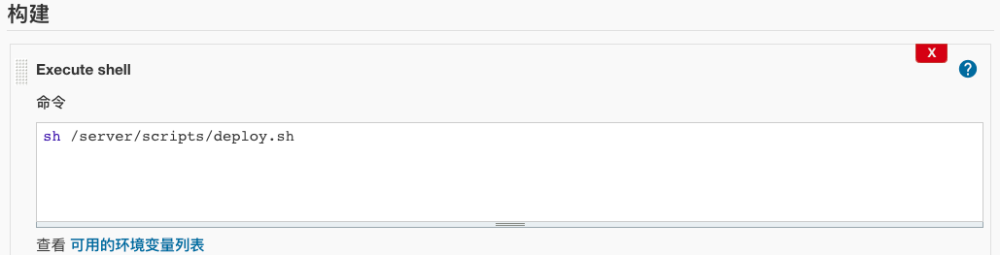

####测试手动部署

```bash
[root @ sora-localhost ~]  cd monitor/
# 修改代码完成后进行推送
[root @ sora-localhost ~/monitor]  git commit -m "修改index"
[root @ sora-localhost ~/monitor]  git push -u origin master 
```

进入Gitlab查看远程仓库的代码是否已经修改

Jenkins进入任务页面-点击`Build Now`   


#### 常见错误2

- jenkins在构建的时候，打开控制台可以看到执行到shell脚本的scp指令部分时，提示权限不足

  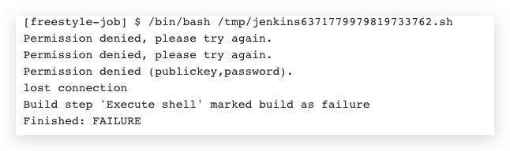

  分析：执行脚本的时候jenkins使用的用户没有对应文件的权限。

1. 查看jenkins使用的用户

   `````bash
   [root @ jenkins ~]  vi /etc/sysconfig/jenkins 
   			JENKINS_USER="jenkins"
   `````

2. 修改默认用户为root

   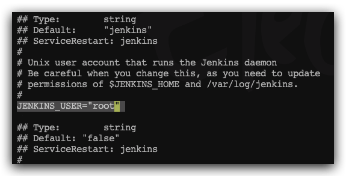

3. 修改Jenkins相关文件夹用户权限 然后重启Jenkins

   ```bash
   [root @ jenkins ~]  chown -R root:root /var/lib/jenkins/
   [root @ jenkins ~]  chown -R root:root /var/cache/jenkins/
   [root @ jenkins ~]  chown -R root:root /var/log/jenkins/
   
   [root @ jenkins ~]  systemctl restart jenkins.service 
   ```

   

###实现自动部署

​		实现自动部署，即Gitlab上的远程仓库有新的改动就立即通知Jenkins进行构建，并自动推送到web站点目录，而无需手动点击`Build Now`   

1. 进入任务页面-配置-构建触发器-勾选`Build when a change is pushed to GitLab. GitLab webhook`

   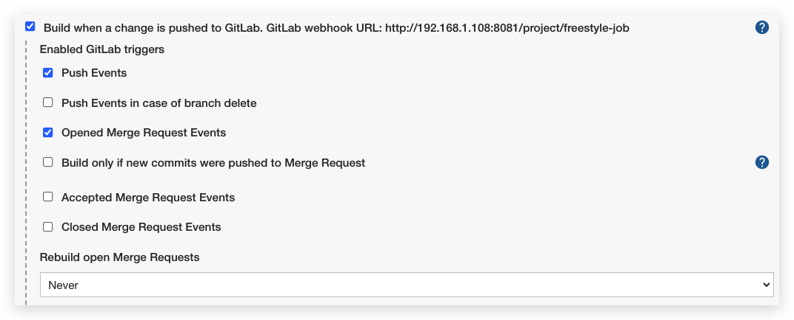

   默认即可-点击`高级`-`Allowed branches` 填入只允许master

   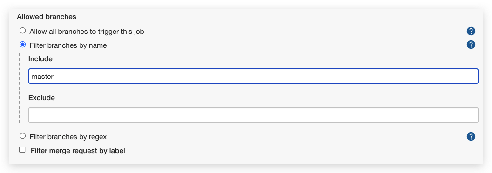 

   ​	`Secret token`-点击`Generate`-复制token  然后点击保存即可

   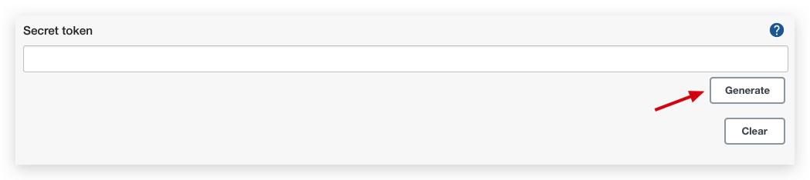


2. 进入Gitlab项目页面-设置-`Webhooks`-粘贴到Secret token

   网址填的是Jenkins提供的webhook URL  其他的默认即可

   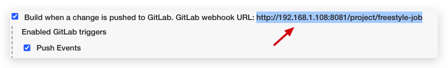

   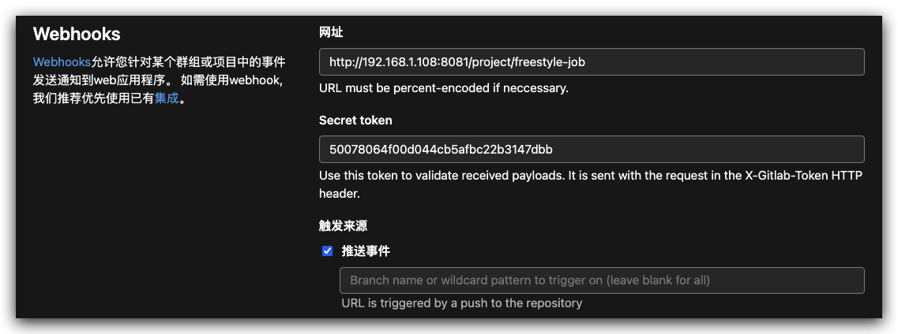

   点击添加webhook完成操作

   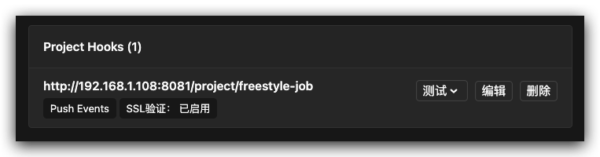

   可以点击`测试`-`Push Event`  如果显示成功即可

   

3. 测试是否实现自动部署    测试方式同手动实现部署


####常见错误3

Webhooks保存时出现以下错误：


解决方法：

进入🔧设置-网络-`outbound requests`外发请求-勾选`Allow requests to the local network from web hooks and services`

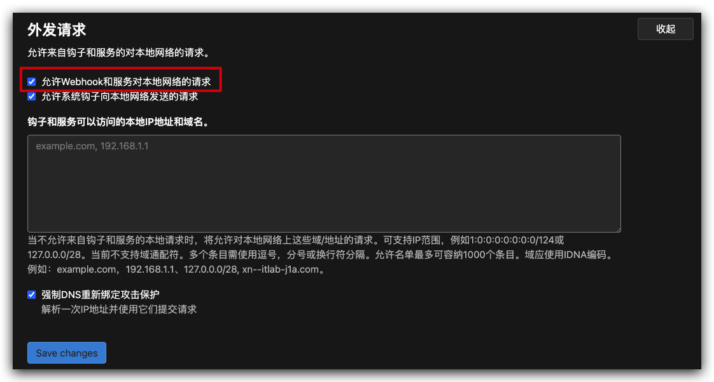


####反馈到Gitlab

实现Jenkins完成构建后的信息会反馈给Gitlab

- Jenkins全局设置

  1. Jenkins系统管理-`Configure System`系统设置-`GitLab`

  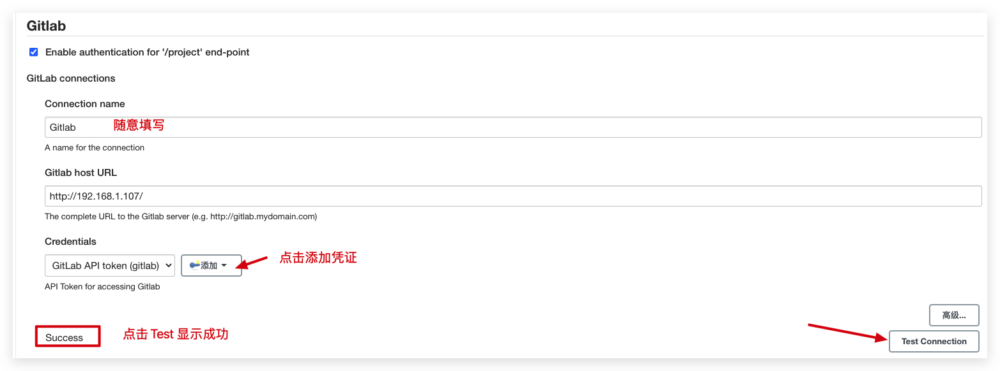

  2. 进入gitlab-用户设置-个人访问令牌-完成信息填写-保存复制个人访问令牌

  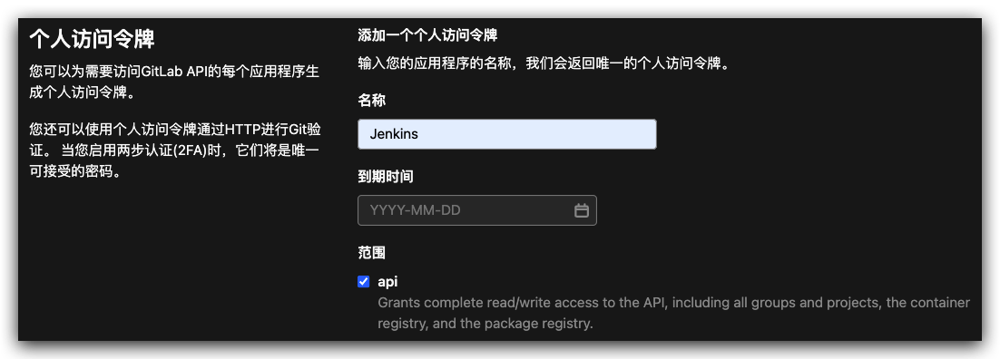

  3. 回到Jenkins设置页码-点击添加   并且选择添加好的凭证

  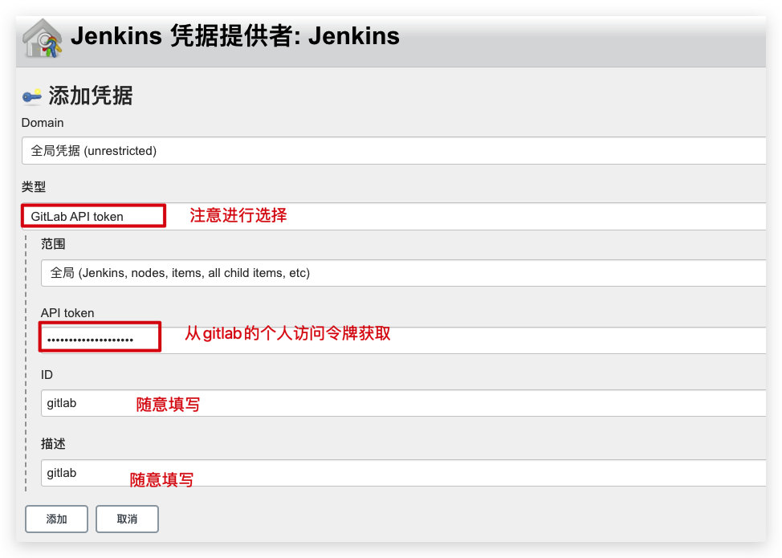


- Jenkins项目设置

  进入项目页面-配置-`构建后的操作`-选择`Publish build status to Gitlab`

  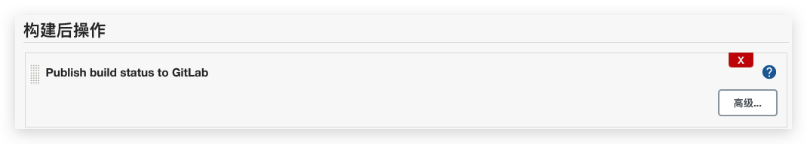


# Maven

​		**Maven**是一个项目管理和综合工具。 Maven提供给开发人员构建一个完整的生命周期框架。 开发团队可以自动完成该项目的基础设施建设, Maven使用标准的目录结构和默认构建生命周期。
​		Apache的开源项目主要服务于JAVA平台的构建、依赖管理、项目管理。
​		**Project Object Model**,项目对象模型。通过xml格式保存的pom.xml文件。该文件用于管理:源代码、配置文件、开发者的信息和角色、问题追踪系统、组织信息、项目授权、项目的url、项目的依赖关系等等。该文件是由开发维护,我们运维人员可以不用去关心

## 安装配置 

1. 下载Maven安装包

   ```bash
   https://mirrors.tuna.tsinghua.edu.cn/apache/maven/
   ```

2. 安装Maven

   ```bash
   [root @ maven ~]  tar xvf apache-maven-3.8.1-bin.tar.gz 
   [root @ maven ~]  mv apache-maven-3.8.1  /usr/local/
   [root @ maven ~]  cd /usr/local/
   [root @ maven /usr/local]  ln -s apache-maven-3.8.1/ maven		# 软链接成maven
   [root @ maven /usr/local]  ll
         lrwxrwxrwx  1 root root 19 Apr 29 00:20 maven -> apache-maven-3.8.1/
   ```

3. 配置环境变量

   ```bash
   [root @ maven ~]  vim /etc/profile
         export PATH=/usr/local/maven/bin:$PATH
   [root @ maven ~]  source /etc/profile
   ```


## 重要目录和指令

- 重要目录

```bash
/usr/local/maven/bin/m2.conf			# 配置下载来的依赖包的存放路径
```

- 重要指令

```bash
mvn -v				# 查看版本号
validate			# (验证):验证项目正确,并且所有必要信息可用。 
compile				# (编译):编译项目源码
test					# (测试):使用合适的单元測试框架测试编译后的源码
package				# (打包):源码编译之后,使用合适的格式(例如JAR格式)对编译后的源码进行打包 
integration-test			# (集成测试):如果有需要,把包处理并部署到可以运行集成测试的环境中去。 
verify				# (验证):进行各种测试来验证包是否有效并且符合质量标准。
insta11				# (安装):把包安装到本地仓库,使该包可以作为其他本地项目的依赖。
deploy				# (部署):在集成或发布环境中完成,将最终软件包复制到远程存储库,以与其他开发人员和项目共享。
mvn clean			# (清除):清除上次编译的结果 
mvn package		# 会去maven的中央仓库去下载需要的依赖包和插件到m2目录下
```


##私服Nexus

### 安装nexus

1. 备份Maven全局配置文件

   ```bash
   [root @ maven /usr/local/maven]  cd /usr/local/maven/conf/
   [root @ maven /usr/local/maven/conf]  cp settings.xml{,.bak}		# 备份全局配置文件
   [root @ maven /usr/local/maven/conf]  ll
         -rw-r--r-- 1 root root 10741 Nov  7  2019 settings.xml
         -rw-r--r-- 1 root root 10741 Apr 29 00:45 settings.xml.bak
   ```

2. 使用阿里云云效Maven进行配置

   打开 maven 的配置文件，在<mirrors></mirrors>标签中添加 mirror 子节点

   ```xml
   <mirror>
     <id>aliyunmaven</id>
     <mirrorOf>*</mirrorOf>
     <name>阿里云公共仓库</name>
     <url>https://maven.aliyun.com/repository/public</url>
   </mirror>
   ```

3. 安装nexus

   - 配置仓库两个选项
     1. 项目下的pom.xml配置、只生效当前的项目 

     2. 在maven配置全局所有项目生效

   - 准备好nexus服务器

   - 下载并上传JDK和nexus安装包

     ```bash
     JDK			http://www.sousou88.com/spec/version8.html#jdk8u271
     nexus		https://pan.baidu.com/s/178Ie7A2oU3eBPZO2bkqz_g  密码: rda7
     ```

   - 安装JDK和nexus

     ```bash
     [root @ nexus ~]  rpm -ivh jdk-8u271-linux-x64.rpm 
     
     [root @ nexus ~]  tar -xvf nexus-3.19.1-01-unix.tar.gz
     [root @ nexus ~]  mv nexus-3.19.1-01/ /usr/local/
     [root @ nexus ~]  cd /usr/local/
     [root @ nexus /usr/local]  ln -s nexus-3.19.1-01/ nexus
     [root @ nexus /usr/local]  ll
     			lrwxrwxrwx  1 root root  16 Apr 29 16:28 nexus -> nexus-3.19.1-01/
     ```

   - 启动nexus

     ```bash
     [root @ nexus /usr/local]  /usr/local/nexus/bin/nexus start
           Starting nexus
     [root @ nexus /usr/local]  /usr/local/nexus/bin/nexus status
     			nexus is running.
     ```

4. 访问Jenkins

   浏览器输入主机号:8081即可访问   `http://192.168.43.23:8081/`

   点击右上角的`Sign in` ，输入用户名和密码

   根据提示进行初始设置

   

###重要目录和指令

- 重要目录

```bash
/usr/local/sonatype-work/nexus3/admin.password					# 默认登陆密码
```

- 重要指令

```bash
/usr/local/nexus/bin/nexus  start						# 启动nexus服务
/usr/local/nexus/bin/nexus  status					# nexus状态
```


### 基本操作

#### 配置nexus

- 配置代理

  进入🔧设置-`Repositiories`-点击`maven-central`

  进入proxy设置，修改remote storage为阿里云公共仓库

  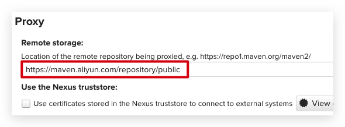

  

- 配置Maven

  1. 进入配置文件

     ```bash
     [root @ maven ~]  cd /usr/local/maven/conf/
     [root @ maven /usr/local/maven/conf]  cp settings.xml settings.xml.aliyun		# 备份文件
     [root @ maven /usr/local/maven/conf]  vim settings.xml
     # 将原先的<mirrors>标签下阿里云公共仓库信息注释掉
     ```

  2. 修改 Maven的配置文件,整合 Nexus

     - 找到<servers>标签,添加 Nexus默认认证信息

       ```xml
           <server>
             <id>my-nexus-releases</id> 
             <username>admin</username> 
             <password>admin123</password> 
           </server> 
           <server>
             <id>my-nexus-snapshot</id>
             <username>admin</username>
             <password>admin123</password>
           </server>
       ```

     - 找到<mirrors>标签,添加镜像,url为nexus私服地址

       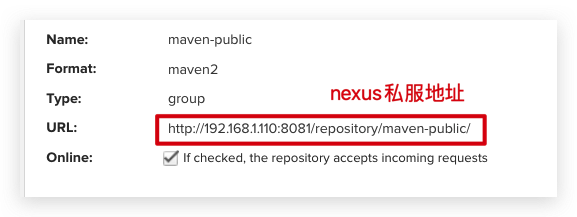

       ```xml
           <mirror>
             <id>nexus</id>
             <mirrorOf>*</mirrorOf>
             <url>http://192.168.1.110:8081/repository/maven-public/</url>
           </mirror>
       ```

     - 找到<profiles>标签,添加合库信息

       ```xml
           <profile>
             <id>nexus</id>
             <repositories>
                 <repository>
                   <id>central</id>
                   <url>http://192.168.1.110:8081/repository/maven-public/</url>
                   <releases><enabled>true</enabled></releases> 
                   <snapshots><enabled>true</enabled></snapshots>
                 </repository>
             </repositories>
             <pluginRepositories>
                 <pluginRepository>
                   <id>central</id>
                   <url>http://192.168.1.110:8081/repository/maven-public/</url>
                   <releases><enabled>true</enabled></releases> 
                   <snapshots><enabled>true</enabled></snapshots>
                 </pluginRepository>
             </pluginRepositories>
           </profile>
       ```

     - 激活仓库

       ```xml
           <activeProfiles>
               <activeProfile>nexus</activeProfile>
           </activeProfiles>
       ```

       

## 代码上线

### 代码上传

1. root服务器上准备要上线的项目 并推送至gitlab

2. Jenkins新建Item-输入任务名-选择`构建一个Maven项目`

3. 项目基本设置参考前文

4. `build`项设置    `Goals and options`填入   **clean package**

5. Jenkins配置Maven

   管理Jenkins-`Global Tool Confiquration`-Maven-点击`安装Maven`

   注意：取消勾选Install automatically

   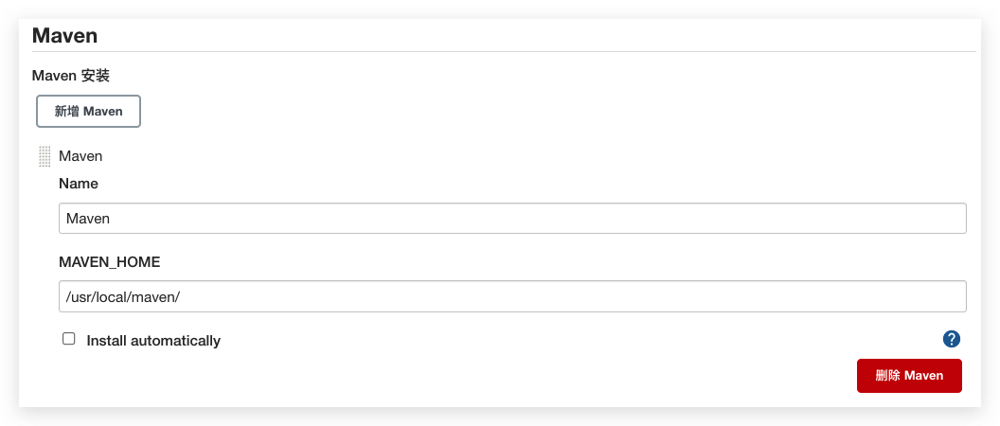

6. 返回项目配置中，查看build不再报错

   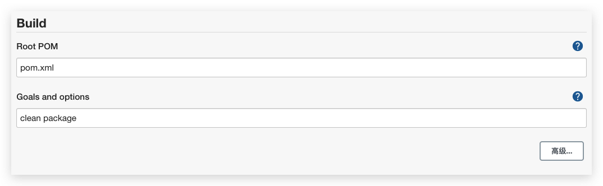

7. 保存成功后进入任务页面-点击`Build Now`   


###部署

- 安装JDK和Tomcat

  1. 下载并安装

     ```bash
     # Tomcat		https://mirrors.cnnic.cn/apache/tomcat/
     [root @ web ~]  rpm -ivh jdk-8u271-linux-x64.rpm 
     
     [root @ web ~]  mkdir /application
     [root @ web ~]  tar xf apache-tomcat-9.0.45-src.tar.gz -C /application/
     [root @ web ~]  cd /application/
     [root @ web /application]  ln -s apache-tomcat-9.0.45-src/ tomcat
     ```

  2. 启动加速

     1. 修改JDK中的文件  

        ```bash
        [root @ web ~]  vim /usr/java/jdk1.8.0_271-amd64/jre/lib/security/java.security 
              117   securerandom.source=file:/dev/urandom
        ```

     2. 启动Tomcat

        如果出现权限错误等，参考https://blog.csdn.net/bingxuesiyang/article/details/88381323

        ```bash
        [root @ web ~]  /application/tomcat/bin/startup.sh 
              Tomcat started.
        ```

        浏览器输入主机号:8080即可访问   `http://192.168.1.111:8080/`

- 安装配置mysql数据库

  1. 安装配置数据库

     在 Centos7中安装 MYSQL8		https://www.cnblogs.com/willick/p/install-mysql-8-centos-7.html

     ```bash
     [root @ web ~]  mysql -uroot -proot -e "create database tduck"
     [root @ web ~]  mysql -uroot -proot -e "show databases"
           +--------------------+
           | Database           |
           +--------------------+
           | information_schema |
           | mysql              |
           | performance_schema |
           | tduck              |
           | test               |
           +--------------------+
     ```

  2. 执行sql文件

     ```bash
     [root @ maven ~]   cd /var/lib/jenkins/workspace/tduck-platform-job/doc/
     [root @ maven doc]  ll
           -rwxr-xr-x 1 root root 18569 Apr 30 11:07 tduck.sql
     [root @ maven doc]  scp  tduck.sql  192.168.1.111:/tmp/      
     
     [root @ web ~]  cd /tmp/
     [root @ web /tmp]  ll
     			-rwxr-xr-x  1 root root 18569 Apr 30 12:58 tduck.sql
     			
     [root @ web ~]  mysql -uroot -proot tduck < tduck.sql 
     [root @ web ~]  mysql -uroot -proot -e "use tduck;show tables"
           mysql: [Warning] Using a password on the command line interface can be insecure.
           +------------------------------+
           | Tables_in_tduck              |
           +------------------------------+
           | ac_user                      |
           | ac_user_authorize            |
           | pr_project_template          |
           | pr_project_template_category |
           | pr_project_template_item     |
           | pr_project_theme             |
           | pr_user_project              |
           | pr_user_project_item         |
           | pr_user_project_result       |
           | pr_user_project_setting      |
           | pr_user_project_theme        |
           | wx_mp_user                   |
           +------------------------------+
     ```

- 远程推送war包

  进入Jenkins-配置-`Post Steps`-添加`Execute shell`

  ```shell
  ssh root@192.168.1.111  "mv /application/tomcat/webapps/*   /opt"			# 备份
  scp /var/lib/jenkins/workspace/maven-1ob/jeesns-web/target/jeesns-web.war  192.168.1.111:/application/tomcat/webapps/ROOT.war
  ```

  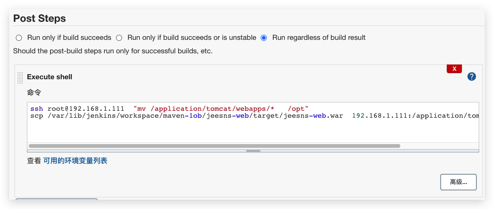

- 前后端分离项目

  1. CentOS7配置node.js：	

     ​	https://www.cnblogs.com/sanduzxcvbnm/p/13495529.html

  2. Jenkins前后端前后端分离	

     ​	https://blog.csdn.net/qq_34775355/article/details/112209634

     ​	https://blog.csdn.net/lvye1221/article/details/106229536

  3. tduck部署文档	

     https://gitee.com/TDuckApp/tduck-platform/wikis/%E6%9C%AC%E5%9C%B0%E8%BF%90%E8%A1%8C?sort_id=3681729

     

  4. 配置Nginx

     ```bash
     [root @ web /etc/nginx]  vim nginx.conf
     ```

     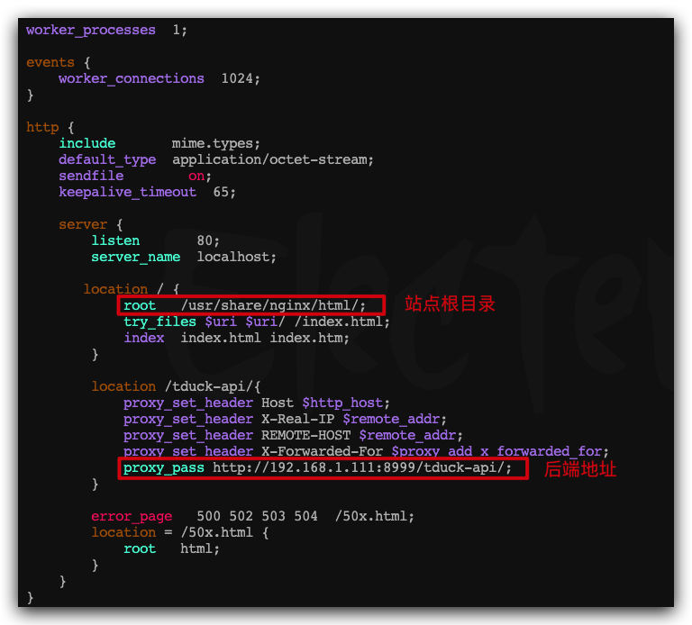

5. 完成部署

   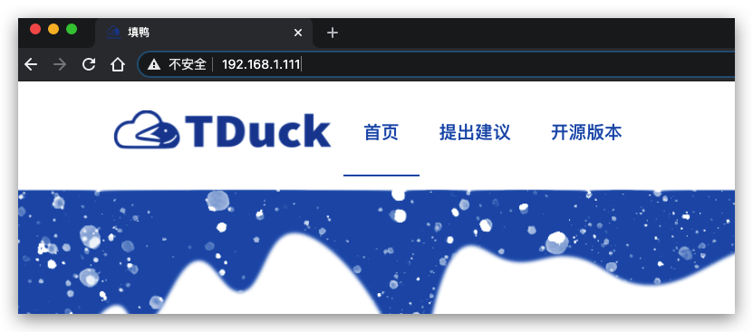


# Jenkins Pipeline


## 基本概念

###**CⅠ/CD  **

1. 持续集成(**c**ontinuous **i**ntegration)是一种软件开发实践,即团队开发成员经常集成它们的工作,通过每个成员每天至少集成一次,也就意味着每天可能会发生多次集成。每次集成都通过自动化的构建(包括编译,发布,自动化测试)来验证,从而尽早地发现集成错误。

   比如(你家装修厨房,其中一项是铺地砖,边角地砖要切割大小。如果一次全切割完再铺上去,发现尺寸有误的话 浪费和返工时间就大了,不如切一块铺一块。这就是持续集成。

2. 持续部署(**c**ontinuous **d**eployment)是通过自动化的构建、测试和部署循环来快速交付高质量的产品。某种程度上代表了一个开发团队工程化的程度,毕竟快速运转的互联网公司人力成本会高于机器,投资机器优化开发流程化 相对也提高了人的效率

   比如(装修厨房有很多部分,每个部分都有检测手段,如地砖铺完了要测试漏水与否,线路铺完了要通电测试电路通顺,水管装好了也要测试冷水热水。如果全部装完了再测測,出现问题可能会互相影响,比如电路不行可能要把地砖给挖开。那么每完成一部分就测试,这是持续部署。)

3. 持续交付(**c**ontinuous **d**elivery)频繁地将软件的新版本,交付给质量团队或者用户,以供评审尽早发现生产环境中存在的问题;如果评审通过,代码就进入生产阶段

   比如(全部装修完了,你去验收,发现地砖颜色不合意,水池太小,灶台位置不对,返工吗?所以不如没完成一部分,你就去用一下试用验收,这就是持续交付)

4. 敏捷思想中提出的这三个观点,还强调一件事:通过技术手段自动化这三个工作。加快交付速度

   

###**Pipeline**

1. 什么是pipeline

   Jenkins2.0的精髓是 Pipeline as Code,是帮助Jenkins实现CI到CD转变的重要角色。什么是 Pipeline,简单 来说,就是一套运行于] elkins上的工作流框架,将原本独立运行于单个或者多个节点的任务连接起来,实现单个任务难以完成的复杂发布流程。 Pipeline的实现方式是一套 Groovy DSL,任何发布流程都可以表述为一段 Groovy 脚本,并且Jenkins支持从代码库直接读取脚本,从而实现了 Pipeline as Code的理念

2. **Pipeline概念**

   Pipeline是一个用户定义的CD流水线模式。 Pipeline代码定义了通常包含构建、测试和发布步骤的完整的构建过程

   - Node
     node是一个**机器**,它是Jenkins环境的一部分,并且能够执行 Pipeline。同时,node代码块也是脚本式Pipeline语法的关键特性。
   - Stage
     Stage块定义了在整个 ipeline中执行的概念上不同的任务子集(例如“构建”,测试”和部署”**阶段**)，许多插件使用它来可视化或呈现Jenkins管道状态/进度 
   - Step
     一项任务。从根本上讲,一个步骤告诉Jenkins在特定时间点(或过程中的“**步骤**”)要做什么。例如,使用 sh  step:sh'make' 可以执行make这个she11命令

###Jenkins file

​	脚本式语法格式:

```shell
pipeline{
	agent any 
	stages{
		stage("get code"){		
			steps{
				echo "get code from scm"
			}
		}
		stage("package"){			
			steps{
				echo "packge code"
			}
		}
		stage("deploy"){	
			steps{
				echo "deploy packge to nodel"
			}
		}    
	}
}
```


## 基本操作

### 创建任务

- 使用本地脚本

  1. 新建Item-输入任务名-选择`流水线`

  2. General - 勾选`Discard old builds`丢弃旧的构建     填入5即可

  3. 流水线-选择`Pipeline script`-写入脚本

     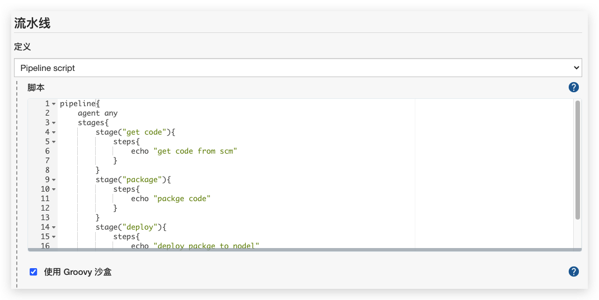

  4. 保存成功后进入任务页面-点击`Build Now`   

     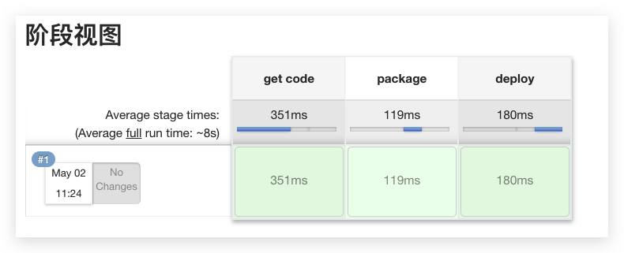

  5. 点击每个阶段的`logs`

     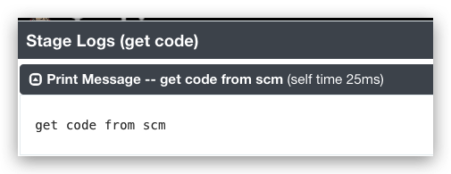

  

### 使用远程仓库脚本

1. 流水线-选择`Pipeline script from SCM`

   1. 填入远程仓库的相关信息

      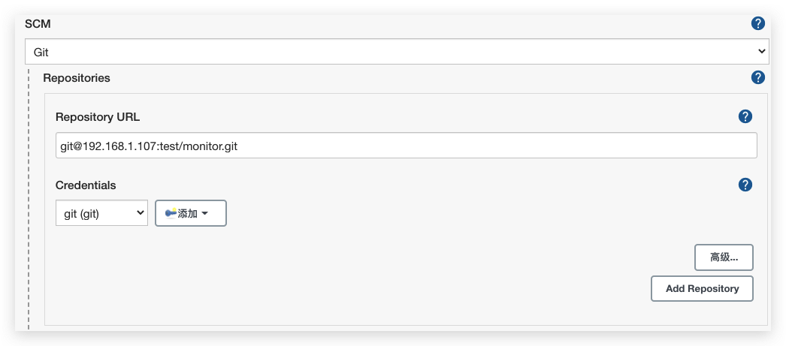

   1. 将脚本推送至gitlab ，并在Jenkins流水线项目中填写脚本路径

      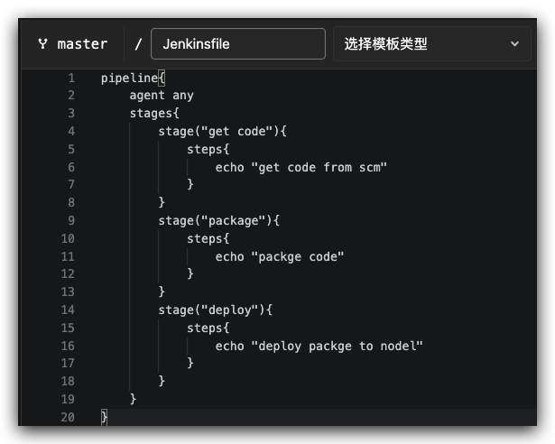

      

      如果不填写的话，直接构建会构建失败

      

### 结合代码追踪的流水线脚本

```shell
pipeline{
	agent any 
	stages{
		stage("get code"){		
			steps{
				echo "get code from scm"
			}
		}
		stage("unit test"){		
			steps{
				echo "unit test"
			}
		}
		stage("package"){			
			steps{
				sh 'tar -zcf /opt/web-${BUILD_ID}.tar.gz ./* --exclude=.git --exclude=Jenkinsfile'
			}
		}
		stage("deploy"){	
			steps{
        sh 'ssh root@192.168.1.111 "cd /usr/share/nginx/ && mkdir web-${BUILD_ID}"'
        sh 'scp /opt/web-${BUILD_ID}.tar.gz 192.168.1.111:/usr/share/nginx/web-${BUILD_ID}'
        sh 'ssh root@192.168.1.111 "cd /usr/share/nginx/web-${BUILD_ID} && tar xf web-${BUILD_ID}.tar.gz"'
        sh 'ssh root@192.168.1.111 "cd /usr/share/nginx/web-${BUILD_ID} && rm -rf web-${BUILD_ID}.tar.gz && rm -rf html "'	
        sh 'ssh root@192.168.1.111 "cd /usr/share/nginx/web-${BUILD_ID} && ln -s web-${BUILD_ID}  /usr/share/nginx/html"'
			}
		}    
	}
}
```

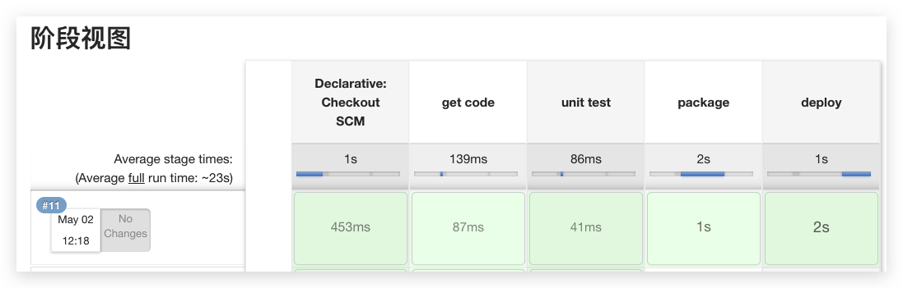


# 总结

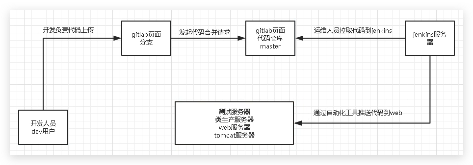

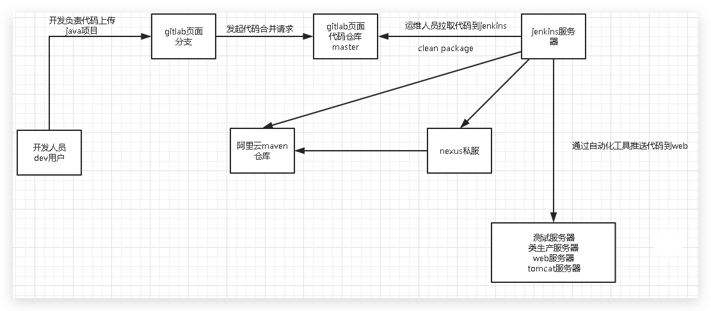

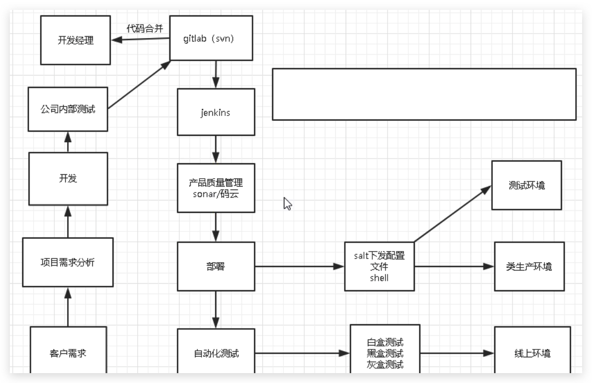

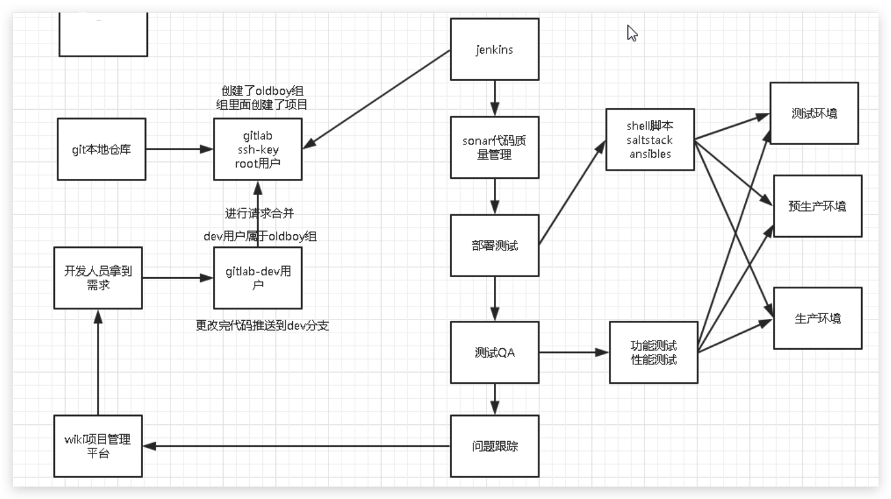


# Git常用指令

```bash
git init				#初始化仓库把一个目录初始化为版本仓库(可以是空的目录也可以是帯内容的目录) 
git status			#査看当前仓库的状态

git add <文件名> 		#添加文件到暂存区
git add ./*		#添加当前所有文件到暂存区 

git rm --cached <文件名>		#撤出暂存区
git rm -f <文件名>		#同时删除暂存区和工作目录的文件

git commit -m   "描述信息"		#从暂存区提交到本地仓库
git commit -am  "描述信息"		#如果某个文件已经被仓库管理,如果在更改此文件直接需要一条命令提交即可

git mv <old_name> <new_name>	#git命令直接更改名称

git diff								#默认比对工作目录和暂存区 
git diff	--cached			#比对暂存区和本地仓库

git log									# 查看历史快照
git log --oneline				# 一行简单的显示 Commit信息
git log --oneline --decorate			# 显示当前的指针指向哪里
git log  -p							# 显示具体内容的变化
git log  -1							# 只显示1条内容

git reset --hard  <哈希值>/<标签>			 # 回滚数据到某一个提交
git reflog 							# 可以查看所有分支的所有操作记录

git branch								# 查看分支
git branch <分支名>				# 创建分支
git branch -d <分支名>  		# 删除分支

git checkout <分支名> 							# 切换分支
git checkout -b <分支名>						# 创建并切换到分支

git merge <分支名>					#合并分支

git tag    							# 显示全部标签
git tag -a <标签名>  <哈希值> -m <说明文字>   	# 添加标签
git tag -d <标签名>			# 删除标签

git remote													# 查看远程地址
git remote add origin <SSH地址>			# 添加远程仓库地址 名称为origin
git remote rm  <本地仓库名>					# 删除远程地址
git push -u origin <master/分支名>		# 推送到远程仓库
git pull 														# 从远程获取代码并合并本地的版本
git clone  <SSH地址>								# 从远程仓库克隆到本地仓库
```


# Git常见英文

```bash
 1. branch		分支 
 2. master		主
 3. conflict  冲突
```

