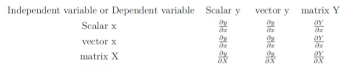
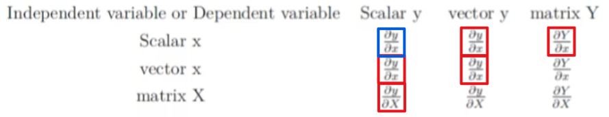
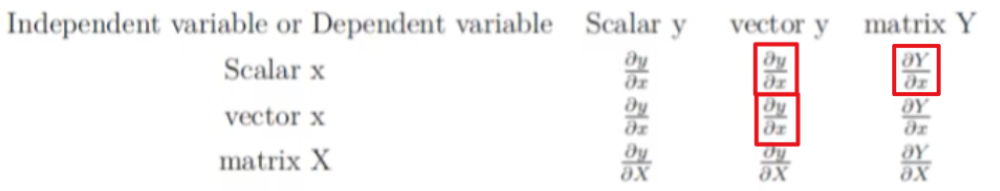
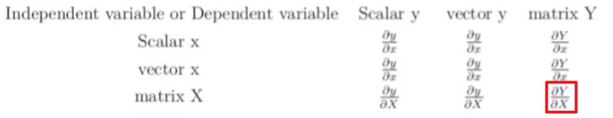

[TOC]

# 1 矩阵向量求导引入

​	在高等数学里面,我们已经学过了标量对标量的求导,比如标量$y$对标量$x$的求导,可以表示为$\frac{\partial y}{\partial x}$.有些时候,我们会有一组标量$y_i=1,2,..,m$来对一个标量$x$的求 导,那么我们会得到一组标量求导的结果:
$$
\frac{\partial y_i}{\partial x_i},i=1,2,..,m
$$
​	如果我们把这组标量写成向量的形式,即得到维度为$m$的一个向 量$y$对一个标量$x$的求导,那么结果也是一个m维的向量: ​

​	$\frac{\partial y}{\partial x}$可见,所谓**向量对标量的求导,其实就是向量里的每个分量分别对标量求导,最后把求导的结果==排列==在一起,按一个向量表示而己**。 总而言之,所谓的向量矩阵求导本质上就是多元函数求导,仅仅是把函数的自变量,因变量以及标量求导的结果排列成了向量矩阵的形式,方便表达与计算,更加简洁而己.

##1.1 矩阵向量求导定义

​	根据求导的自变量和因变量是标量,向量还是矩阵,我们有 9种可能的矩阵求导定义,如下:

​	这9种里面,标量对标量的求导高数里面就有,不需要我们单独讨论,在剩下的8种情况里面,我们先讨论上图中标量对向量或矩阵求导,向量或矩阵对标量求导,以及向量对向量求导这5 种情况。

​	另外三种向量对矩阵的求导,矩阵对向量的求导,以及矩 阵对矩阵的求导我们在后面再讲。

​	现在我们回看第一节讲到的例子,维度为m的一个向量$y$对一个标量$x$的求导,那么结果也是一个m维的向量$\frac{\partial y}{\partial x}$.这是我们表格里面向量对标量求导的情况。

​	这里有一个问题有讲到,就是这个m维的求导结果排列成的m维向量到底应该是列向量还是行向量?

​	这个问题的答案是:行向量或者列向量皆可!毕竟我们求导的 本质只是把标量求导的结果排列起来,至于是按行排列还是按列排 列都是可以的。但是这样也有问题,在我们机器学习算法法优化过程中,如果行向量或者列向量随便写,那么结果就不唯一,限套了。

​	为了解决这个问题,我们引入`求导布局`的概念。

## 1.2 矩阵向量求导布局

​	为了解决矩阵向量求导的结果不唯一,我们引入求导布局。最基本的求导布局有两个:`分子布局`( numerator layout)和`分母布局 `(denominator layout)。

- 对于分子布局来说,我们求导结果的**维度以分子为主**,比如对于我们上面对标量求导的例子,结果的维度和分子的维度是一致的。也就是说,如果向量$y$是一个m维的==列==向量,那么求导结果也是一个m维==列==向量。如果向量$y$是一个m维的行向量,那 么求导结果也是一个m维行向量。

- 对于分母布局来说,我们求导结果的**维度以分母为主**,比如对于我们上面对标量求导的例子,如果向量$y$是一个m维的==列==向量, 那么求导结果$\frac{\partial y}{\partial x}$是一个m维==行==向量。如果向量y是一个m维的行向量,那么求导结果$\frac{\partial y}{\partial x}$是一个m维的列向量。

​	再举一个例子,标量$y$对矩阵$X$求导,那么如果按分母布局 则求导结果的维度和矩阵X的维度 m × n 是一致的。如果是分子布局,则求导结果的维度为 n x m。

​	这样,对于**标量对向量或者矩阵求导**,**向量或者矩阵对标量求导**这4种情况,对应的分子布局和分母布局的排列方式就确定了。

​	稍微麻烦点的是**向量对向量**的求导,本文只讨论列向量对列向量的求导,其他的行向量求导只是差一个转置而已。

​	比如m维列向量$y$对n维列向量$x$求导。它的求导结果在分子布局和分母布局各是什么呢? 

​	对于这2个向量求导,那么一共有m*n个标量对标量的求导。求导的结果一般是排列为一个矩阵。

- 如果是`分子布局`, 则矩阵的  第一个维度以分子为准,即结果是一个 m × n 的矩阵.

  
  $$
  \frac{\partial \mathbf{y}}{\partial \mathbf{x}}=\left(\begin{array}{cccc}\frac{\partial y_{1}}{\partial x_{1}} & \frac{\partial y_{1}}{\partial x_{2}} & \cdots & \frac{\partial y_{1}}{\partial x_{n}} \\ \frac{\partial y_{2}}{\partial x_{1}} & \frac{\partial y_{2}}{\partial x_{2}} & \cdots & \frac{\partial_{n}}{\partial x_{n}} \\ \vdots & \vdots & \ddots & \vdots \\ \frac{\partial u_{m}}{\partial x_{1}} & \frac{\partial y_{m}}{\partial x_{2}} & \cdots & \frac{\partial y_{m}}{\partial x_{n}}\end{array}\right)
  $$
  上边这个按分子布局的向量对向量求导的结果矩阵,我们一般叫做`雅克比矩阵`。有的资料上会使用$\frac{\partial y}{\partial x^T}$来定义雅克比矩阵,意义是一样的。

- 如果是按`分母布局`,则求导的结果矩阵的第一维度会以分母为准, 即结果是一个 n x m的矩阵,如下:	

  
  $$
  \frac{\partial \mathbf{y}}{\partial \mathbf{x}}=\left(\begin{array}{cccc}\frac{\partial y_{1}}{\partial x_{1}} & \frac{\partial y_{2}}{\partial x_{1}} & \cdots & \frac{\partial y_{m}}{\partial x_{1}} \\ \frac{\partial y_{1}}{\partial x_{2}} & \frac{\partial y_{2}}{\partial x_{2}} & \cdots & \frac{\partial y_{m}}{\partial x_{2}} \\ \vdots & \vdots & \ddots & \vdots \\ \frac{\partial y_{1}}{\partial x_{n}} & \frac{\partial y_{2}}{\partial x_{n}} & \cdots & \frac{\partial y_{m}}{\partial x_{n}}\end{array}\right)
  $$
  上边这个按分母布局的向量对向量求导的结果矩阵,我们一般叫 做`梯度矩阵`。有的资料上会使用$\frac{\partial y}{\partial x}$来定义梯度矩阵,意义是一样的。

​	有了布局的概念,我们对于上面5种求导类型,可以各选择 布局来求导。但是对于某一种求导类型,不能同时使用分子布局和 分母布局求导。

# 2 标量对向量求导

​	标量对向量求导,严格来说是实值函数对向量的求导。即定义 实值函数$f:R_n→R$,自变量$x$是n维向量,而输出$y$是标量。对于一个给定的实值函数,如何求解$\frac{\partial y}{\partial x}$呢?

​	首先我们想到的是基于矩阵求导的定义来做,由于所谓标量对向量的求导,其实就是标量对向量里的每个分量分别求导,最后把求导的结果排列在一起,按一个向量表示而己。那么我们可以将实值 函数对向量的每一个分量来求导,最后找到规律,得到求导的结果向量。

1. 首先我们来看一个简单的例子: $y=\mathbf{a}^{T} \mathbf{x}$, 求解 $\frac{\partial \mathbf{a}^{T} \mathbf{x}}{\partial \mathbf{x}}$.

   ​	根据定义, 我们先对 $\mathrm{x}$ 的第 $\mathrm{i}$ 个分量进行求导, 这是一个标量对标量的求导, 如下:
   $$
   \frac{\partial \mathbf{a}^{T} \mathbf{x}}{\partial x_{i}}=\frac{\partial \sum_{j=1}^{n} a_{j} x_{j}}{\partial x_{i}}=\frac{\partial a_{i} x_{i}}{\partial x_{i}}=a_{i}
   $$
   ​	可见,对向量的第i个分量的求导结果就等于向量a的第个分量。由于我们是分母布局,最后所有求导结果的分量组成的是一个 n维向量。那么其实就是向量a。也就是说:

$$
\frac{\partial \mathbf{a}^{T} \mathbf{x}}{\partial \mathbf{x}}=\mathbf{a}
$$
​			同样的思路, 我们也可以直接得到:
$$
\begin{array}{l}
\frac{\partial \mathbf{x}^{T} \mathbf{a}}{\partial \mathbf{x}}=\mathbf{a} \\
\frac{\partial \mathbf{x}^{T} \mathbf{x}}{\partial \mathbf{x}}=2 \mathbf{x}
\end{array}
$$

2. 再来看一个复杂一点点的例子: $y=\mathrm{x}^{T} \mathrm{Ax}$, 求解 $\frac{\partial \mathrm{x}^{T} \mathrm{Ax}}{\partial \mathrm{x}}$.

   ​	我们对 $\mathrm{x}$ 的第 $\mathrm{k}$ 个分量进行求导如下:
   $$
   \frac{\partial \mathbf{x}^{T} \mathbf{A x}}{\partial x_{k}}=\frac{\partial \sum_{i=1}^{n} \sum_{j=1}^{n} x_{i} A_{i j} x_{j}}{\partial x_{k}}=\sum_{i=1}^{n} A_{i k} x_{i}+\sum_{j=1}^{n} A_{k j} x_{j}
   $$
   ​	这个第 $\mathrm{k}$ 个分量的求导结果稍微复杂些了, 仔细观察一下, 第1部分是矩阵 $\mathrm{A}$ 的第 $\mathrm{k}$ 列转置后和 $\mathrm{x}$ 相乘得到，第2部分是矩阵 $\mathrm{A}$ 的第 $\mathrm{k}$ 行和 $\mathrm{x}$ 相乘得到，排列好就是:

$$
\frac{\partial \mathbf{x}^{T} \mathbf{A} \mathbf{x}}{\partial \mathbf{x}}=\mathbf{A}^{T} \mathbf{x}+\mathbf{A} \mathbf{x}
$$

##2.1 标量对向量求导的一些基本法则

​	在我们寻找一些简单的方法前,我们简单看下标量对向量求导的一些基本法则,这些法则和标量对标量求导的过程类似。

1. 常量对向量的求导结果为0。
2. 线性法则:如果$f,g$都是实值函数,$c1,c2$为常数,则:

$$
\frac{\partial\left(c_{1} f(\mathbf{x})+c_{2} g(\mathbf{x})\right.}{\partial \mathbf{x}}=c_{1} \frac{\partial f(\mathbf{x})}{\partial \mathbf{x}}+c_{2} \frac{\partial g(\mathbf{x})}{\partial \mathbf{x}}
$$
3. 乘法法则：如果 $f,g$都是实值函数, 则:

$$
\frac{\partial f(\mathbf{x}) g(\mathbf{x})}{\partial \mathbf{x}}=f(\mathbf{x}) \frac{\partial g(\mathbf{x})}{\partial \mathbf{x}}+\frac{\partial f(\mathbf{x})}{\partial \mathbf{x}} g(\mathbf{x})
$$
​			要注意的是如果不是实值函数, 则不能这么使用乘法法则。

4. 除法法则：如果 $f,g$ 都是实值函数, 且 $\mathrm{g}(\mathrm{x}) \neq 0$, 则:

$$
\frac{\partial f(\mathbf{x}) / g(\mathbf{x})}{\partial \mathbf{x}}=\frac{1}{g^{2}(\mathbf{x})}\left(g(\mathbf{x}) \frac{\partial f(\mathbf{x})}{\partial \mathbf{x}}-f(\mathbf{x}) \frac{\partial g(\mathbf{x})}{\partial \mathbf{x}}\right)
$$

##2.2 用定义法求解标量对矩阵求导

​	现在我们来看看定义法如何解决标量对矩阵的求导问题。其实思路和第一节的标量对向量的求导是类似的,只是最后的结果是一个和自变量同型的矩阵。

​	首先我们来看一个例子: $y=\mathrm{a}^{T} \mathrm{Xb}$, 求解 $\frac{\partial \mathrm{a}^{T} \mathrm{Xb}}{\partial \mathrm{x}}$.

​	其中,$a$是m维向量,$b$是n维向量,$X$是m x n的矩阵。因此，$y$是一个变量。

​	我们对矩阵 $\mathrm{X}$ 的任意一个位置的 $\mathrm{X}_{i j}$ 求导, 如下:
$$
\frac{\partial \mathbf{a}^{T} \mathbf{X b}}{\partial X_{i j}}=\frac{\partial \sum_{p=1}^{m} \sum_{q=1}^{n} a_{p} X_{p q} b_{q}}{\partial X_{i j}}=\frac{\partial a_{i} X_{i j} b_{j}}{\partial X_{i j}}=a_{i} b_{j}
$$
​	即求导结果在 $(i,j)$ 位置的求导结果是 a 向量第 $\mathrm{i}$ 个分量和 $\mathrm{b}$ 第 $\mathrm{j}$ 个分量的乘积, 将所有的位置的求导结果排列成一个 $\mathrm{m} \times \mathrm{n}$ 的矩 阵, 即为 $\mathrm{ab}^{T}$, 这样最后的求导结果为:
$$
\frac{\partial \mathbf{a}^{T} \mathbf{X b}}{\partial \mathbf{X}}=a b^{T}
$$
​	简单的求导的确不难, 但是如果是比较复杂的标量对矩阵求导, 比如 $y=\mathbf{a}^{T} e^{\mathbf{X b}}$, 对任意标量求导容易, 排列起来还是蛮麻烦的, 也就是我们遇到了和标量对向量求导一样的问题，定义法比较适合解决简单的问题，复杂的求导需要更简便的方法。

​	同时, 标量对矩阵求导也有和第二节对向量求导类似的基本法则，这里就不累述了。

## 2.3 用定义法求解向量对向量求导

​	这里我们也同样给出向量对向量求导的定义法的具体例子。 

​	先来一个简单的例子:$y=Ax$.

​	其中$A$为 n x m 的矩阵。$x,y$分别为 m, n 维向量。需要求导 $\frac{\partial \mathbf{A} \mathbf{x}}{\partial \mathbf{x}}$.根据定义,n 维向量对 m 维向量求导 得到结果应该是一个 n × m 的矩阵.

​	先求矩阵的第$i$行和向量的内积对向量的第$j$分量求导,用定义法求解过程如下:
$$
\frac{\partial {A}_{i}{x}}{\partial x_{j}}=\frac{\partial A_{ij} x_{j}}{\partial x_{j}}={A}_{ij}
$$
​	可见   矩阵$A$的第$i$行和向量的内积  对  向量的第$j$分量  求导的结果就是  矩阵$A$的$(i,j)$位置的值。排列起来就是一个矩阵了,由于我们分子布局,所以排列出的结果是$A$,而不是$A^T$

## 2.4 定义法矩阵向量求导的局限

​	使用定义法虽然已经求出一些简单的向量矩阵求导的结果,但 是对于复杂的求导式子,则中间运算会很复杂,同时求导出的结果 排列也是很头痛的。

​	接下来我们讨论使使用矩阵微分和迹函数的方法来求解矩阵向量求导。

# 3 矩阵微分

​	在高数里面我们学习过标量的导数和微分, 他们之间有这样的关系: $df={f}^{\prime}(x) dx$ .如果是多变量的情况, 则微分可以写成:
$$
d f=\sum_{i=1}^{n} \frac{\partial f}{\partial x_{i}} d x_{i}=\left(\frac{\partial f}{\partial \mathbf{x}}\right)^{T} d \mathbf{x}
$$
​	从上次我们可以发现 标量对向量 的求导和它的 向量微分 有一个**转置**的关系。 

​	现在我们再推广到矩阵。对于矩阵微分, 我们的定义为:
$$
d f=\sum_{i=1}^{m} \sum_{j=1}^{n} \frac{\partial f}{\partial X_{i j}} d X_{i j}=\operatorname{tr}\left(\left(\frac{\partial f}{\partial \mathbf{X}}\right)^{T} d \mathbf{X}\right)
$$
​	其中第二步使用了矩阵迹的性质, 即**迹函数等于主对角线的和**。即
$$
\operatorname{tr}\left(A^{T} B\right)=\sum_{i, j} A_{i j} B_{i j}
$$
​	从上面矩阵微分的式子, 我们可以看到矩阵微分和它的导数也有 一个转置的关系, 不过在外面套了一个迹函数而已。

​	由于标量的迹函数就是它本身，那么矩阵微分和向量微分可以统一表示，即：
$$
d f=\operatorname{tr}\left(\left(\frac{\partial f}{\partial \mathbf{X}}\right)^{T} d \mathbf{X}\right) \quad d f=\operatorname{tr}\left(\left(\frac{\partial f}{\partial \mathbf{x}}\right)^{T} d \mathbf{x}\right)
$$

## 3.1 矩阵微分的性质

​	我们在讨论如何使用矩阵微分来求导前，先看看矩阵微分的性质:
$$
\begin{array}{l}
d(X+Y)=d X+d Y, d(X-Y)=d X-d Y \\
d(X Y)=(d X) Y+X(d Y) \\
d\left(X^{T}\right)=(d X)^{T} \\
\operatorname{dtr}(X)=\operatorname{tr}(d X) \\
d(X \odot Y)=X \odot d Y+d X \odot Y \\
d \sigma(X)=\sigma^{\prime}(X) \odot d X \\
d X^{-1}=-X^{-1} d X X^{-1} \\
d|X|=|X| \operatorname{tr}\left(X^{-1} d X\right)
\end{array}
$$
​	有了这些性质,我们再来看看如何由矩阵微分来求导数。

​	使用微分法求解矩阵向量求导还需要用到的迹函数的技巧主要有这么几个:

- $\operatorname{tr}(x)=x \quad x$ 为标量
- $\operatorname{tr}\left(A^{T}\right)=\operatorname{tr}(A)$
- $\operatorname{tr}(A B)=\operatorname{tr}(B A)$, 需要满足 $A, B^{T}$ 同维度
- $\operatorname{tr}(X+Y)=\operatorname{tr}(X)+\operatorname{tr}(Y), \operatorname{tr}(X-Y)=\operatorname{tr}(X)-\operatorname{tr}(Y)$
- $\operatorname{tr}(A \odot B)^{T} C=\operatorname{tr} A^{T}(B \odot C)$ 需要满足 $\mathrm{A}, \mathrm{B}, \mathrm{C}$ 同维度

## 3.2 使用微分法求解矩阵向量求导

​	若标量函数$f$是矩阵$X$经加减乘法、逆、行列式、逐元素函数等运算构成,则**使用相应的运算则对$f$求微分,再使用迹函数技巧给$df$套上迹并将其它项交换至$dX$左侧,那么对于迹函数里面在$dX$左边的部分,我们只需要加一个转置就可以得到导数了**。

- 例1：使用上面定义法中的一个求导问题
  $$
  y=\mathbf{a}^{T} \mathbf{X b}, \frac{\partial \mathbf{a}^{T} \mathbf{X b}}{\partial \mathbf{X}}
  $$
  

  1. 首先，我们使用微分乘法的性质对 $y$ 求微分, 得到:

  $$
  \mathrm{d} \mathbf{y}=\mathbf{d}(a^{T}) \mathbf{X} \mathbf{b}+\mathbf{a}^{T} \mathbf{d} (\mathbf{X}) \mathbf{b}+\mathbf{a}^{T} \mathbf{X} \mathbf{d}(\mathbf b)=\mathbf{a}^{T} \mathbf{d} (\mathbf{X) b}
  $$

  2. 第二步, 就是**两边套上迹函数**, 即：
     $$
     ∵\operatorname{tr}(A B)=\operatorname{tr}(B A)\\
     \mathrm{dy}=\operatorname{tr} (\mathrm{d} \mathbf{y})=\operatorname{tr} \left[(\mathbf{a}^{\mathrm{T}} \mathrm{d(} \mathrm{X))b}\right]=\operatorname{tr} [\mathbf{b a}^{\mathrm{T}} \mathrm{d} (\mathrm{X})]
     $$

  3. 根据我们矩阵导数和微分的定义, **迹函数里面在 $\mathrm{dX}$ 左边的部分 $\mathrm{ba}^{T}$, 加上一个转置**即为我们要求的导数, 即:

  $$
  \frac{\partial f}{\partial x}=\left(\mathbf{b a}^{\mathrm{T}}\right)^{\mathrm{T}}=\mathbf{a b}^{\mathrm{T}}
  $$

  

- 例2:

$$
y=\mathbf{a}^{T} exp (\mathbf{X b}), \frac{\partial y}{\partial x}

$$
​			解：
$$
∵d \sigma(X)=\sigma^{\prime}(X) \odot d X \\\operatorname{tr}(A \odot B)^{T} C=\operatorname{tr} A^{T}(B \odot C)\\
$$

$$
∴\mathrm{d} \mathbf{y}=\operatorname{tr} \mathbf{d} \mathbf{y}=\operatorname{tr} [\mathbf{a}^{\mathrm{T}} \operatorname{d(exp}(\mathbf{X b}))]\\
=\operatorname{tr}[\mathbf{a}^{\mathrm{T}}(\exp (\mathbf{X b}) \odot \mathbf{d}(\mathbf{X b}))]\\
=\operatorname{tr} [\mathbf{a} \odot\exp (\mathbf{X b})]^T \mathbf{d(} \mathbf{X b)} \\

=\operatorname{tr}\mathbf{a}^{\mathrm{T}} \odot\exp (\mathbf{X b})^{\mathrm{T}} \mathbf{d} \mathbf{(X b)}\\
=\operatorname{tr} \mathbf{b}\left(\mathbf{a}^{\mathrm{T}} \odot\exp(\mathbf{X b})^{\mathrm{T}} \mathbf{d}(\mathbf{X})\right)\\
$$

​					这样我们的求导结果为:
$$
\frac{\partial y}{\partial x}=\left[\mathbf{b}\left(\mathbf{a}^{\mathrm{T}} \odot\exp (\mathbf{X b})^{\mathrm{T}} \mathbf{d}(\mathbf{X})\right)\right]^T=(a \odot \exp (X b)) b^{T}
$$

## 3.3 迹函数对向量矩阵求导

​	由于微分法使用了迹函数的技巧，那么迹函数对对向量矩阵 求导这一大类问题，使用微分法是最简单直接的。

​	下面给出一些常见的迹函数的求导过程，也顺便给大家熟纺掌握微分法的技巧。 

- 例1：
  $$
  \frac{\partial \operatorname{tr} \mathrm{AB}}{\partial \mathbf{A}}, \frac{\partial \operatorname{tr} \mathbf{A} {\mathrm{B}}}{\partial \mathbf{B}}
  $$
  这个直接根据矩阵微分的定义即可得到。 

$$
\frac{\partial \operatorname{tr} \mathrm{AB}}{\partial \mathbf{A}}\\
$$

$$
∵\operatorname{dtr}(X)=\operatorname{tr}(d X) \\ \\ 
d(X Y)=(d X) Y+X(d Y) \\
$$

$$
∴dy= d(\operatorname{tr} \mathrm{AB})=\operatorname{tr}[d \mathrm{(AB)}]
=\operatorname{tr}[d \mathrm{(A)B}+Ad \mathrm{(B)}]=\operatorname{tr}[Bd \mathrm{(A)}]
$$

​				求导结果为:
$$
\frac{\partial \operatorname{tr} \mathrm{AB}}{\partial \mathbf{A}}=B^T
$$

$$
\frac{\partial \operatorname{tr} \mathrm{AB}}{\partial \mathbf{A}}=\mathrm{B}^{\mathrm{T}}, \frac{\partial \operatorname{tr} \mathbf{A} {\mathrm{B}}}{\partial \mathbf{B}}=\mathbf{A}^{\mathrm{T}}
$$

- 例2： 
  $$
  \frac{\partial \operatorname{tr} \mathbf{W}^{\mathrm{T}} \mathbf{A} 
  \mathbf{W}}{\partial \mathbf{W}}
  $$

$$
∵d(X+Y)=d X+d Y, d(X-Y)=d X-d Y \\
d\left(X^{T}\right)=(d X)^{T} \\
\operatorname{tr}\left(A^{T}\right)=\operatorname{tr}(A)
$$

$$
\begin{array}{l}
∴\mathrm{d}\left(\operatorname{tr} \mathbf{W}^{\mathrm{T}} \mathbf{A} \mathbf{W}\right)=
\operatorname{tr d}\left( \mathbf{W}^{\mathrm{T}} \mathbf{A} \mathbf{W}\right)
\\=\operatorname{tr}\left(\mathbf{d} \mathbf{W}^{\mathrm{T}} \mathbf{A} \mathbf{W}+\mathbf{W}^{\mathrm{T}} \mathbf{A} \mathbf{d} \mathbf{W}\right)\\=\operatorname{tr}\left(\mathbf{d} \mathbf{W}^{\mathrm{T}} \mathbf{A} \mathbf{W}\right)+\operatorname{tr}\left(\mathbf{W}^{\mathrm{T}} \mathbf{A} \mathbf{d} \mathbf{W}\right) \\
=\operatorname{tr}\left((\mathbf{d} \mathbf{W})^{\mathrm{T}} \mathbf{A} \mathbf{W}\right)+\operatorname{tr}\left(\mathbf{W}^{\mathrm{T}} \mathbf{A} \mathbf{d} \mathbf{W}\right) \\

=\operatorname{tr}\left(\mathbf{W}^{\mathrm{T}}\mathbf{A}^{\mathrm{T}} \mathbf{d} \mathbf{W})+\operatorname{tr}\left(\mathbf{W}^{\mathrm{T}} \mathbf{A} \mathbf{d} \mathbf{W}\right)\\
=\operatorname{tr}\left(\mathbf{w}^{\mathrm{T}}\left(\mathbf{A}+\mathbf{A}^{\mathrm{T}}\right) \mathrm{d} \mathbf{W}\right)\right.
\end{array}
$$

​				求导结果为:
$$
\frac{\partial \operatorname{tr} \mathbf{W}^{\mathrm{T}} \mathbf{A} \mathbf{W}}{\partial \mathbf{W}}=
\left(\mathbf{w}^{\mathrm{T}}\left(\mathbf{A}+\mathbf{A}^{\mathrm{T}}\right) \mathrm{d} \mathbf{W}\right)^T=
\left(\mathbf{A}+\mathbf{A}^{\mathrm{T}}\right) \mathbf{w}
$$

- 例3: 
  $$
  \frac{\partial \operatorname{tr} \mathbf{B}^{\mathrm{T}} \mathbf{X}^{\mathrm{T}} \mathrm{CXB}}{\partial X}
  $$

$$
\begin{array}{l}
d\left(\operatorname{tr}\left(B^{T} X^{T} C X B\right)\right)\\
=\operatorname{tr}\left(B^{T} d X^{T} C X B\right)+\operatorname{tr}\left(B^{T} X^{T} C d X B\right) \\
=\operatorname{tr}\left((d X)^{T} C X B B^{T}\right)+\operatorname{tr}\left(B B^{T} X^{T} C d X\right) \\
=\operatorname{tr}\left(B B^{T} X^{T} C^{T} d X\right)+\operatorname{tr}\left(B B^{T} X^{T} C d X\right) \\
=\operatorname{tr}\left(\left(B B^{T} X^{T} C^{T}+B B^{T} X^{T} C\right) d X\right)
\end{array}
$$

​				**技巧 $dx$最后要放到最后，可以想将其放到最前面再整体转置**

​				求导结果为:
$$
\frac{\partial \operatorname{tr} \mathbf{B}^{\mathrm{T}} \mathbf{X}^{\mathrm{T}} \mathrm{CXB}}{\partial X}=\left(B B^{T} X^{T} C^{T}+B B^{T} X^{T} C\right)^T=(C+C)^TXBB^T
$$

# 4 向量对向量求导的链式法则

​	首先我们来看看向量对向量求导的链式法则。假设多个向量存在依赖关系,比如三个向量$x→y→z$存在依赖关系,则我们有

​	下面的链式求导法则：
$$
\frac{\partial {z}}{\partial {x}}=\frac{\partial {z}}{\partial {y}} \frac{\partial {y}}{\partial {x}}
$$
​	该法则也可以推广到更多的向量依赖关系。但是要注意的是要求所有有依赖关系的变量**都是向量**, 如果有一个 ${Y}$ 是矩阵, 比如是 ${x} \rightarrow \mathrm{Y} \rightarrow {z}$, 则上式并不成立。

​	从矩阵维度相容的角度也很容易理解上面的链式法则，假设 $\mathrm{x}, \mathrm{y}, \mathrm{z}$ 分别是$\mathrm{m}, \mathrm{n}, \mathrm{p}$ 维向量, 则求导结果 $\frac{\partial z}{\partial {x}}$ 是一个 $\mathrm{p} \times \mathrm{m}$ 的雅克比矩阵,
而右边 $\frac{\partial z}{\partial y}$ 是一个 $\mathrm{p} \times \mathrm{n}$ 的雅克比矩阵, $\frac{\partial y}{\partial x}$ 是一个 $\mathrm{n} \times \mathrm{m}$ 的矩阵, 两个雅克比矩阵的乘积维度刚好是 $\mathrm{p} \times \mathrm{m}$, 和左边相容。

## 4.1 标量对多个向量的链式求导法则

​	在我们的机器学习算法中, 最终要优化的一般是一个标量损失函数, 因此最后求导的目标是标量, 无法使用上一节的链式求导法则, 比如向量到标量的依赖关系： $x \rightarrow y \rightarrow z$, 此时很容易发现维度不相容。 

​	假设 $x,y$ 分别是 $m,n$ 维向量, 那么 $\frac{\partial \boldsymbol{z}}{\partial {x}}$ 的求导结果是一个 ${m} \times 1$ 的向量, 而 $\frac{\partial z}{\partial y}$ 是一个 $n \times 1$ 的向量, $\frac{\partial y}{\partial x}$ 是一个 $n \times m$ 的雅克比矩阵, 右边的向量和矩阵是没法直接乘的。 

​	但是假如我们把标量求导的部分都做一个转置, 那么维度就可以相容了, 也就是:
$$
\left(\frac{\partial z}{\partial {x}}\right)^{T}=\left(\frac{\partial z}{\partial {y}}\right)^{T} \frac{\partial {y}}{\partial{x}}
$$
​	但是毕竟我们要求导的是$\frac{\partial {z}}{\partial {x}}$而不是它的转置, 因此两边转置我们可以得到标量对多个向量求导的链式法则:
$$
\left(\frac{\partial z}{\partial {x}}\right)=\left(\frac{\partial y}{\partial {x}}\right)^{T} \frac{\partial {z}}{\partial {y}}
$$
​	如果是标量对更多的向量求导, 比如 $\mathrm{y}_1 \rightarrow \mathrm{y}_2 \rightarrow \cdots \rightarrow \mathrm{y_n} \rightarrow {z}$, 则其链式求导表达式可以表示为:
$$
\frac{\partial z}{\partial \mathbf{y}_{1}}=\left(\frac{\partial \mathbf{y}_{\mathbf{n}}}{\partial \mathbf{y}_{\mathbf{n}-1}} \frac{\partial \mathbf{y}_{\mathbf{n}-1}}{\partial \mathbf{y}_{\mathbf{n}-2}} \cdots \frac{\partial \mathbf{y}_{2}}{\partial \mathbf{y}_{1}}\right)^{T} \frac{\partial z}{\partial \mathbf{y}_{\mathbf{n}}}
$$
​	这里我们给一个最常见的**最小二乘法求导**的例子。最小二乘法优化的目标是最小化如下损失函数:
$$
l=(X \theta-y)^{T}(X \theta-y)
$$
​	我们优化的损失函数 $l$ 是一个标量, 而模型参数 $\theta$ 是一个向量, 期望 $l$ 对 $\theta$ 求导, 并求出导数等于 0 时候的极值点。

​	我们假设向量 $\mathrm{z}=\mathrm{X} \theta-\mathrm{y}$, 则 ${l}=\mathrm{z}^{T} \mathrm{z}, \theta \rightarrow \mathrm{z} \rightarrow l$ 存在链式求导的关系, 因此:
$$
\frac{\partial l}{\partial \theta}=\left(\frac{\partial z}{\partial \theta}\right)^{T} \frac{ \partial l}{\partial {z}}=X^{T}(2 z)=2 X^{T}(X \theta-y)
$$
​				其中: 
$$
\frac{\partial X \theta-y}{\partial \theta}=X\\
\frac{\partial \mathrm{z}^{T} \mathrm{z}}{\partial z}=2z\\
$$

## 4.2 标量对多个矩阵的链式求导法则

​	下面我们再来看看标量对多个矩阵的链式求导法则.

​	假设有这样的依赖关系$X \rightarrow Y \rightarrow z$, 此那么我们有:

$$
\frac{\partial z}{\partial x_{i j}}=\sum_{k, l} \frac{\partial z}{\partial Y_{k l}} \frac{\partial Y_{k l}}{\partial X_{i j}}=\operatorname{tr}\left(\left(\frac{\partial z}{\partial Y}\right)^{T} \frac{\partial Y}{\partial X_{i j}}\right)
$$
​	这里大家会发现我们没有给出基于矩阵整体的链式求导法则，主要原因是矩阵对矩阵的求导是比较复杂的定义，我们目前也未涉及。因此只能给出对矩阵中一个标量的链式求导方法。这个方法并不实用，因为我们并不想每次都基于定义法来求导最后再去排列求导结果。 

​	虽然我们没有全局的标量对矩阵的链式求导法则，但是对于一些线性关系的链式求导, 我们还是可以得到一些有用的结论的。 

- 例1：

  ​	 $\mathrm{A}, \mathrm{X}, \mathrm{B}, \mathrm{Y}$ 都是矩阵, $\mathrm{z}$ 是标量, 其中 ${z}={f}({Y}), {Y}={AX}+{B}$, 求 $\frac{\partial{z}}{\partial Y}$

  ​	这个问题在机器学习中是很常见的。此时, 我们并不能直接整体使用矩阵的链式求导法则, 因为 矩阵对矩阵的求导结果不好处理。

  ​	这里我们使用定义法试一试, 先使用上面的 标量链式求导公式 : 

$$
\frac{\partial z}{\partial x_{i j}}=\sum_{k, l} \frac{\partial z}{\partial Y_{k l}} \frac{\partial Y_{k l}}{\partial X_{i j}}
$$
​			我们再来看看后半部分的导数:
$$
\frac{\partial Y_{k l}}{\partial X_{i j}}=\frac{\partial \sum_{s}\left(A_{k s} X_{s l}\right)}{\partial X_{i j}}=\frac{\partial A_{k i} X_{i l}}{\partial X_{i j}}=A_{k i} \delta_{l j}
$$
​			其中:

1.  $s$遍历$AX$  ,$k,l$固定   -> 对$ X_{i j}$求导

2. 当$s=i$   $l=j$时，求导为$A_{k i}$,不为0.因此引入$\delta_{l j}$

3. $\delta_{l j}$ 在 $l=j$ 时为 1 , 否则为 0 . 

   ​     

   ​	那么最终的标签链式求导公式转化为:

$$
\frac{\partial z}{\partial x_{i j}}==\sum_{k, l} \frac{\partial z}{\partial Y_{k l}} \frac{\partial Y_{k l}}{\partial X_{i j}}=\sum_{k, l} \frac{\partial z}{\partial Y_{k l}} A_{k i} \delta_{l j}=\sum_{k} \frac{\partial z}{\partial Y_{k j}} A_{k i}
$$
​			其中：

1. 因为只有当 $l=j$ 时，$\delta_{l j}$为 1 ，所以可以固定$l$，以简化式子。
2. $A_{k i}$即矩阵 $\mathrm{A}^{T}$ 的第 $\mathrm{i}$ 行，$\frac{\partial z}{\partial Y_{k j}}$即$\frac{\partial z}{\partial Y}$ 的第 $\mathrm{j}$ 列

3. 计算内积，排列成矩阵即为:

$$
\frac{\partial z}{\partial X}=A^{T} \frac{\partial z}{\partial Y}
$$
​	总结下就是：
$$
z=f(Y), Y=A X+B \rightarrow \frac{\partial z}{\partial X}=A^{T} \frac{\partial z}{\partial Y}
$$
​	

​	

​	这结论在 $x$ 是一个向量的时候也成立, 即:
$$
z=f(\mathbf{y}), \mathbf{y}=A \mathbf{x}+\mathbf{b} \rightarrow \frac{\partial z}{\partial \mathbf{x}}=A^{T} \frac{\partial z}{\partial \mathbf{y}}
$$
​	如果要求导的自变量在左边, 线性变换在右边, 也有类似稍有不同的结论如下，证明方法是类似的, 这里直接给出结论:
$$
z=f(Y), Y=X A+B \rightarrow \frac{\partial z}{\partial X}=\frac{\partial z}{\partial Y} A^{T} \\
z=f(\mathbf{y}), \mathbf{y}=\mathbf{x} \mathbf{a}+\mathbf{b} \rightarrow \frac{\partial z}{\partial \mathbf{x}}=\frac{\partial z}{\partial \mathbf{y}} a^{T}
$$

# 5 矩阵对矩阵求导的定义

	

​	假设我们有一个 $\mathrm{p} \times \mathrm{q}$ 的矩阵 $\mathrm{F}$ 要对 $\mathrm{m} \times \mathrm{n}$ 的矩阵 $\mathrm{X}$ 求导, 那么根据我们第一篇求导的定义，矩阵 $\mathrm{F}$ 中的 $\mathrm{pq}$ 个值要对矩阵 $\mathrm{X}$ 中的 $\mathrm{mn}$ 个值分别求导, 那么求导的结果一共会有 mnpq 个。那么求导的结果如何排列呢？方法有很多种。

​	最直观可以想到的求导定义有 2 种:

1. 矩阵 $\mathrm{F}$ 对矩阵 $\mathrm{X}$ 中的每个值 $\mathrm{X}_{i j}$ 求导, 这样对于矩阵 $\mathrm{X}$ 每一个位置 $(\mathrm{i}, \mathrm{j})$ 求导得到的结果是一个矩阵 $\frac{\partial F}{\partial X_{i j}}$, 可以理解为矩阵 $\mathrm{X}$的每个位置都被替换成一个$\mathrm{p} \times \mathrm{q}$ 的矩阵，最后我们得到了一个 $\mathrm{mp} \times \mathrm{nq}$ 的矩阵。
2. 第二种和第一种类似，可以看做矩阵 $\mathrm{F}$ 中的每个值 $\mathrm{F}_{k l}$ 分别对矩阵 $\mathrm{X}$ 求导, 这样矩阵 $\mathrm{F}$ 每一个位置 $(\mathrm{k}, \mathrm{l})$ 对矩阵 $\mathrm{X}$ 求导得到的结果是一个矩阵 $\frac{\partial F_{k l}}{\partial X}$, 可以理解为矩阵 $\mathrm{F}$ 的每个位置且都被替换成一 个 $\mathrm{m} \times \mathrm{n}$ 的矩阵, 最后我们得到了一个 $\mathrm{mp} \times \mathrm{nq}$ 的矩阵。 

​    

​	目前主流的矩阵对矩阵求导定义是**对矩阵先做向量化,然后再使用向量对向量的求导**。而这里的向量化一般是使用**列向量化**。也就是说,现在我们的矩阵对矩阵求导可以表示为
$$
\frac{\partial F}{\partial X} = \frac{\partial vec(F)}{\partial vec(X)}
$$
​	对于矩阵$F$列向量化后，$vec(F)$的维度是 pq × 1 的向量,同样的,$vec(X)$的维度是 mn x 1 的向量。最终求导的结果,这里我们使用分母布局,得到的是一个 $\mathrm{mn} \times \mathrm{pq}$ 的矩阵。 

## 5.1 矩阵对矩阵求导的微分法

​	回忆之前**标量对向量矩阵求导的微分法**里, 我们有：
$$
d f=\operatorname{tr}\left(\left(\frac{\partial f}{\partial \mathbf{X}}\right)^{T} d \mathbf{X}\right)
$$
​	这里矩阵对矩阵求导我们有：
$$
{vec}(d F)=\frac{\partial {vec}(F)^{T}}{\partial {vec}(X)} {vec}(d X)=\frac{\partial F^{T}}{\partial X} {vec}(d X)
$$
​	和之前标量对矩阵的微分法相比, 这里的迹函数被矩阵向量化代替了。 

​	矩阵对矩阵求导的微分法,也有一些法则可以直接使用。主要集中在矩阵向量化后的运算法则,以及向量化和克罗内克积之间的关系。关于矩阵向量化和克罗内克积,具体可以参考张贤达的《矩阵分析与应用》,这里只给出微分法会用到的常见转化性质,相关证明可以参考张的书。

- 矩阵向量化的主要运算法则有:

  1. 线性性质   ${vec}(A+B)={vec}(A)+{vec}(B)$

  2. 矩阵乘法   ${vec}(A X B)=\left(B^{T} \otimes A\right) {vec}(X)$     其中 $\otimes$ 为克罗内克积

  3. 矩阵转置   ${vec}\left(\mathrm{A}^{T}\right)=\mathrm{K}_{m n} {vec}(\mathrm{A}) {vec}\left(\mathrm{A}^{T}\right)=\mathrm{K}_{m n} {vec}(\mathrm{A})$

     ​	其中$A$是 m × n 的矩阵,$K_{m n}$是 mn x mn 的交换矩阵,用于矩阵列向量化和行向量化之间的转换。

  4. 逐元素乘法  ${vec}(\mathrm{A} \odot \mathrm{X})={diag}(\mathrm{A}) {vec}(\mathrm{X})$,
         其中 ${diag}(\mathrm{A})$ 是 $\mathrm{mn} \times \mathrm{mn}$ 的对角矩阵, 对角线上的元素是矩阵$\mathrm{A}$按列向量化后排列出来的。

     

- 克罗内克积的主要运算法则有:
  1. $(A \otimes B)^{T}=A^{T} \otimes B^{T} $
  2. ${vec}\left(a b^{T}\right)=b \otimes a$
  3.  $(A \otimes B)(C \otimes D)=A C \otimes B D$
  4. $K_{m n}=K_{n m}^{T}, K_{m n} K_{n m}=I$

​	

​	使用上面的性质, 求出 ${vec}(\mathrm{dF})$ 关于 ${vec}(\mathrm{dX})$ 的表达式, 则表达式左边的转置即为我们要求的 $\frac{\partial {vec}(F)}{\partial {vec}(X)}$, 或者说 $\frac{\partial F}{\partial X}$.

## 5.2 矩阵对矩阵求导实例

​	下面我们给出一个使用微分法求解矩阵对矩阵求导的实例。 

- 例1：假设 $\mathrm{A}, \mathrm{X}, \mathrm{B}$ 都是矩阵, $\mathrm{X}$ 是 $\mathrm{m} \times \mathrm{n}$ 的矩阵,求
  $$
  \frac{\partial A X B}{\partial X}
  $$

  1. 首先求 $\mathrm{dF}$, 我们有:

  $$
  d F=A d (X) B
  $$

  2. 两边列向量化(之前的微分法是套上迹函数)得到:
     $$
     ∵ {vec}(A X B)=\left(B^{T} \otimes A\right) {vec}(X)
     $$

  $$
  ∴{vec}(d F)={vec}(A d (X) B)=\left(B^{T} \otimes A\right) {vec}(d X)
  $$

  3. 根据定义, **$vec(dx)$ 左边的部分 , 加上一个转置 **即为我们要求的导数, 

     求导结果为:

  $$
  \frac{\partial A X B}{\partial X}=\left(B^{T} \otimes A\right)^{T}=B \otimes A^{T}
  $$

  

  利用上面的结果我们也可以得到:
  $$
  \begin{array}{l}
  \frac{\partial A X}{\partial X_{B}}=I_{n} \otimes A^{T} \\
  \frac{\partial X B}{\partial X}=B \otimes I_{m}
  \end{array}
  $$

- 例2: 
  $$
  \frac{\partial \operatorname{Aexp}(B X C) D}{\partial X}
  $$

  1. 首先求微分得到:
     $$
     ∵d \sigma(X)=\sigma^{\prime}(X) \odot d X \\
     {d(exp}(B X C)) = \exp{(BXC)} \odot [Bd(X)C]
     $$

  $$
  ∴d F=A [{d(\exp}(B X C))] D=A[\exp (B X C) \odot(B d (X) C)] D
  $$

  2. 两边矩阵向量化，我们有:
     $$
     ∵ {vec}(A X B)=\left(B^{T} \otimes A\right) {vec}(X)-①\\
     {vec}(\mathrm{A} \odot \mathrm{X})={diag}(\mathrm{A}) {vec}(\mathrm{X})-②
     $$

  $$
  \begin{aligned}
  ∴{vec}(d F)=\left(D^{T} \otimes A\right) {vec}[\exp (B X C) \odot(B d (X)  C)] \\
  =\left(D^{T} \otimes A\right) {diag}[\exp (B X C)] {vec}[B d (X) C] \\
  =\left(D^{T} \otimes A\right) {diag}(\exp (B X C))\left(C^{T} \otimes B\right) {vec}(d X)
  \end{aligned}
  $$

  ​	其中第一个等式使用了①, 第二个等式使用了② , 第三个等式使用了①。 

  3. 求导结果为:

  $$
  \frac{\partial {A\exp}(B X C) D}{\partial X}=\left[\left(D^{T} \otimes A\right) {diag}(\exp (B X C))\left(C^{T} \otimes B\right)\right]^{T} \\
  =\left(C \otimes B^{T}\right) {diag}(\exp (B X C))\left(D \otimes A^{T}\right)
  $$

  
